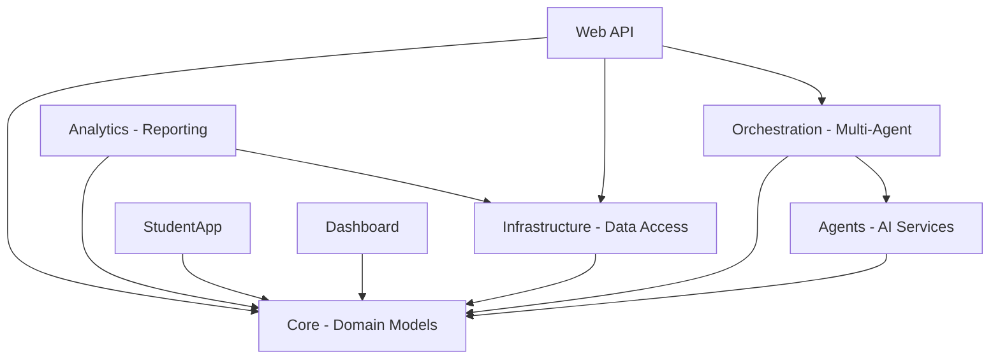

# EduMind.AI Development Instructions

**Version:** 0.2.0  
**Last Updated:** October 24, 2025

This document consolidates all coding standards, development practices, and architectural patterns used in the EduMind.AI Academic Assessment Multi-Agent System.

---

## Table of Contents

1. [Project Overview](#project-overview)
2. [Solution Structure](#solution-structure)
3. [C# Coding Standards](#c-coding-standards)
4. [API Development](#api-development)
5. [Blazor Development](#blazor-development)
6. [Infrastructure as Code](#infrastructure-as-code)
7. [Testing Standards](#testing-standards)
8. [Git Workflow](#git-workflow)
9. [Documentation Standards](#documentation-standards)
10. [Configuration Management](#configuration-management)
11. [Copilot Usage Guidelines](#copilot-usage-guidelines)

---

## 1. Project Overview

### 1.1 System Purpose

EduMind.AI is a multi-tenant academic assessment platform powered by AI agents that:

- Generates adaptive assessments using local Ollama LLMs
- Provides personalized feedback through specialized AI agents
- Tracks student progress with analytics
- Supports both B2B (school-based) and B2C (self-service) models

### 1.2 Technology Stack

- **.NET 9.0** - Latest LTS with C# 13
- **Blazor Server** - Interactive web UI
- **ASP.NET Core Web API** - RESTful services
- **PostgreSQL 17** - Primary data store
- **Redis 7** - Caching and session storage
- **Ollama** - Local LLM inference (llama3.2:3b)
- **Semantic Kernel** - AI agent orchestration
- **.NET Aspire** - Cloud-native orchestration
- **Azure Container Apps** - Cloud deployment platform

### 1.3 Key Features

- Multi-agent AI system for question generation and feedback
- Adaptive assessments that adjust to student performance
- Real-time analytics and progress tracking
- Multi-tenant architecture with RBAC
- Comprehensive privacy controls (COPPA, FERPA, GDPR compliant)

---

## 2. Solution Structure

### 2.1 Project Organization

```
EduMind.AI.sln
├── src/
│   ├── AcademicAssessment.Core/          # Domain models, interfaces, enums
│   ├── AcademicAssessment.Infrastructure/ # Data access, repositories, EF Core
│   ├── AcademicAssessment.Agents/         # AI agents using Semantic Kernel
│   ├── AcademicAssessment.Orchestration/  # Multi-agent coordination
│   ├── AcademicAssessment.Analytics/      # Analytics and reporting
│   ├── AcademicAssessment.Web/            # RESTful Web API
│   ├── AcademicAssessment.Dashboard/      # Admin/Teacher Blazor UI
│   ├── AcademicAssessment.StudentApp/     # Student Blazor UI
│   ├── EduMind.AppHost/                   # .NET Aspire orchestration
│   └── EduMind.ServiceDefaults/           # Shared Aspire configuration
├── tests/
│   ├── AcademicAssessment.Tests.Unit/      # Unit tests
│   ├── AcademicAssessment.Tests.Integration/ # Integration tests
│   ├── AcademicAssessment.Tests.UI/        # UI/E2E tests
│   └── AcademicAssessment.Tests.Performance/ # Performance tests
├── infra/
│   ├── main.bicep                         # Azure infrastructure
│   └── resources.bicep                    # Resource definitions
├── docs/                                  # Architecture and planning docs
└── scripts/                               # Deployment and utility scripts
```

### 2.2 Architecture Layers

#### Core Layer (AcademicAssessment.Core)

- **Domain models** using C# records for immutability
- **Enums** for type-safe constants
- **Interfaces** for repository and service contracts
- **Common utilities** like `Result<T>` for functional error handling
- **No dependencies** on other projects

#### Infrastructure Layer (AcademicAssessment.Infrastructure)

- **Repository implementations** using Entity Framework Core
- **Database context** with multi-tenancy support
- **Migrations** for schema versioning
- References: Core

#### Application Services Layer

- **Agents** - AI-powered domain services
- **Orchestration** - Multi-agent coordination
- **Analytics** - Business intelligence
- References: Core, Infrastructure

#### Presentation Layer

- **Web API** - RESTful endpoints with versioning
- **StudentApp** - Blazor Server for students
- **Dashboard** - Blazor Server for teachers/admins
- References: Core, Infrastructure, Application Services

### 2.3 Namespace Conventions

```csharp
// Project namespaces match folder structure exactly
namespace AcademicAssessment.Core.Models;
namespace AcademicAssessment.Core.Enums;
namespace AcademicAssessment.Core.Interfaces;
namespace AcademicAssessment.Core.Common;

namespace AcademicAssessment.Infrastructure.Repositories;
namespace AcademicAssessment.Infrastructure.Data;

namespace AcademicAssessment.Web.Controllers;
namespace AcademicAssessment.StudentApp.Components.Pages;
```

**Rules:**

- File-scoped namespaces (C# 10+)
- One namespace per file
- Namespace reflects physical folder structure
- No nested namespace blocks

### 2.4 Project Dependencies



---

## 3. C# Coding Standards

### 3.1 General Principles

- **Language Version:** C# 13 (latest)
- **Target Framework:** .NET 9.0
- **Nullable Reference Types:** Enabled globally
- **Implicit Usings:** Enabled
- **File-Scoped Namespaces:** Required
- **Records over Classes:** Prefer immutable records for domain models

### 3.2 Naming Conventions

```csharp
// Interfaces: I prefix + PascalCase
public interface IAssessmentRepository { }
public interface IStudentService { }

// Classes: PascalCase
public class AssessmentController { }
public class StudentRepository { }

// Methods: PascalCase
public async Task<Result<Assessment>> GetByIdAsync(Guid id) { }

// Parameters: camelCase
public void ProcessAssessment(Guid assessmentId, string studentName) { }

// Private fields: camelCase (no underscore prefix)
private readonly ILogger logger;
private readonly HttpClient httpClient;

// Constants: PascalCase
public const int DefaultTimeoutSeconds = 30;

// Enums: PascalCase (singular)
public enum AssessmentType { Diagnostic, Formative, Summative, Adaptive }
public enum GradeLevel { Elementary, MiddleSchool, HighSchool, College }
```

### 3.3 Code Style

#### Immutable Domain Models

```csharp
// Use records for immutability and value semantics
public record Assessment
{
    public required Guid Id { get; init; }
    public required string Title { get; init; }
    public required AssessmentType AssessmentType { get; init; }
    public IReadOnlyList<Guid> QuestionIds { get; init; } = [];
    
    // Computed properties
    public int QuestionCount => QuestionIds.Count;
    public bool IsAdaptive => AssessmentType == AssessmentType.Adaptive;
}
```

#### Required Properties

```csharp
// Use 'required' keyword for mandatory properties
public record User
{
    public required Guid Id { get; init; }
    public required string Email { get; init; }
    public required string FullName { get; init; }
    
    // Optional properties without 'required'
    public Guid? SchoolId { get; init; }
    public string? ExternalId { get; init; }
}
```

#### Collection Expressions

```csharp
// Use collection expressions (C# 12+)
public IReadOnlyList<string> Topics { get; init; } = [];
public string[] AllowedOrigins { get; set; } = [];

// Collection initialization
var assessments = new List<Assessment>
{
    new() { Id = guid1, Title = "Math" },
    new() { Id = guid2, Title = "Science" }
};
```

### 3.4 Async/Await Patterns

```csharp
// All I/O operations must be async
public async Task<Result<Assessment>> GetByIdAsync(
    Guid id, 
    CancellationToken cancellationToken = default)
{
    var assessment = await dbContext.Assessments
        .FirstOrDefaultAsync(a => a.Id == id, cancellationToken);
        
    return assessment is null 
        ? new Error("NotFound", $"Assessment {id} not found")
        : assessment;
}

// Async method naming: always suffix with 'Async'
// Always accept CancellationToken as last parameter
// Always use ConfigureAwait(false) in library code (not UI)
```

### 3.5 Error Handling

#### Railway-Oriented Programming with Result<T>

```csharp
// Result type for functional error handling
public abstract record Result<T>
{
    public sealed record Success(T Value) : Result<T>;
    public sealed record Failure(Error Error) : Result<T>;
    
    public bool IsSuccess => this is Success;
    public bool IsFailure => this is Failure;
}

public sealed record Error(
    string Code,
    string Message,
    Exception? Exception = null);

// Usage in repositories
public async Task<Result<Student>> GetByIdAsync(Guid id)
{
    try
    {
        var student = await dbContext.Students.FindAsync(id);
        
        return student is null
            ? new Error("NotFound", $"Student {id} not found")
            : student;  // Implicit conversion
    }
    catch (Exception ex)
    {
        return new Error("DatabaseError", "Failed to retrieve student", ex);
    }
}

// Pattern matching consumption
var result = await repository.GetByIdAsync(studentId);
return result switch
{
    Result<Student>.Success s => Ok(s.Value),
    Result<Student>.Failure f => Problem(f.Error.Message),
    _ => StatusCode(500)
};
```

### 3.6 LINQ and Query Patterns

```csharp
// Prefer method syntax over query syntax
var activeAssessments = assessments
    .Where(a => a.IsActive)
    .OrderBy(a => a.Title)
    .Take(10)
    .ToList();

// Use async LINQ with EF Core
var students = await dbContext.Students
    .Where(s => s.GradeLevel == gradeLevel)
    .Include(s => s.Classes)
    .AsNoTracking()
    .ToListAsync(cancellationToken);
```

### 3.7 XML Documentation

```csharp
/// <summary>
/// Gets all assessments for a specific course
/// </summary>
/// <param name="courseId">The unique identifier of the course</param>
/// <param name="cancellationToken">Cancellation token</param>
/// <returns>Result containing list of assessments or error</returns>
Task<Result<IReadOnlyList<Assessment>>> GetByCourseIdAsync(
    Guid courseId,
    CancellationToken cancellationToken = default);
```

**Rules:**

- All public APIs must have XML docs
- Use `<summary>`, `<param>`, `<returns>` tags
- Document exceptions with `<exception>` tag
- Warning 1591 (missing docs) suppressed in Directory.Build.props

---

## 4. API Development

### 4.1 Controller Structure

```csharp
using Asp.Versioning;
using Microsoft.AspNetCore.Mvc;

namespace AcademicAssessment.Web.Controllers;

[ApiController]
[ApiVersion("1.0")]
[Route("api/v{version:apiVersion}/[controller]")]
public class AssessmentController : ControllerBase
{
    private readonly IAssessmentRepository repository;
    private readonly ILogger<AssessmentController> logger;

    public AssessmentController(
        IAssessmentRepository repository,
        ILogger<AssessmentController> logger)
    {
        this.repository = repository;
        this.logger = logger;
    }

    [HttpGet]
    public async Task<IActionResult> GetAssessments(
        CancellationToken cancellationToken)
    {
        var result = await repository.GetAllAsync(cancellationToken);
        return result switch
        {
            Result<IReadOnlyList<Assessment>>.Success s => Ok(s.Value),
            Result<IReadOnlyList<Assessment>>.Failure f => Problem(f.Error.Message),
            _ => StatusCode(500)
        };
    }

    [HttpGet("{id:guid}")]
    public async Task<IActionResult> GetAssessment(
        Guid id,
        CancellationToken cancellationToken)
    {
        var result = await repository.GetByIdAsync(id, cancellationToken);
        return result switch
        {
            Result<Assessment>.Success s => Ok(s.Value),
            Result<Assessment>.Failure f when f.Error.Code == "NotFound" => NotFound(),
            Result<Assessment>.Failure f => Problem(f.Error.Message),
            _ => StatusCode(500)
        };
    }
}
```

### 4.2 API Versioning

- **Asp.Versioning** NuGet package
- URL-based versioning: `/api/v1/assessment`
- Swagger UI per version

```csharp
// In Program.cs
builder.Services.AddApiVersioning(options =>
{
    options.DefaultApiVersion = new ApiVersion(1, 0);
    options.AssumeDefaultVersionWhenUnspecified = true;
    options.ReportApiVersions = true;
    options.ApiVersionReader = new UrlSegmentApiVersionReader();
})
.AddApiExplorer(options =>
{
    options.GroupNameFormat = "'v'VVV";
    options.SubstituteApiVersionInUrl = true;
});
```

### 4.3 DTO Patterns

```csharp
namespace AcademicAssessment.Core.Models.Dtos;

/// <summary>
/// Data transfer object for assessment summary
/// </summary>
public record AssessmentSummary
{
    public required Guid Id { get; init; }
    public required string Title { get; init; }
    public required string Subject { get; init; }
    public required string Difficulty { get; init; }
    public required int EstimatedDurationMinutes { get; init; }
    public required int QuestionCount { get; init; }
    public double? ProgressPercentage { get; init; }
    public bool IsInProgress { get; init; }
    public DateTimeOffset? LastAttemptedAt { get; init; }
}
```

### 4.4 CORS Configuration

```csharp
// Development: allow localhost ports
builder.Services.AddCors(options =>
{
    options.AddPolicy("DevelopmentCors", policy =>
    {
        policy
            .WithOrigins("https://localhost:5001", "https://localhost:5002")
            .AllowAnyMethod()
            .AllowAnyHeader()
            .AllowCredentials(); // Required for SignalR
    });
});

// Use in pipeline
app.UseCors(builder.Environment.IsDevelopment() 
    ? "DevelopmentCors" 
    : "ProductionCors");
```

### 4.5 Health Checks

```csharp
builder.Services.AddHealthChecks()
    .AddNpgSql(connectionString, name: "postgresql")
    .AddRedis(redisConnection, name: "redis")
    .AddUrlGroup(new Uri(ollamaUrl), name: "ollama");

// Map health endpoints
app.MapHealthChecks("/health");
app.MapHealthChecks("/health/ready");
app.MapHealthChecks("/health/live");
```

---

## 5. Blazor Development

### 5.1 Component Structure

```csharp
@page "/assessments"
@inject IHttpClientFactory HttpClientFactory
@inject NavigationManager Navigation
@inject ILogger<AssessmentDashboard> Logger

<PageTitle>Assessments - EduMind.AI</PageTitle>

<div class="container-fluid">
    <h1 class="display-4 mb-4">📚 Your Assessments</h1>
    
    @if (assessments is null)
    {
        <p><em>Loading assessments...</em></p>
    }
    else if (!assessments.Any())
    {
        <p>No assessments available.</p>
    }
    else
    {
        <div class="row">
            @foreach (var assessment in assessments)
            {
                <AssessmentCard Assessment="@assessment" />
            }
        </div>
    }
</div>

@code {
    private List<AssessmentSummary>? assessments;

    protected override async Task OnInitializedAsync()
    {
        await LoadAssessmentsAsync();
    }

    private async Task LoadAssessmentsAsync()
    {
        try
        {
            using var client = HttpClientFactory.CreateClient("ApiClient");
            assessments = await client.GetFromJsonAsync<List<AssessmentSummary>>(
                "api/v1/assessment");
        }
        catch (Exception ex)
        {
            Logger.LogError(ex, "Failed to load assessments");
        }
    }
}
```

### 5.2 HTTP Client Configuration

**IMPORTANT:** Use named clients via factory pattern to avoid performance issues.

```csharp
// In Program.cs - CORRECT pattern
builder.Services.AddHttpClient("ApiClient", client =>
{
    var apiBaseUrl = builder.Configuration["ApiBaseUrl"] 
        ?? "http://localhost:5103";
    client.BaseAddress = new Uri(apiBaseUrl);
    client.Timeout = TimeSpan.FromSeconds(30);
});

// In components - inject factory and create named client
@inject IHttpClientFactory HttpClientFactory

@code {
    private async Task CallApiAsync()
    {
        using var client = HttpClientFactory.CreateClient("ApiClient");
        var data = await client.GetFromJsonAsync<DataType>("api/endpoint");
    }
}
```

**ANTI-PATTERN (causes 15+ second page loads):**

```csharp
// DO NOT DO THIS - causes HttpClient disposal issues
builder.Services.AddHttpClient<HttpClient>();
```

### 5.3 Navigation Patterns

**Known Issue:** Blazor Server SignalR sometimes fails to handle `@onclick` events.

**Workaround:** Use HTML anchor links for critical navigation:

```razor
@* PREFERRED - Reliable navigation *@
<a href="/assessment/@AssessmentId/session" class="btn btn-primary">
    Start Assessment
</a>

@* AVOID - May not work reliably in Blazor Server *@
<button @onclick="NavigateToSession" class="btn btn-primary">
    Start Assessment
</button>
```

### 5.4 State Management

- Use **component parameters** for parent-child data flow
- Use **Blazor's built-in state** for simple scenarios
- Use **scoped services** for shared state within a circuit
- Avoid **static state** (violates multi-tenancy)

### 5.5 Blazor InteractiveServer Mode

```razor
@* Enable interactivity at page level *@
@page "/assessment/{AssessmentId:guid}"
@rendermode InteractiveServer

@* Or at component level *@
<InteractiveComponent @rendermode="InteractiveServer" />
```

---

## 6. Infrastructure as Code

### 6.1 Bicep Standards

```bicep
targetScope = 'subscription'

@minLength(1)
@maxLength(64)
@description('Name of the environment')
param environmentName string

@minLength(1)
@description('The location used for all deployed resources')
param location string

@description('Id of the user or app to assign application roles')
param principalId string = ''

@metadata({
  azd: {
    type: 'generate'
    config: { length: 22, noSpecial: true }
  }
})
@secure()
param cache_password string

var tags = {
  'azd-env-name': environmentName
  'managed-by': 'azd'
}

resource rg 'Microsoft.Resources/resourceGroups@2022-09-01' = {
  name: 'rg-${environmentName}'
  location: location
  tags: tags
}
```

### 6.2 Naming Conventions

```bicep
// Resource group
name: 'rg-${environmentName}'

// Container Apps Environment
name: 'cae-${environmentName}'

// Container Apps
name: 'ca-webapi-${environmentName}'
name: 'ca-studentapp-${environmentName}'

// PostgreSQL
name: 'psql-${environmentName}-${uniqueSuffix}'

// Redis Cache
name: 'redis-${environmentName}'

// Log Analytics
name: 'log-${environmentName}'
```

### 6.3 Azure Container Apps

```bicep
resource containerApp 'Microsoft.App/containerApps@2023-05-01' = {
  name: 'ca-webapi-${environmentName}'
  location: location
  properties: {
    environmentId: containerAppsEnvironment.id
    configuration: {
      ingress: {
        external: true
        targetPort: 8080
        allowInsecure: false
      }
    }
    template: {
      containers: [
        {
          name: 'webapi'
          image: 'mcr.microsoft.com/dotnet/aspnet:9.0'
          resources: {
            cpu: json('0.5')
            memory: '1Gi'
          }
          env: [
            {
              name: 'ASPNETCORE_ENVIRONMENT'
              value: 'Production'
            }
          ]
        }
      ]
      scale: {
        minReplicas: 1
        maxReplicas: 10
      }
    }
  }
}
```

---

## 7. Testing Standards

### 7.1 Test Project Structure

```
tests/
├── AcademicAssessment.Tests.Unit/
│   ├── Models/
│   ├── Repositories/
│   └── Services/
├── AcademicAssessment.Tests.Integration/
│   ├── Api/
│   ├── Database/
│   └── Agents/
├── AcademicAssessment.Tests.UI/
│   └── BasicFunctionalityTests.cs
└── AcademicAssessment.Tests.Performance/
```

### 7.2 Testing Frameworks

- **xUnit** - Test framework
- **FluentAssertions** - Assertion library
- **Moq** - Mocking framework (if used)
- **Microsoft.AspNetCore.Mvc.Testing** - Integration testing

### 7.3 Test Naming

```csharp
// Pattern: MethodName_StateUnderTest_ExpectedBehavior
[Fact]
public async Task GetByIdAsync_ExistingId_ReturnsSuccess()
{
    // Arrange
    var repository = CreateRepository();
    var id = Guid.NewGuid();
    
    // Act
    var result = await repository.GetByIdAsync(id);
    
    // Assert
    result.Should().BeOfType<Result<Student>.Success>();
}

[Fact]
public async Task GetByIdAsync_NonExistentId_ReturnsNotFoundError()
{
    // Arrange
    var repository = CreateRepository();
    var id = Guid.NewGuid();
    
    // Act
    var result = await repository.GetByIdAsync(id);
    
    // Assert
    result.Should().BeOfType<Result<Student>.Failure>();
    var failure = (Result<Student>.Failure)result;
    failure.Error.Code.Should().Be("NotFound");
}
```

### 7.4 FluentAssertions Patterns

```csharp
using FluentAssertions;

// Value assertions
response.StatusCode.Should().Be(HttpStatusCode.OK);
content.Should().NotBeEmpty();
content.Should().Contain("EduMind.AI");
content.Should().NotContain("error");

// Collection assertions
assessments.Should().HaveCount(5);
assessments.Should().Contain(a => a.Title == "Introduction to Algebra");

// Exception assertions
Func<Task> act = async () => await service.ProcessAsync(null);
await act.Should().ThrowAsync<ArgumentNullException>();
```

### 7.5 UI Test Example

```csharp
public class BasicFunctionalityTests
{
    [Fact]
    public async Task WebApi_ShouldReturnHealthy()
    {
        using var client = new HttpClient();

        var response = await client.GetAsync("http://localhost:5103/health");

        response.StatusCode.Should().Be(HttpStatusCode.OK);
        var content = await response.Content.ReadAsStringAsync();
        content.Should().Be("Healthy");
    }

    [Fact]
    public async Task StudentApp_AssessmentDetailShouldNotError()
    {
        using var client = new HttpClient();
        client.Timeout = TimeSpan.FromSeconds(15);

        var response = await client.GetAsync(
            "http://localhost:5049/assessment/6c8d46f0-9cf6-4ba6-8361-5a6dc7bb9e38");

        response.StatusCode.Should().Be(HttpStatusCode.OK);
        var content = await response.Content.ReadAsStringAsync();

        content.Should().NotContain("unhandled error");
        content.Should().Contain("Introduction to Algebra");
    }
}
```

### 7.6 Test Coverage

- **Target:** 70%+ overall code coverage
- **Critical paths:** 90%+ coverage required
- **Run coverage:** `dotnet test --collect:"XPlat Code Coverage"`
- Configuration in `coverlet.runsettings`

---

## 8. Git Workflow

### 8.1 Branching Strategy

- **main** - production-ready code
- Feature branches for new work
- Direct commits to main for small fixes (single-developer project)

### 8.2 Commit Message Format

Observed patterns from git history:

```
# Feature work
Add multi-agent orchestration for assessment feedback
Implement adaptive question selection algorithm

# Fixes
Fix: Use environment-specific resource group in workflow
Fix: Add quotes to template variable to prevent formatting issues

# Configuration changes
Configure PostgreSQL to work with Azure Files permissions
Migrate to Azure Database for PostgreSQL Flexible Server

# Documentation
Document deployment status and template substitution issue
Update architecture docs with RBAC design

# Work in progress
WIP: Fix Student App HTTP client and navigation issues

# Deployment/Infrastructure
Prepare for clean deployment in Australia East
Generate Bicep infrastructure to exit azd limited mode
```

**Conventions:**

- Present tense ("Add feature" not "Added feature")
- Imperative mood ("Fix bug" not "Fixes bug")
- Prefix `Fix:` for bug fixes
- Prefix `WIP:` for unfinished work
- Keep under 72 characters when possible
- Add detailed body for complex changes

### 8.3 CI/CD Integration

- **GitHub Actions** workflows in `.github/workflows/`
- Automated tests run on push
- Azure deployment via `azd` (Azure Developer CLI)

---

## 9. Documentation Standards

### 9.1 XML Documentation

```csharp
/// <summary>
/// Repository for managing student assessment records
/// </summary>
public interface IStudentAssessmentRepository : IRepository<StudentAssessment, Guid>
{
    /// <summary>
    /// Gets all assessment attempts for a specific student
    /// </summary>
    /// <param name="studentId">The unique identifier of the student</param>
    /// <param name="cancellationToken">Cancellation token for the operation</param>
    /// <returns>
    /// Result containing list of student assessments or error if operation fails
    /// </returns>
    Task<Result<IReadOnlyList<StudentAssessment>>> GetByStudentIdAsync(
        Guid studentId,
        CancellationToken cancellationToken = default);
}
```

### 9.2 README Files

- **Root README.md** - Project overview, getting started
- **docs/** - Architecture, deployment, planning docs
- Use Markdown with proper heading hierarchy
- Include code examples in fenced blocks with language tags

### 9.3 Code Comments

```csharp
// Single-line comments for explaining WHY, not WHAT
// Avoid obvious comments

// GOOD - explains reasoning
// Using named client to avoid HttpClient disposal issues that cause 15s delays
using var client = HttpClientFactory.CreateClient("ApiClient");

// BAD - states the obvious
// Create HTTP client
using var client = new HttpClient();
```

### 9.4 Architecture Decision Records

Located in `docs/architecture/`:

- Document significant technical decisions
- Include context, options considered, decision, consequences

---

## 10. Configuration Management

### 10.1 appsettings.json Structure

```json
{
  "Logging": {
    "LogLevel": {
      "Default": "Information",
      "Microsoft.AspNetCore": "Warning"
    }
  },
  "AllowedHosts": "*",
  "ConnectionStrings": {
    "AcademicDatabase": "Host=localhost;Port=5432;Database=edumind_dev"
  },
  "AzureAdB2C": {
    "Instance": "https://login.microsoftonline.com/",
    "Domain": "edumindai.onmicrosoft.com",
    "TenantId": "common",
    "ClientId": "",
    "SignUpSignInPolicyId": "B2C_1_susi_google"
  },
  "Ollama": {
    "BaseUrl": "http://localhost:11434",
    "ModelName": "llama3.2:3b",
    "Timeout": 120
  },
  "LLM": {
    "Provider": "Ollama",
    "Comments": "Options: Stub, Ollama, AzureOpenAI, Hybrid"
  }
}
```

### 10.2 Environment Variables

```bash
# Database
ConnectionStrings__AcademicDatabase="Host=...;Database=...;Username=...;Password=..."

# Azure AD B2C
AzureAdB2C__ClientId="..."
AzureAdB2C__ClientSecret="..."

# Ollama
Ollama__BaseUrl="http://ollama:11434"
Ollama__ModelName="llama3.2:3b"

# ASP.NET Core
ASPNETCORE_ENVIRONMENT="Development"
ASPNETCORE_URLS="http://+:8080"
```

### 10.3 Secrets Management

- **Development:** User secrets (`dotnet user-secrets set`)
- **Azure:** Key Vault or App Configuration
- **Never commit secrets** to source control
- Use `.gitignore` for local secrets files

### 10.4 .NET Aspire Service Defaults

```csharp
// In EduMind.ServiceDefaults
builder.AddServiceDefaults();

// Provides:
// - OpenTelemetry (traces, metrics, logs)
// - Service discovery
// - Health checks
// - Resilience patterns
```

---

## 11. Copilot Usage Guidelines

### 11.1 Effective Prompting

```csharp
// GOOD - Provides context and patterns
// Copilot: Create a repository method to get students by grade level
// following the existing pattern with Result<T> return type

// BAD - Too vague
// Copilot: Add a method
```

### 11.2 Code Review Checklist

When accepting Copilot suggestions, verify:

- [ ] Follows project namespace conventions
- [ ] Uses `required` keyword for mandatory properties
- [ ] Async methods end with `Async`
- [ ] XML documentation provided
- [ ] Returns `Result<T>` for operations that can fail
- [ ] Uses `CancellationToken` parameter
- [ ] File-scoped namespace used
- [ ] Nullable reference types handled correctly

### 11.3 Testing with Copilot

```csharp
// Copilot: Generate xUnit test for GetByIdAsync following FluentAssertions pattern
// Copilot: Add integration test for assessment workflow
// Copilot: Create performance test for question generation
```

### 11.4 Documentation Generation

```csharp
// Copilot: Generate XML documentation for this interface
// Copilot: Add inline comments explaining the error handling strategy
// Copilot: Document this Bicep parameter
```

---

## Appendix A: Common Patterns Quick Reference

### A.1 Creating a New Domain Model

```csharp
using AcademicAssessment.Core.Enums;

namespace AcademicAssessment.Core.Models;

/// <summary>
/// Represents a course offering within a school
/// </summary>
public record Course
{
    public required Guid Id { get; init; }
    public required string Name { get; init; }
    public required Subject Subject { get; init; }
    public required GradeLevel GradeLevel { get; init; }
    public Guid? SchoolId { get; init; }
    public required DateTimeOffset CreatedAt { get; init; }
    public required DateTimeOffset UpdatedAt { get; init; }
}
```

### A.2 Creating a New Repository Interface

```csharp
using AcademicAssessment.Core.Common;
using AcademicAssessment.Core.Models;

namespace AcademicAssessment.Core.Interfaces;

/// <summary>
/// Repository for course management
/// </summary>
public interface ICourseRepository : IRepository<Course, Guid>
{
    /// <summary>
    /// Gets all courses for a specific school
    /// </summary>
    Task<Result<IReadOnlyList<Course>>> GetBySchoolIdAsync(
        Guid schoolId,
        CancellationToken cancellationToken = default);
}
```

### A.3 Creating a New API Controller

```csharp
using Asp.Versioning;
using Microsoft.AspNetCore.Mvc;

namespace AcademicAssessment.Web.Controllers;

[ApiController]
[ApiVersion("1.0")]
[Route("api/v{version:apiVersion}/[controller]")]
public class CourseController : ControllerBase
{
    private readonly ICourseRepository repository;
    private readonly ILogger<CourseController> logger;

    public CourseController(
        ICourseRepository repository,
        ILogger<CourseController> logger)
    {
        this.repository = repository;
        this.logger = logger;
    }

    [HttpGet]
    public async Task<IActionResult> GetCourses(
        CancellationToken cancellationToken)
    {
        var result = await repository.GetAllAsync(cancellationToken);
        return result switch
        {
            Result<IReadOnlyList<Course>>.Success s => Ok(s.Value),
            Result<IReadOnlyList<Course>>.Failure f => Problem(f.Error.Message),
            _ => StatusCode(500)
        };
    }
}
```

### A.4 Creating a New Blazor Page

```razor
@page "/courses"
@inject IHttpClientFactory HttpClientFactory
@inject ILogger<CourseList> Logger

<PageTitle>Courses - EduMind.AI</PageTitle>

<h1>📚 Courses</h1>

@if (courses is null)
{
    <p><em>Loading...</em></p>
}
else
{
    <ul>
        @foreach (var course in courses)
        {
            <li>@course.Name</li>
        }
    </ul>
}

@code {
    private List<Course>? courses;

    protected override async Task OnInitializedAsync()
    {
        try
        {
            using var client = HttpClientFactory.CreateClient("ApiClient");
            courses = await client.GetFromJsonAsync<List<Course>>("api/v1/course");
        }
        catch (Exception ex)
        {
            Logger.LogError(ex, "Failed to load courses");
        }
    }
}
```

---

## Appendix B: Troubleshooting Common Issues

### B.1 Blazor SignalR Navigation Not Working

**Symptom:** `@onclick` events don't navigate, buttons appear unresponsive

**Solution:** Use HTML anchor links instead

```razor
@* Use this *@
<a href="/target" class="btn btn-primary">Navigate</a>

@* Instead of this *@
<button @onclick="() => Navigation.NavigateTo(\"/target\")">Navigate</button>
```

### B.2 Slow Page Loads (15+ seconds)

**Symptom:** Blazor pages take 15+ seconds to load

**Root Cause:** Incorrect HttpClient registration causing disposal issues

**Solution:** Use named clients via factory

```csharp
// In Program.cs
builder.Services.AddHttpClient("ApiClient", client => 
{
    client.BaseAddress = new Uri("http://localhost:5103");
});

// In component
using var client = HttpClientFactory.CreateClient("ApiClient");
```

### B.3 Azure Container Apps Connection String Issues

**Symptom:** Apps can't connect to PostgreSQL or Redis in Azure

**Root Cause:** Aspire connection strings use service discovery names, not Azure FQDNs

**Solution:** Patch connection strings to use internal FQDNs

```csharp
// Workaround in Program.cs
var connectionString = builder.Configuration.GetConnectionString("AcademicDatabase");
if (!string.IsNullOrEmpty(containerAppsDomain))
{
    connectionString = connectionString.Replace("edumind", $"edumind.{containerAppsDomain}");
}
```

---

## Document Version History

| Version | Date | Changes |
|---------|------|---------|
| 0.2.0 | 2025-10-24 | Initial consolidated instructions from scattered documentation |

---

**For questions or clarifications, see:**

- `.github/specification.md` - Detailed system architecture
- `.github/adr.md` - Architectural decision records
- `.github/deploy.md` - Deployment procedures
- `.github/testing.md` - Comprehensive testing guide
