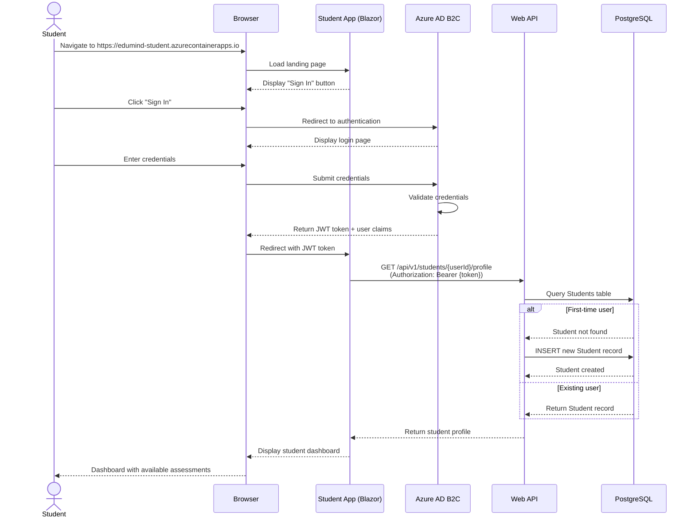
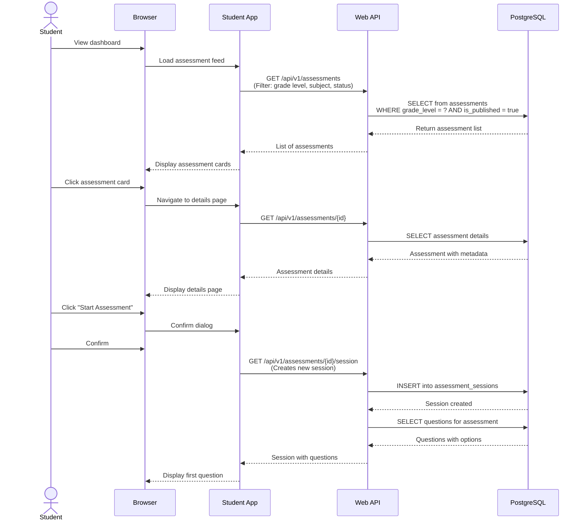
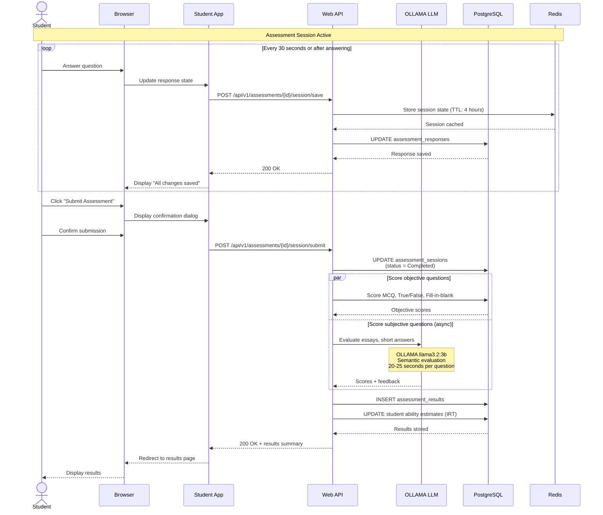
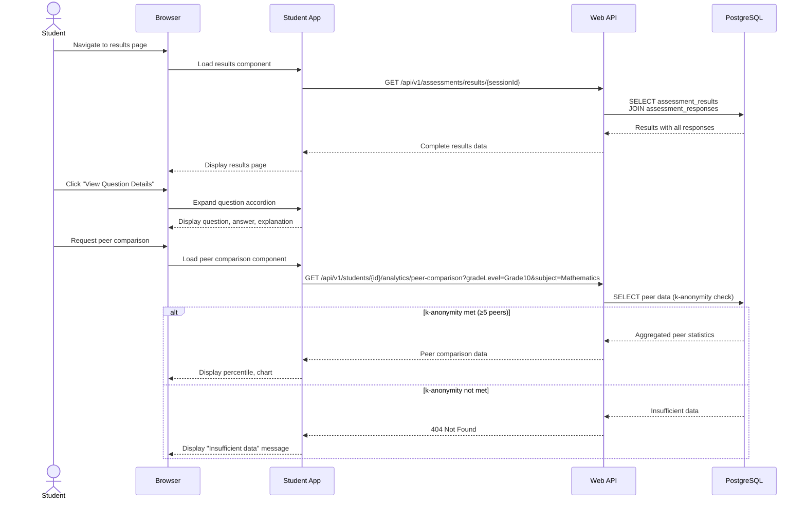
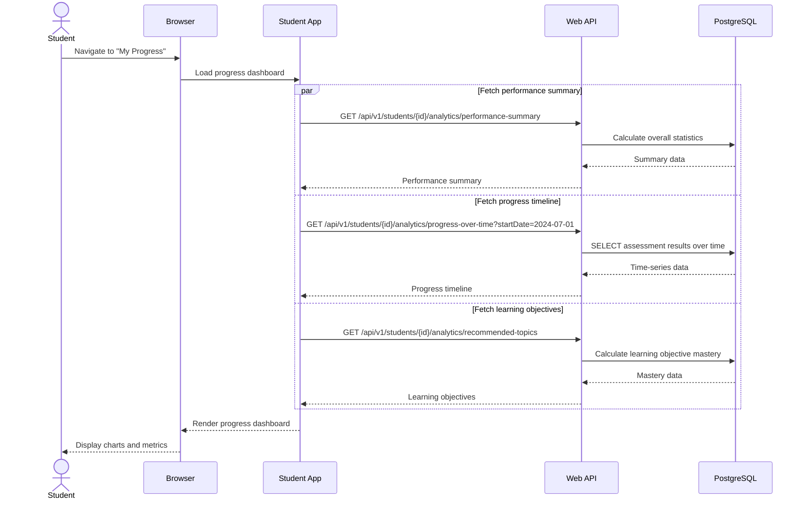
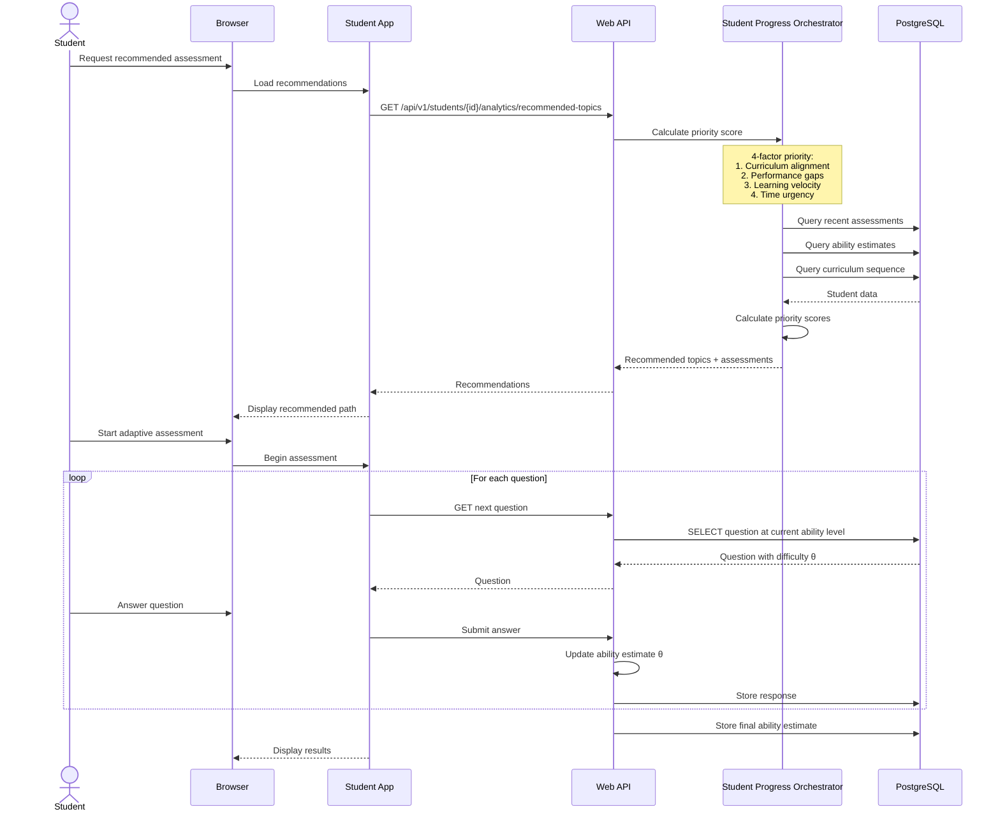
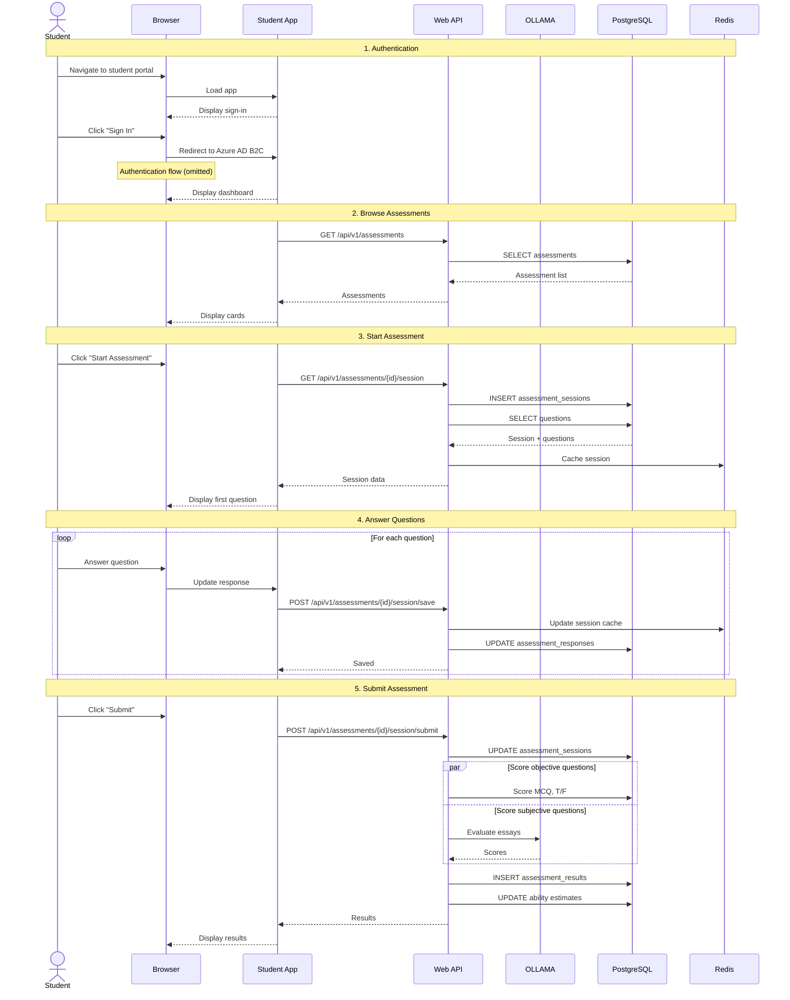

# Student Workflows

**Version:** 1.0  
**Last Updated:** 2025-01-20  
**Target Audience:** Students (Grade 6-12)

## Table of Contents

- [Overview](#overview)
- [1. Student Registration and Onboarding](#1-student-registration-and-onboarding)
- [2. Assessment Discovery and Selection](#2-assessment-discovery-and-selection)
- [3. Taking an Assessment](#3-taking-an-assessment)
- [4. Reviewing Assessment Results](#4-reviewing-assessment-results)
- [5. Tracking Progress Over Time](#5-tracking-progress-over-time)
- [6. Identifying Areas for Improvement](#6-identifying-areas-for-improvement)
- [7. Adaptive Learning Path](#7-adaptive-learning-path)
- [Sequence Diagrams](#sequence-diagrams)
- [User Interface Screenshots](#user-interface-screenshots)
- [Common Scenarios](#common-scenarios)
- [Troubleshooting](#troubleshooting)

---

## Overview

Students use EduMind.AI to take assessments, review their performance, track progress over time, and receive personalized learning recommendations. The platform provides an intuitive, distraction-free assessment experience with real-time feedback and progress visualization.

**Key Student Capabilities:**

- Browse and start available assessments
- Complete assessments with various question types (MCQ, FRQ, essay, coding, etc.)
- Auto-save progress to prevent data loss
- Track time spent on questions
- Review results with detailed explanations
- View performance analytics and trends
- Identify weak areas needing improvement
- Receive personalized topic recommendations
- Compare performance with peers (privacy-protected)

---

## 1. Student Registration and Onboarding

### Workflow Steps

1. **Navigate to Student Portal**
   - Access URL: `https://edumind-student.azurecontainerapps.io` (production) or `http://localhost:5001` (development)
   - Landing page displays "Sign In" button

2. **Azure AD B2C Authentication**
   - Click "Sign In" button
   - Redirect to Azure AD B2C login page
   - Choose authentication method:
     - **School Email**: Enter school-issued email and password
     - **Social Login**: Google, Microsoft, or Apple account
   - First-time users: Complete registration form
     - Full name
     - Grade level (Grade 6-12)
     - School/organization selection
     - Date of birth
     - Consent to terms of service

3. **Profile Creation**
   - System creates `Student` entity in database
   - Assigns student to school and default class
   - Generates unique `StudentId` (GUID)
   - Sets initial `AbilityEstimate` to 0.0 (neutral starting point)

4. **Initial Assessment (Optional)**
   - Some schools require diagnostic assessment
   - Establishes baseline ability estimates across subjects
   - Typically 10-15 questions per subject
   - Used to initialize adaptive assessment algorithm

5. **Dashboard Access**
   - Redirect to student dashboard after successful login
   - Display welcome message with student name
   - Show assessment feed with available assessments
   - Display progress summary widgets

### Sequence Diagram



### Database Updates

**Students Table:**

```sql
INSERT INTO students (
    student_id,
    user_id,
    school_id,
    first_name,
    last_name,
    email,
    grade_level,
    date_of_birth,
    created_at,
    updated_at
) VALUES (
    gen_random_uuid(),
    'azure-ad-user-object-id',
    'school-guid',
    'Jane',
    'Doe',
    'jane.doe@school.edu',
    'Grade10',
    '2009-05-15',
    NOW(),
    NOW()
);
```

---

## 2. Assessment Discovery and Selection

### Workflow Steps

1. **View Assessment Feed**
   - Dashboard displays list of available assessments
   - Filtered by:
     - Student's grade level
     - Assigned by teachers
     - Subject areas
     - Assessment type (diagnostic, practice, summative)
   - Each card shows:
     - Assessment title
     - Subject and grade level
     - Estimated duration (e.g., "45 minutes")
     - Number of questions (e.g., "30 questions")
     - Difficulty level (adaptive or fixed)
     - Due date (if assigned)

2. **Filter and Search**
   - Filter by subject: Mathematics, Physics, Chemistry, Biology, English
   - Filter by type: Diagnostic, Practice, Summative, Adaptive
   - Filter by status: Not Started, In Progress, Completed
   - Search by title or description

3. **View Assessment Details**
   - Click assessment card to view detailed information
   - Details page shows:
     - Full description
     - Learning objectives covered
     - Recommended preparation materials
     - Question type breakdown (e.g., "20 MCQ, 5 FRQ, 5 Essay")
     - Time limit (if applicable)
     - Number of attempts allowed
     - Scoring method (standard, partial credit, IRT-based)

4. **Start Assessment**
   - Click "Start Assessment" button
   - System checks prerequisites:
     - Student is enrolled in correct grade level
     - Assessment not already completed (if single-attempt)
     - No ongoing assessment session (only 1 active session per student)
   - Display confirmation dialog:
     - "Ready to begin? You will have 45 minutes to complete this assessment."
     - "Auto-save is enabled. You can pause and resume."
   - Confirm → Redirect to assessment session page

### Sequence Diagram



### API Calls

**List Assessments:**

```http
GET /api/v1/assessments?gradeLevel=Grade10&subject=Mathematics&status=NotStarted
Authorization: Bearer {jwt-token}
```

**Get Assessment Details:**

```http
GET /api/v1/assessments/a1b2c3d4-e5f6-7890-1234-567890abcdef
Authorization: Bearer {jwt-token}
```

**Start Assessment Session:**

```http
GET /api/v1/assessments/a1b2c3d4-e5f6-7890-1234-567890abcdef/session
Authorization: Bearer {jwt-token}
```

---

## 3. Taking an Assessment

### Workflow Steps

1. **Assessment Session Page Loads**
   - Display header with:
     - Assessment title and subject
     - Timer (counts up if no time limit, counts down if time limit)
     - Question counter: "Question 1 of 30"
     - Auto-save indicator: "All changes saved" or "Saving..."
   - Display question palette (sidebar):
     - Grid of question numbers
     - Color coding: Not Visited (gray), Answered (green), Flagged (yellow), Current (blue)
   - Display main question area:
     - Question number and type badge (e.g., "Question 1 - Multiple Choice")
     - Question text with rich formatting (Markdown, KaTeX math, syntax highlighting)
     - Answer options/input area based on question type
     - "Flag for Review" checkbox
     - Navigation buttons: "Previous" and "Next"

2. **Answer Question**
   - **Multiple Choice (Single Answer)**:
     - Select one radio button
     - Selected option highlighted in blue
   - **Multiple Choice (Multiple Answers)**:
     - Select multiple checkboxes
     - Must select exact number of correct answers (if specified)
   - **True/False**:
     - Select True or False radio button
   - **Fill in the Blank**:
     - Enter text in input field
     - Case-insensitive matching (usually)
   - **Short Answer**:
     - Enter 1-3 sentences in textarea
     - Character limit: 500 characters
   - **Essay**:
     - Enter long-form response in rich text editor
     - Character limit: 5000 characters
     - Supports basic formatting (bold, italic, lists)
   - **Coding**:
     - Write code in Monaco editor (VS Code editor component)
     - Syntax highlighting based on language (Python, JavaScript, Java, C++)
     - Run code button (executes in sandboxed environment)
     - Display output/errors below editor
   - **Matching**:
     - Drag-and-drop or dropdown matching
     - Connect items from left list to right list
   - **Ordering**:
     - Drag items to reorder list
     - Display numbered list with drag handles

3. **Auto-Save Progress**
   - Triggered every 30 seconds (configurable)
   - Triggered immediately after answering a question
   - API call: `POST /api/v1/assessments/{id}/session/save`
   - Payload:

     ```json
     {
       "sessionId": "session-guid",
       "responses": [
         {
           "questionId": "question-guid",
           "answer": "Student's answer",
           "timeSpent": 120,
           "isFlagged": false
         }
       ]
     }
     ```

   - Success: Display "All changes saved" indicator
   - Failure: Display "Save failed - retrying..." and retry with exponential backoff

4. **Navigate Between Questions**
   - Click "Next" button: Save current answer, move to next question
   - Click "Previous" button: Save current answer, move to previous question
   - Click question number in palette: Save current answer, jump to specific question
   - Keyboard shortcuts:
     - Ctrl+Right Arrow: Next question
     - Ctrl+Left Arrow: Previous question
     - Ctrl+S: Save current answer

5. **Flag Questions for Review**
   - Check "Flag for Review" checkbox
   - Question number turns yellow in palette
   - Can return to flagged questions before submission

6. **Time Management**
   - Timer displayed prominently at top
   - Warning when 5 minutes remaining (if time limit)
   - Auto-submit when time expires

7. **Submit Assessment**
   - Click "Submit Assessment" button
   - Display confirmation dialog:
     - "You have answered 28 of 30 questions."
     - "2 questions are unanswered."
     - "3 questions are flagged for review."
     - "Are you sure you want to submit?"
   - Options:
     - "Review Unanswered" → Navigate to first unanswered question
     - "Review Flagged" → Navigate to first flagged question
     - "Submit" → Confirm submission
   - Final confirmation: "This action cannot be undone. Submit now?"
   - Submit → API call: `POST /api/v1/assessments/{id}/session/submit`
   - Redirect to results page after processing

### Sequence Diagram



### Database Updates

**Assessment Sessions:**

```sql
UPDATE assessment_sessions
SET status = 'Completed',
    completed_at = NOW(),
    total_score = 85.5,
    time_spent = '00:42:15'
WHERE session_id = 'session-guid';
```

**Assessment Responses:**

```sql
INSERT INTO assessment_responses (
    response_id,
    session_id,
    question_id,
    student_answer,
    is_correct,
    score,
    time_spent,
    created_at
) VALUES (
    gen_random_uuid(),
    'session-guid',
    'question-guid',
    'Student''s answer text',
    true,
    1.0,
    120,
    NOW()
);
```

---

## 4. Reviewing Assessment Results

### Workflow Steps

1. **Results Page Loads**
   - Display overall score: "85.5 / 100" with progress bar
   - Display breakdown by subject/topic
   - Display time statistics:
     - Total time: 42 minutes 15 seconds
     - Average time per question: 1 minute 24 seconds
   - Display mastery level: "Proficient" (with badge)
   - Display ability estimate change: "+0.15 → 1.60" (IRT estimate)

2. **Subject Performance Breakdown**
   - Table showing performance by topic:

     | Topic | Questions | Correct | Accuracy | Mastery |
     |-------|-----------|---------|----------|---------|
     | Algebra - Linear Equations | 5 | 5 | 100% | Advanced |
     | Geometry - Triangles | 4 | 3 | 75% | Proficient |
     | Statistics - Probability | 3 | 1 | 33% | Developing |

3. **Question-by-Question Review**
   - Expandable accordion for each question
   - For each question show:
     - Question text
     - Student's answer (highlighted)
     - Correct answer (if incorrect)
     - Explanation/solution
     - LLM feedback (for essay/short answer questions)
     - Points earned: "4 / 5 points"
     - Time spent: "2 minutes 15 seconds"

4. **Strengths and Weaknesses**
   - **Strong Areas** (mastery ≥ 0.75):
     - "Linear Equations: 100% accuracy"
     - "Geometry - Triangles: Strong understanding of angle relationships"
   - **Areas for Improvement** (mastery < 0.50):
     - "Probability: Review fundamental concepts"
     - "Quadratic Equations: Practice factoring techniques"
   - Actionable recommendations:
     - "Review Khan Academy: Probability Fundamentals"
     - "Practice 10-15 problems on quadratic factoring"

5. **Peer Comparison (Privacy-Protected)**
   - Display percentile rank: "78th percentile"
   - Compare to grade-level peers in same school
   - Only displayed if k-anonymity threshold met (≥5 students)
   - Chart showing:
     - Student's score
     - Class average
     - Grade-level median

6. **Download Report (Optional)**
   - Generate PDF report with all results
   - Includes detailed breakdown, explanations, recommendations
   - Can be shared with parents/teachers

### Sequence Diagram



### API Calls

**Get Assessment Results:**

```http
GET /api/v1/assessments/results/session-guid
Authorization: Bearer {jwt-token}
```

**Get Peer Comparison:**

```http
GET /api/v1/students/a1b2c3d4-e5f6-7890-1234-567890abcdef/analytics/peer-comparison?gradeLevel=Grade10&subject=Mathematics
Authorization: Bearer {jwt-token}
```

---

## 5. Tracking Progress Over Time

### Workflow Steps

1. **Progress Dashboard**
   - Navigate to "My Progress" tab
   - Display time-series chart:
     - X-axis: Date (last 30 days, 3 months, 6 months, 1 year)
     - Y-axis: Score (0-100) or Mastery Level (0-1)
     - Lines for each subject
     - Data points for each completed assessment

2. **Performance Metrics**
   - **Overall Statistics**:
     - Total assessments taken: 47
     - Average score: 78.5%
     - Current streak: 5 days
     - Total time spent: 45 hours 30 minutes
   - **Subject Breakdown**:

     | Subject | Assessments | Avg Score | Mastery | Trend |
     |---------|-------------|-----------|---------|-------|
     | Mathematics | 12 | 82.3% | 0.78 | ↑ +5% |
     | Physics | 10 | 76.8% | 0.72 | ↑ +3% |
     | Chemistry | 9 | 79.1% | 0.75 | → 0% |
     | Biology | 8 | 75.2% | 0.70 | ↓ -2% |
     | English | 8 | 79.0% | 0.74 | ↑ +4% |

3. **Growth Rate Analysis**
   - Display growth rate per subject:
     - "Mathematics: +0.052 mastery points per week"
     - "Physics: +0.038 mastery points per week"
   - Predict future performance:
     - "At current rate, you'll reach 'Advanced' level in Mathematics in 4 weeks"

4. **Learning Objective Mastery**
   - List of learning objectives with progress bars:
     - "Solve linear equations: 95% mastered"
     - "Calculate probability: 45% mastered"
   - Color coding: Mastered (green), Proficient (blue), Developing (yellow), Beginning (red)

5. **Achievements and Badges**
   - Earned badges for milestones:
     - "10 Assessments Completed"
     - "Perfect Score"
     - "5-Day Streak"
     - "Subject Expert: Mathematics"
   - Progress toward next badge

### Sequence Diagram



---

## 6. Identifying Areas for Improvement

### Workflow Steps

1. **Weak Areas Dashboard**
   - Navigate to "Areas for Improvement" tab
   - Display priority-ordered list of topics needing work
   - Each card shows:
     - Subject and topic
     - Current mastery level (e.g., "35% mastered")
     - Target mastery level (e.g., "75% target")
     - Number of questions attempted
     - Accuracy rate
     - Priority level (Critical, High, Medium, Low)
     - Recommended action

2. **Priority Levels**
   - **Critical** (red badge):
     - Mastery < 30% and ≥10 questions attempted
     - Example: "Quadratic Equations: 25% mastery"
   - **High** (orange badge):
     - Mastery < 50% and ≥8 questions attempted
     - Example: "Probability: 45% mastery"
   - **Medium** (yellow badge):
     - Mastery < 70% and ≥5 questions attempted
     - Example: "Trigonometry: 60% mastery"
   - **Low** (gray badge):
     - All other cases

3. **Recommended Actions**
   - Personalized recommendations for each weak area:
     - "Review fundamentals of quadratic equations"
     - "Practice 10-15 factoring problems"
     - "Watch Khan Academy video: Quadratic Formula"
     - "Complete practice assessment: Algebra Review"
   - Links to learning resources:
     - Internal practice assessments
     - External resources (Khan Academy, YouTube, textbooks)
     - Teacher-created materials

4. **Track Improvement Progress**
   - Monitor mastery level changes over time
   - Display progress bar: "45% → 62% (+17%)"
   - Celebrate milestones: "Great job! You've improved by 20% in Probability this month!"

### API Call

```http
GET /api/v1/students/a1b2c3d4-e5f6-7890-1234-567890abcdef/analytics/weak-areas?topN=5
Authorization: Bearer {jwt-token}
```

**Response:**

```json
[
  {
    "subject": "Mathematics",
    "topic": "Quadratic Equations",
    "learningObjective": "Solve quadratic equations using the quadratic formula",
    "currentMastery": 0.35,
    "targetMastery": 0.75,
    "questionsAttempted": 12,
    "accuracyRate": 0.33,
    "recommendedAction": "Review fundamentals of factoring and discriminant calculation",
    "priority": "High"
  }
]
```

---

## 7. Adaptive Learning Path

### Workflow Steps

1. **Adaptive Assessment Selection**
   - System recommends next assessment based on:
     - Current ability estimates (IRT)
     - Recent performance trends
     - Learning objectives not yet mastered
     - Teacher priorities

2. **Question Selection Algorithm**
   - For adaptive assessments:
     - First question: Medium difficulty (θ = 0.0)
     - Subsequent questions: Difficulty adjusted based on previous responses
     - Correct answer → Increase difficulty (higher θ)
     - Incorrect answer → Decrease difficulty (lower θ)
     - Target: Questions at student's ability level (50% chance of correct answer)

3. **Ability Estimate Updates**
   - After each assessment:
     - Recalculate ability estimate using IRT
     - θ (theta) = student ability on -3 to +3 scale
     - Formula: Maximum likelihood estimation based on response pattern
   - Updated ability estimates used for next assessment

4. **Learning Path Visualization**
   - Display learning path with milestones:
     - Current position: "Algebra - Proficient"
     - Next milestone: "Algebra - Advanced"
     - Recommended steps:
       1. Complete practice assessment: "Quadratic Equations Review"
       2. Master learning objective: "Factor complex polynomials"
       3. Complete summative assessment: "Algebra II Mastery Test"

### Sequence Diagram



---

## Sequence Diagrams

### Complete Assessment Journey



---

## User Interface Screenshots

(Screenshots would be inserted here showing actual UI components)

**Key Screens:**

1. Student Dashboard with assessment feed
2. Assessment details page
3. Assessment session page with question and palette
4. Results page with score breakdown
5. Progress dashboard with charts
6. Weak areas page with recommendations

---

## Common Scenarios

### Scenario 1: Student Runs Out of Time

**Problem:** Time limit expires before student completes assessment

**System Behavior:**

1. Display warning at 5 minutes remaining
2. Auto-submit when time expires
3. Save all answered questions
4. Score completed questions only
5. Mark unanswered questions as "Not Attempted"
6. Display message: "Time expired. Your assessment has been automatically submitted."

---

### Scenario 2: Student Loses Internet Connection

**Problem:** Network disconnected during assessment

**System Behavior:**

1. Display "Connection lost" warning banner
2. Continue allowing student to answer questions (offline mode)
3. Store responses in browser local storage
4. Attempt to reconnect every 10 seconds
5. When reconnected, sync all responses to server
6. Display "Connection restored. Your answers have been saved."

---

### Scenario 3: Student Accidentally Closes Browser

**Problem:** Browser closed with assessment in progress

**System Behavior:**

1. Last auto-save stored in Redis cache (TTL: 4 hours)
2. Student returns and logs in again
3. Dashboard displays "Resume Assessment" button for incomplete session
4. Click "Resume" → Load session from cache
5. Continue from last saved question
6. All previous answers preserved

---

### Scenario 4: Student Wants to Review Before Submission

**Problem:** Student unsure about some answers

**System Behavior:**

1. Student flags questions for review (yellow badge in palette)
2. Before submission, click "Review Flagged Questions"
3. Navigate through only flagged questions
4. Update answers as needed
5. Click "Submit" when satisfied
6. Confirmation dialog shows flagged count

---

## Troubleshooting

### Issue: "Assessment session not found"

**Cause:** Session expired (TTL exceeded 4 hours)

**Solution:**

1. Start new assessment session
2. Previous responses not recovered
3. Contact teacher if assessment was critical

---

### Issue: Auto-save failing repeatedly

**Cause:** Network issues or server problems

**Solution:**

1. Check internet connection
2. Responses stored locally in browser
3. Retry save when connection restored
4. If persistent, contact support

---

### Issue: Unable to submit essay question

**Cause:** Character limit exceeded or formatting issues

**Solution:**

1. Check character count (max: 5000 characters)
2. Remove excessive formatting
3. Simplify answer to fit within limit
4. Use plain text if rich formatting causing issues

---

### Issue: Timer not displaying correctly

**Cause:** Browser timezone mismatch or JavaScript error

**Solution:**

1. Refresh page (auto-save preserves progress)
2. Check browser console for errors
3. Disable browser extensions that might interfere
4. Use different browser if issue persists

---

## Related Documentation

- **Assessment API**: `.github/specification/10a-assessment-api.md`
- **Student Analytics API**: `.github/specification/10b-student-analytics-api.md`
- **User Interface Features**: `.github/specification/09c-user-interface-features.md`
- **Security & Privacy**: `.github/specification/07-security-privacy.md`

---

**Document Status:** Complete  
**Last Updated:** 2025-01-20  
**Version:** 1.0  
**Contributors:** GitHub Copilot
