```mermaid
sequenceDiagram
    actor Teacher
    participant Browser
    participant Dashboard as Dashboard
    participant WebAPI as Web API
    participant ReportGenerator as Report Generator
    participant Database as PostgreSQL

    Teacher->>Browser: Navigate to "Reports"
    Browser->>Dashboard: Load reports page
    Teacher->>Browser: Select report type + parameters
    Browser->>Dashboard: Submit report request
    
    Dashboard->>WebAPI: POST /api/v1/reports/generate<br/>{type, studentId/classId, dateRange, metrics}
    
    WebAPI->>ReportGenerator: Generate report
    
    par Fetch data
        ReportGenerator->>Database: SELECT student performance
        Database-->>ReportGenerator: Performance data
    and
        ReportGenerator->>Database: SELECT assessment results
        Database-->>ReportGenerator: Results data
    and
        ReportGenerator->>Database: SELECT learning objective mastery
        Database-->>ReportGenerator: Mastery data
    end
    
    ReportGenerator->>ReportGenerator: Calculate statistics
    ReportGenerator->>ReportGenerator: Generate charts
    ReportGenerator->>ReportGenerator: Format report
    ReportGenerator-->>WebAPI: Report data
    
    WebAPI-->>Dashboard: Report JSON
    Dashboard-->>Browser: Render report
    
    Teacher->>Browser: Click "Export PDF"
    Dashboard->>WebAPI: POST /api/v1/reports/{id}/export<br/>{format: "PDF"}
    WebAPI->>ReportGenerator: Generate PDF
    ReportGenerator-->>WebAPI: PDF bytes
    WebAPI-->>Dashboard: PDF download
    Dashboard-->>Browser: Trigger download
    Browser-->>Teacher: Save report.pdf
```

# Teacher Workflows

**Version:** 1.0  
**Last Updated:** 2025-01-20  
**Target Audience:** Teachers/Educators

## Table of Contents

- [Overview](#overview)
- [1. Teacher Registration and Class Setup](#1-teacher-registration-and-class-setup)
- [2. Creating and Publishing Assessments](#2-creating-and-publishing-assessments)
- [3. Assigning Assessments to Students](#3-assigning-assessments-to-students)
- [4. Monitoring Student Progress](#4-monitoring-student-progress)
- [5. Grading and Providing Feedback](#5-grading-and-providing-feedback)
- [6. Generating Progress Reports](#6-generating-progress-reports)
- [7. Class Analytics and Insights](#7-class-analytics-and-insights)
- [Sequence Diagrams](#sequence-diagrams)
- [User Interface Screenshots](#user-interface-screenshots)
- [Common Scenarios](#common-scenarios)
- [Troubleshooting](#troubleshooting)

---

## Overview

Teachers use EduMind.AI to manage classes, create assessments, monitor student progress, provide feedback, and generate performance reports. The platform provides comprehensive class-level analytics and individual student insights to support differentiated instruction.

**Key Teacher Capabilities:**
- Create and manage classes
- Design custom assessments with 9 question types
- Assign assessments to individual students or entire classes
- Monitor real-time assessment progress
- Review and grade student submissions
- Provide personalized feedback
- Generate class and individual performance reports
- Identify struggling students requiring intervention
- Track learning objective mastery across classes
- Export data for parent-teacher conferences

---

## 1. Teacher Registration and Class Setup

### Workflow Steps

1. **Teacher Registration**
   - Access teacher portal: `https://edumind-dashboard.azurecontainerapps.io`
   - Azure AD B2C authentication with school email
   - First-time users: Complete teacher profile
     - Full name
     - Subject specialization (Mathematics, Physics, etc.)
     - School/organization
     - Grade levels taught
     - Contact information

2. **Create New Class**
   - Navigate to "My Classes" section
   - Click "Create New Class" button
   - Fill in class details:
     - **Class Name**: "10th Grade Math - Period 3"
     - **Subject**: Mathematics
     - **Grade Level**: Grade 10
     - **Academic Year**: 2024-2025
     - **Class Schedule**: Days and times
     - **Maximum Students**: 30
     - **Description**: Optional class description
   - Click "Create Class"

3. **Add Students to Class**
   - **Option 1: Manual Entry**
     - Click "Add Students" button
     - Enter student email addresses (one per line)
     - System sends invitation emails
     - Students accept invites and join class
   
   - **Option 2: CSV Import**
     - Download CSV template
     - Fill in student data (name, email, student ID)
     - Upload CSV file
     - System validates and imports students
     - Send bulk invitation emails
   
   - **Option 3: Class Code**
     - Generate unique 6-digit class code
     - Share code with students
     - Students enter code during registration
     - Automatically added to class

4. **Configure Class Settings**
   - Set default time limits for assessments
   - Configure auto-grading preferences
   - Set notification preferences (email/SMS for submissions)
   - Enable/disable peer comparison features
   - Set grade weighting rules

### Sequence Diagram


### Database Updates

**Classes Table:**
```sql
INSERT INTO classes (
    class_id,
    name,
    subject,
    grade_level,
    school_id,
    academic_year,
    created_at,
    updated_at
) VALUES (
    gen_random_uuid(),
    '10th Grade Math - Period 3',
    'Mathematics',
    'Grade10',
    'school-guid',
    '2024-2025',
    NOW(),
    NOW()
);
```

**Class_Teachers Association:**
```sql
INSERT INTO class_teachers (
    class_id,
    teacher_id,
    role,
    created_at
) VALUES (
    'class-guid',
    'teacher-guid',
    'Primary',
    NOW()
);
```

---

## 2. Creating and Publishing Assessments

### Workflow Steps

1. **Create New Assessment**
   - Navigate to "Assessments" tab
   - Click "Create Assessment" button
   - Fill in assessment metadata:
     - **Title**: "Algebra II - Quadratic Equations"
     - **Subject**: Mathematics
     - **Grade Level**: Grade 10
     - **Assessment Type**: Practice, Diagnostic, or Summative
     - **Duration**: 45 minutes (optional time limit)
     - **Description**: Learning objectives and instructions
     - **Passing Score**: 70% (optional)
     - **Allow Multiple Attempts**: Yes/No
     - **Shuffle Questions**: Yes/No
     - **Show Results Immediately**: Yes/No

2. **Add Questions**
   - Click "Add Question" button
   - Select question type:
     - Multiple Choice (Single Answer)
     - Multiple Choice (Multiple Answers)
     - True/False
     - Fill in the Blank
     - Short Answer
     - Essay
     - Coding
     - Matching
     - Ordering
   
   - **For Multiple Choice:**
     - Enter question text (supports Markdown, KaTeX math)
     - Add options (minimum 2, maximum 10)
     - Mark correct answer(s)
     - Set points value (default: 1 point)
     - Add explanation/solution (shown after submission)
   
   - **For Essay:**
     - Enter prompt
     - Set character limits (e.g., 500-2000 characters)
     - Define grading rubric (for LLM evaluation)
     - Set maximum points
     - Add sample answer (for reference)
   
   - **For Coding:**
     - Enter problem description
     - Select programming language (Python, JavaScript, Java, C++)
     - Define test cases (input/expected output)
     - Set execution timeout (default: 30 seconds)
     - Add starter code template (optional)

3. **Configure IRT Parameters** (Optional)
   - For adaptive assessments:
     - **Difficulty (b)**: -3 to +3 scale (default: 0)
     - **Discrimination (a)**: 0.5 to 2.5 (default: 1.0)
     - **Guessing (c)**: 0 to 0.5 (default: 0 for non-MCQ, 0.25 for 4-option MCQ)
   - System can estimate parameters from historical data

4. **Tag Questions with Learning Objectives**
   - Assign learning objectives to each question
   - Example: "Solve quadratic equations using the quadratic formula"
   - Enables mastery tracking and progress reports
   - Can select from curriculum-aligned objective library

5. **Preview Assessment**
   - Click "Preview" button
   - View assessment as student would see it
   - Test all question types
   - Verify formatting, math rendering, code execution
   - Check time estimates

6. **Publish Assessment**
   - Click "Save as Draft" (not visible to students)
   - Or click "Publish" (make available to students)
   - Published assessments can still be edited if no submissions yet
   - Once students begin, editing is locked (can create new version)

### Sequence Diagram


### Database Updates

**Assessments Table:**
```sql
INSERT INTO assessments (
    assessment_id,
    title,
    description,
    subject,
    grade_level,
    assessment_type,
    duration_minutes,
    total_points,
    passing_score,
    is_published,
    created_by,
    created_at,
    updated_at
) VALUES (
    gen_random_uuid(),
    'Algebra II - Quadratic Equations',
    'Assessment covering quadratic equation solving techniques',
    'Mathematics',
    'Grade10',
    'Practice',
    45,
    100,
    70,
    false,
    'teacher-guid',
    NOW(),
    NOW()
);
```

**Questions Table:**
```sql
INSERT INTO questions (
    question_id,
    assessment_id,
    question_text,
    question_type,
    points,
    difficulty_parameter,
    discrimination_parameter,
    guessing_parameter,
    correct_answer,
    explanation,
    created_at,
    updated_at
) VALUES (
    gen_random_uuid(),
    'assessment-guid',
    'Solve for x: $x^2 + 5x + 6 = 0$',
    'MultipleChoice',
    5,
    0.5,
    1.2,
    0.25,
    '{"answers": ["x = -2, x = -3"]}',
    'Factor the quadratic: $(x+2)(x+3) = 0$',
    NOW(),
    NOW()
);
```

---

## 3. Assigning Assessments to Students

### Workflow Steps

1. **Navigate to Assessment Assignment**
   - Select published assessment from list
   - Click "Assign to Students" button
   - Choose assignment method:
     - Assign to entire class
     - Assign to specific students
     - Assign to student groups

2. **Configure Assignment Details**
   - **Available From**: Start date/time (optional)
   - **Due Date**: Deadline for completion
   - **Late Submission**: Allow/disallow submissions after due date
   - **Attempts Allowed**: 1, 2, 3, or unlimited
   - **Weightage**: How much this assessment counts toward final grade
   - **Instructions**: Additional guidance for students
   - **Prerequisites**: Required assessments to complete first (optional)

3. **Select Recipients**
   - **For Class Assignment:**
     - Select one or more classes from dropdown
     - Preview student list
     - Optionally exclude specific students
   
   - **For Individual Assignment:**
     - Search students by name or email
     - Select students from list
     - Can select across multiple classes
   
   - **For Group Assignment:**
     - Create student groups (e.g., "Advanced", "Remedial")
     - Assign to existing groups

4. **Set Notifications**
   - Email notification to students (on assignment)
   - Reminder emails (1 day before, 1 hour before due date)
   - SMS notifications (optional, if enabled)
   - Push notifications to mobile app

5. **Review and Confirm**
   - Preview assignment summary:
     - Assessment title
     - Number of students
     - Due date
     - Notification settings
   - Click "Assign" to finalize
   - System creates assignment records in database
   - Sends notifications to students

### Sequence Diagram


### Database Updates

**Assignments Table:**
```sql
INSERT INTO assignments (
    assignment_id,
    assessment_id,
    teacher_id,
    available_from,
    due_date,
    late_submission_allowed,
    max_attempts,
    weightage,
    created_at,
    updated_at
) VALUES (
    gen_random_uuid(),
    'assessment-guid',
    'teacher-guid',
    '2025-01-20 08:00:00',
    '2025-01-27 23:59:59',
    false,
    1,
    10.0,
    NOW(),
    NOW()
);
```

**Student_Assignments (Many-to-Many):**
```sql
INSERT INTO student_assignments (
    assignment_id,
    student_id,
    status,
    attempts_used,
    created_at
) VALUES (
    'assignment-guid',
    'student-guid',
    'Assigned',
    0,
    NOW()
);
```

---

## 4. Monitoring Student Progress

### Workflow Steps

1. **Class Dashboard Overview**
   - View all assigned assessments for class
   - For each assessment, display:
     - Assignment name and due date
     - Total students assigned
     - Number of submissions (e.g., "18 / 28 submitted")
     - Average score so far
     - Submission status breakdown:
       - Not Started: 5 students
       - In Progress: 5 students
       - Submitted: 18 students

2. **Real-Time Progress Monitoring**
   - Click on specific assessment
   - View live student progress table:
     | Student Name | Status | Progress | Time Spent | Last Activity |
     |--------------|--------|----------|------------|---------------|
     | Alice Johnson | In Progress | 15/30 | 22 min | 2 min ago |
     | Bob Smith | Submitted | 30/30 | 38 min | 1 hour ago |
     | Carol White | Not Started | 0/30 | 0 min | - |
   
   - Status indicators:
     - 🔴 Not Started (red)
     - 🟡 In Progress (yellow)
     - 🟢 Submitted (green)
     - ⏰ Overdue (red with clock icon)

3. **Individual Student Drill-Down**
   - Click on student name
   - View detailed progress:
     - Current question number
     - Questions answered
     - Questions flagged for review
     - Time spent per question
     - Current score (if objective questions auto-graded)
   
   - **For In-Progress Sessions:**
     - Real-time updates via SignalR
     - See which question student is currently on
     - Monitor time remaining (if time limit)
     - Option to grant time extension (emergencies)

4. **Filter and Sort**
   - Filter by status: All, Not Started, In Progress, Submitted
   - Filter by score range: e.g., < 70% (failing)
   - Sort by: Name, Status, Score, Time Spent, Submission Date
   - Search by student name

5. **Identify At-Risk Students**
   - Automatic flagging of students:
     - 🚨 **Not started** and due date < 24 hours
     - 🚨 **In progress** for > 2 hours (potential stuck)
     - 🚨 **Low score** < 50% (submitted)
   - Generate at-risk student list
   - Send reminder notifications or intervention emails

6. **Export Progress Data**
   - Download CSV with all student progress
   - Columns: Student Name, Status, Score, Time Spent, Submission Date
   - Use for gradebook import or parent communication

### Sequence Diagram


### API Calls

**Get Class Assignments:**
```http
GET /api/v1/classes/class-guid/assignments
Authorization: Bearer {jwt-token}
```

**Get Assignment Progress:**
```http
GET /api/v1/assignments/assignment-guid/progress
Authorization: Bearer {jwt-token}
```

**Get Student Session Details:**
```http
GET /api/v1/sessions/session-guid/details
Authorization: Bearer {jwt-token}
```

---

## 5. Grading and Providing Feedback

### Workflow Steps

1. **Grading Queue**
   - Navigate to "Grading" section
   - View submissions requiring manual grading:
     - Essay questions (LLM-scored but need review)
     - Short answer questions
     - Coding questions with failed test cases
   - Sorted by:
     - Due date (oldest first)
     - Priority (flagged by LLM for review)
     - Student name

2. **Review Objective Questions** (Auto-Graded)
   - Multiple choice, true/false, fill-in-blank auto-scored
   - Display correct/incorrect answers
   - Review student responses
   - Option to override scores (if answer technically correct but not in options)
   - Add comments explaining why answer was wrong

3. **Grade Essay Questions**
   - Display student essay alongside prompt
   - Show LLM-generated score and feedback
   - LLM provides:
     - Suggested score (0-100%)
     - Strengths identified
     - Areas for improvement
     - Comparison to rubric criteria
   
   - Teacher reviews and:
     - Accepts LLM score (click "Approve")
     - Adjusts score manually (e.g., 85% → 90%)
     - Adds personalized feedback comments
     - Highlights specific sections (inline comments)
   
   - Grading rubric displayed:
     | Criteria | Points | LLM Score | Teacher Score |
     |----------|--------|-----------|---------------|
     | Thesis Statement | 20 | 18 | 20 |
     | Supporting Evidence | 30 | 24 | 26 |
     | Analysis | 30 | 27 | 28 |
     | Conclusion | 20 | 16 | 18 |

4. **Grade Coding Questions**
   - Display student code with syntax highlighting
   - Show test case results:
     - ✅ Test 1: Passed (expected: 5, got: 5)
     - ✅ Test 2: Passed
     - ❌ Test 3: Failed (expected: [1,2,3], got: [1,3,2])
   - Option to run additional manual tests
   - Partial credit based on:
     - Percentage of test cases passed
     - Code quality (readability, efficiency)
     - Edge case handling
   - Add comments on code structure, optimization suggestions

5. **Batch Grading**
   - Grade multiple students' responses to same question simultaneously
   - View side-by-side comparison
   - Apply consistent grading standards
   - Copy feedback to multiple students (if similar mistakes)

6. **Return Graded Assessments**
   - Click "Return to Student" for individual assessment
   - Or "Return All" to release all graded assessments
   - Students receive notification
   - Scores visible in student dashboard
   - Detailed feedback available in results page

### Sequence Diagram


### Database Updates

**Assessment_Responses (After Grading):**
```sql
UPDATE assessment_responses
SET score = 92.0,
    teacher_feedback = 'Excellent analysis with strong supporting evidence. Consider exploring counterarguments in future essays.',
    graded_by = 'teacher-guid',
    graded_at = NOW(),
    is_graded = true
WHERE response_id = 'response-guid';
```

**Assessment_Sessions (Recalculate Total):**
```sql
UPDATE assessment_sessions
SET total_score = (
    SELECT SUM(score)
    FROM assessment_responses
    WHERE session_id = 'session-guid'
),
results_released = true,
released_at = NOW()
WHERE session_id = 'session-guid';
```

---

## 6. Generating Progress Reports

### Workflow Steps

1. **Select Report Type**
   - **Individual Student Report**: Detailed report for one student
   - **Class Summary Report**: Aggregate statistics for entire class
   - **Comparative Report**: Compare multiple students or classes
   - **Learning Objective Report**: Mastery levels across objectives

2. **Configure Report Parameters**
   - **Date Range**: Last week, last month, last quarter, custom range
   - **Assessments**: All assessments or specific subset
   - **Subjects**: Filter by subject (Mathematics, Physics, etc.)
   - **Metrics**: Select metrics to include
     - Average scores
     - Mastery levels
     - Time spent
     - Attempt counts
     - Growth rates
     - Peer comparisons

3. **Individual Student Report**
   - **Student Overview:**
     - Name, grade level, class
     - Profile photo
     - Current GPA or average score
   
   - **Performance Summary:**
     - Total assessments taken: 12
     - Average score: 82.3%
     - Overall mastery: 78%
     - Current streak: 5 days
     - Total time: 15 hours
   
   - **Subject Breakdown:**
     - Chart showing scores by subject
     - Trend lines (improving/declining)
     - Comparison to class average
   
   - **Strengths & Weaknesses:**
     - Top 3 strong areas with mastery levels
     - Top 5 weak areas with recommendations
   
   - **Learning Objective Mastery:**
     - Table of objectives with progress bars
     - Color-coded by mastery level
   
   - **Detailed Assessment History:**
     - Chronological list of all assessments
     - Scores, dates, time spent
     - Links to individual assessment results

4. **Class Summary Report**
   - **Class Overview:**
     - Class name, subject, grade level
     - Total students: 28
     - Active students (took ≥1 assessment): 26
   
   - **Aggregate Statistics:**
     - Average class score: 74.5%
     - Median score: 76.0%
     - Score distribution histogram
     - Standard deviation: 12.3%
   
   - **Top Performers:**
     - Top 5 students by average score
     - Students with 100% completion rate
     - Students with perfect scores
   
   - **Students Needing Support:**
     - Students with average < 60%
     - Students with declining trends
     - Students who haven't started recent assignments
   
   - **Learning Objective Analysis:**
     - Which objectives are well-mastered (class avg > 80%)
     - Which objectives need reteaching (class avg < 60%)
     - Scatter plot: student mastery vs. class average

5. **Generate and Export**
   - **Preview Report:**
     - View report in browser
     - Interactive charts and tables
   
   - **Export Formats:**
     - PDF (for printing or email)
     - Excel/CSV (for data analysis)
     - PowerPoint (for presentations)
   
   - **Share Report:**
     - Email to parents
     - Share with school administrators
     - Print for parent-teacher conferences

### Sequence Diagram



### API Calls

**Generate Individual Report:**
```http
POST /api/v1/reports/generate
Authorization: Bearer {jwt-token}
Content-Type: application/json

{
  "type": "IndividualStudent",
  "studentId": "student-guid",
  "dateRange": {
    "startDate": "2024-09-01",
    "endDate": "2025-01-20"
  },
  "includeMetrics": [
    "PerformanceSummary",
    "SubjectBreakdown",
    "LearningObjectiveMastery",
    "AssessmentHistory"
  ]
}
```

**Generate Class Report:**
```http
POST /api/v1/reports/generate
Authorization: Bearer {jwt-token}
Content-Type: application/json

{
  "type": "ClassSummary",
  "classId": "class-guid",
  "dateRange": {
    "startDate": "2025-01-01",
    "endDate": "2025-01-31"
  },
  "includeMetrics": [
    "AggregateStatistics",
    "ScoreDistribution",
    "TopPerformers",
    "StudentsNeedingSupport"
  ]
}
```

---

## 7. Class Analytics and Insights

### Workflow Steps

1. **Class Performance Dashboard**
   - **Overall Metrics:**
     - Average class score: 74.5%
     - Completion rate: 93% (26/28 students)
     - Total assessments completed: 312
     - Average time per assessment: 38 minutes
   
   - **Performance Trends:**
     - Line chart showing average scores over time
     - Compare to previous semester/year
     - Identify improving or declining trends

2. **Assessment Analytics**
   - For each assessment, view:
     - **Difficulty Analysis:**
       - Avg score vs. expected score
       - Questions with <40% accuracy (too difficult)
       - Questions with >95% accuracy (too easy)
     
     - **Question-Level Statistics:**
       | Question | Type | Avg Score | Accuracy | Time Spent |
       |----------|------|-----------|----------|------------|
       | Q1 | MCQ | 4.2/5 | 84% | 1:32 |
       | Q2 | Essay | 21.5/30 | 72% | 8:45 |
       | Q3 | Coding | 8.1/15 | 54% | 12:20 |
     
     - **Common Mistakes:**
       - Most frequently selected wrong answers (MCQ)
       - Common misconceptions identified by LLM
       - Patterns in incorrect responses

3. **Learning Objective Mastery Matrix**
   - Heat map showing mastery levels:
     - Rows: Students
     - Columns: Learning objectives
     - Color: Green (mastered), Yellow (developing), Red (struggling)
   
   - Identify:
     - Objectives needing class-wide review
     - Students needing individualized support
     - Ready-for-advancement students

4. **Predictive Insights** (AI-Powered)
   - **At-Risk Student Identification:**
     - Students likely to fail based on current trajectory
     - Early warning alerts
     - Recommended interventions
   
   - **Optimal Pacing Recommendations:**
     - Suggested timeline for curriculum coverage
     - Based on current mastery rates
     - Adjust for class pace (ahead/behind schedule)
   
   - **Differentiation Suggestions:**
     - Students ready for advanced topics
     - Students needing remediation
     - Suggested groupings for peer learning

5. **Comparison Tools**
   - **Compare Classes:**
     - Same grade, different periods
     - Same teacher, different years
     - Different teachers, same curriculum
   
   - **Compare to Benchmarks:**
     - School average
     - District average
     - National standards (if available)

### API Calls

**Get Class Analytics:**
```http
GET /api/v1/classes/class-guid/analytics?dateRange=2025-01-01,2025-01-31
Authorization: Bearer {jwt-token}
```

**Get Assessment Question Statistics:**
```http
GET /api/v1/assessments/assessment-guid/question-statistics
Authorization: Bearer {jwt-token}
```

---

## Sequence Diagrams

### Complete Teacher Workflow


---

## User Interface Screenshots

(Screenshots would be inserted here showing actual UI components)

**Key Screens:**
1. Teacher dashboard with class list
2. Class detail page with student roster
3. Assessment creation wizard
4. Question editor for different types
5. Assignment configuration page
6. Real-time progress monitoring dashboard
7. Grading interface with LLM suggestions
8. Report generation page
9. Class analytics dashboard

---

## Common Scenarios

### Scenario 1: Student Requests Time Extension

**Problem:** Student needs more time due to technical issues

**Teacher Actions:**
1. Navigate to assignment progress page
2. Find student in list
3. Click "Grant Extension" button
4. Add extra time (e.g., +15 minutes)
5. Optionally add note explaining reason
6. Student automatically granted extension
7. Timer updated in student's session

---

### Scenario 2: Assessment Has Mistake in Question

**Problem:** Question has wrong correct answer marked

**Teacher Actions:**
1. Cannot edit after students have started (locked)
2. Options:
   - **Option A**: Manually override all affected student scores
   - **Option B**: Create corrected version, reassign to class
   - **Option C**: Delete question from scoring, recalculate totals
3. Communicate with students about mistake
4. Document change for record-keeping

---

### Scenario 3: Bulk Import of Students Failed

**Problem:** CSV import shows errors for some students

**System Behavior:**
1. Validation errors displayed:
   - "Row 5: Invalid email format"
   - "Row 12: Student already in class"
   - "Row 18: Missing required field (grade level)"
2. Teacher options:
   - Fix CSV and re-upload
   - Skip invalid rows, import valid ones
   - Manually add failed students
3. Import summary shows success/failure counts

---

### Scenario 4: Need to Grade 50 Essay Responses

**Teacher Optimization:**
1. Use LLM auto-grading as baseline
2. Review LLM scores for outliers (very high or very low)
3. Batch review: Accept LLM scores for responses that:
   - Score is 70-85% (typical range)
   - LLM confidence is high
   - No flags for review
4. Manually review only:
   - Scores <70% or >85%
   - Flagged by LLM for unusual content
   - Random sample (10%) for quality check
5. Reduces grading time by 70-80%

---

## Troubleshooting

### Issue: Cannot publish assessment

**Cause:** Validation errors in questions

**Solution:**
1. Check error messages in validation panel
2. Common issues:
   - No correct answer marked (MCQ)
   - Missing test cases (coding questions)
   - Duplicate options (MCQ)
   - Empty question text
3. Fix errors and try publishing again

---

### Issue: Student not receiving assignment notifications

**Cause:** Email not configured or student opted out

**Solution:**
1. Verify student email in profile
2. Check notification settings for student
3. Resend notification manually
4. Have student check spam folder
5. Verify Azure AD B2C email delivery

---

### Issue: LLM grading taking too long

**Cause:** OLLAMA service overloaded or slow

**Expected Behavior:**
- 20-25 seconds per essay (normal)
- >60 seconds indicates issue

**Solution:**
1. Check OLLAMA service health status
2. Review system logs for errors
3. Queue essays for later processing (async)
4. Grade objective questions first while waiting
5. Contact system admin if persistent

---

### Issue: Cannot see student progress in real-time

**Cause:** SignalR connection failed

**Solution:**
1. Check browser console for WebSocket errors
2. Refresh page to reconnect
3. Fallback: Manual refresh every 30 seconds
4. Verify firewall not blocking WebSocket connections
5. Use polling mode if SignalR unavailable

---

## Related Documentation

- **Assessment API**: `.github/specification/10a-assessment-api.md`
- **Student Analytics API**: `.github/specification/10b-student-analytics-api.md`
- **Student Workflows**: `.github/specification/11a-student-workflows.md`
- **User Interface Features**: `.github/specification/09c-user-interface-features.md`
- **Agent Orchestration**: `.github/specification/09b-agent-orchestration-features.md`

---

**Document Status:** Complete  
**Last Updated:** 2025-01-20  
**Version:** 1.0  
**Contributors:** GitHub Copilot
