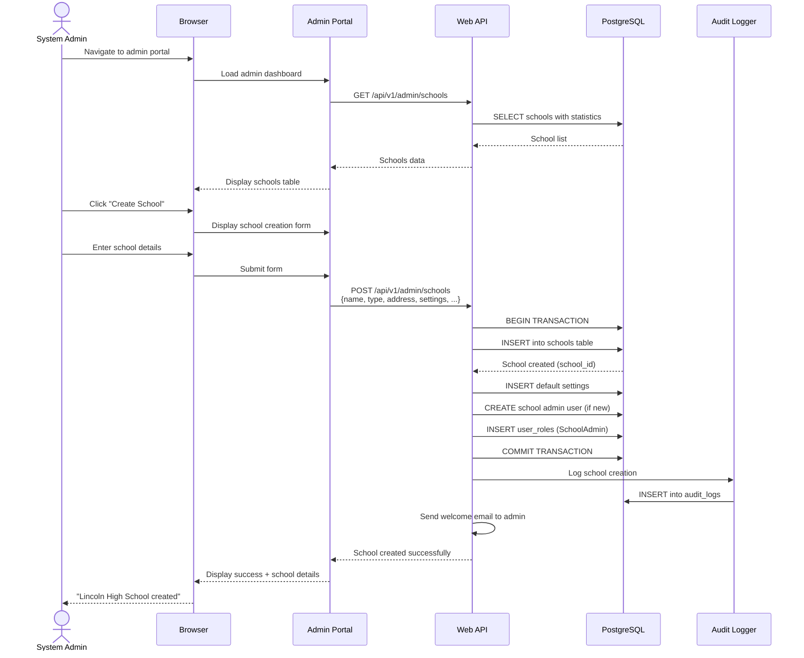
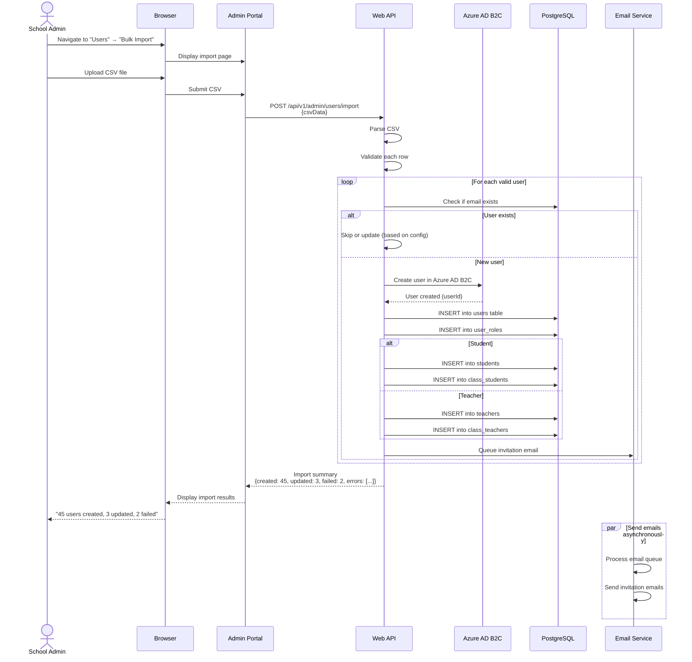
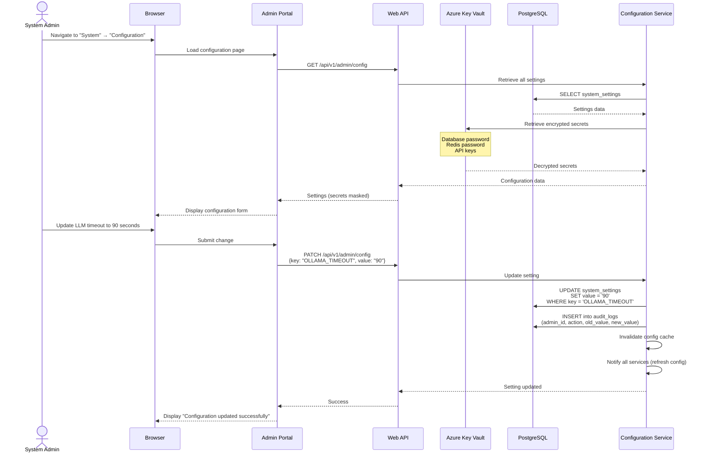
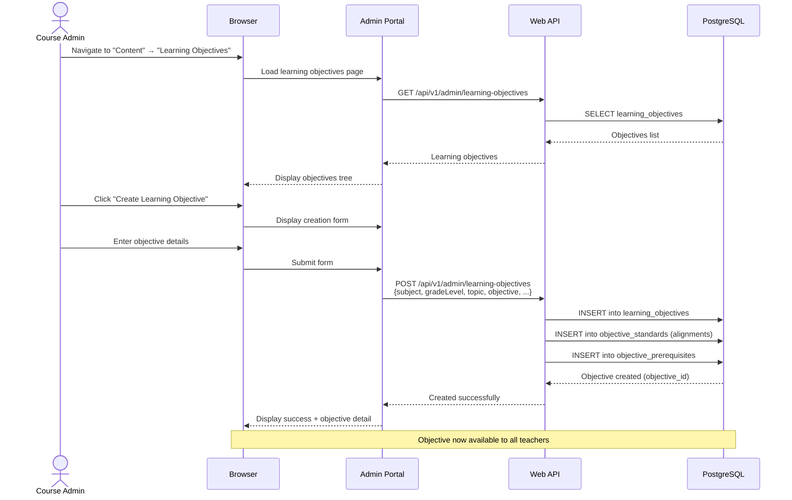
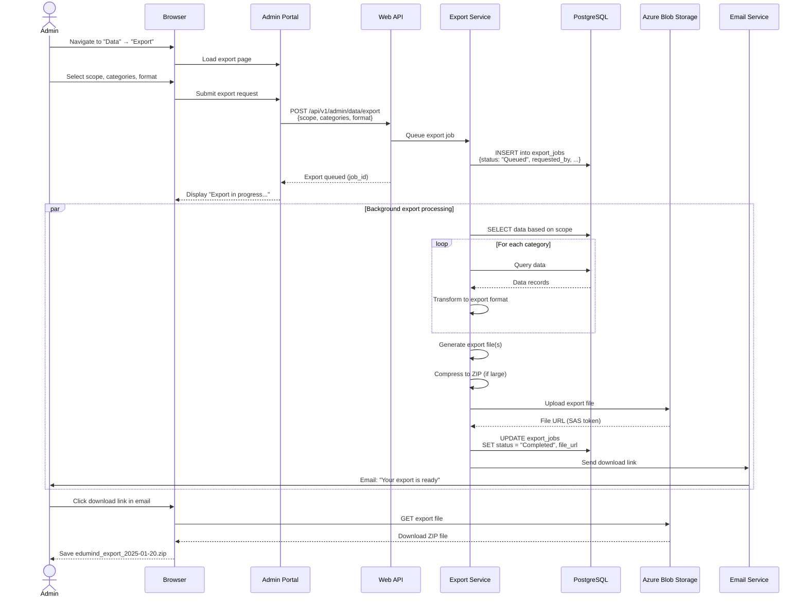
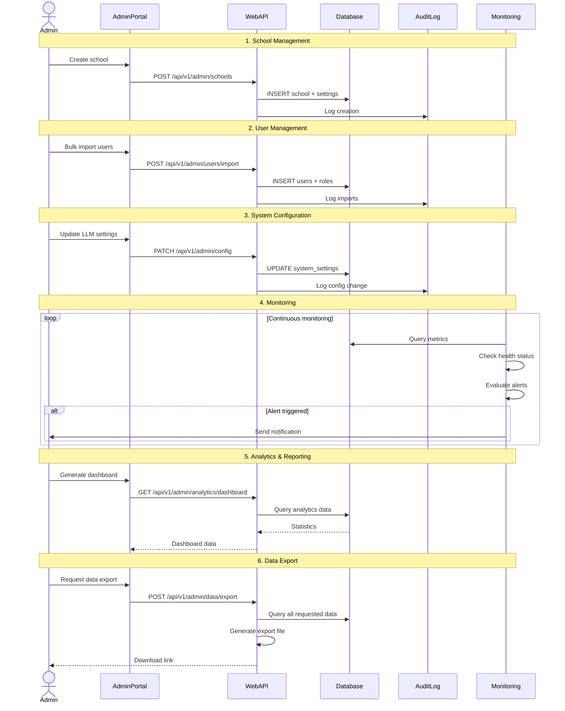

# Administrator Workflows

**Version:** 1.0  
**Last Updated:** 2025-01-20  
**Target Audience:** School Admins, System Admins, Business Admins

## Table of Contents

- [Overview](#overview)
- [1. School and Organization Management](#1-school-and-organization-management)
- [2. User Management and Access Control](#2-user-management-and-access-control)
- [3. System Configuration](#3-system-configuration)
- [4. School-Wide Analytics Dashboard](#4-school-wide-analytics-dashboard)
- [5. Content and Curriculum Management](#5-content-and-curriculum-management)
- [6. System Monitoring and Health](#6-system-monitoring-and-health)
- [7. Data Export and Compliance](#7-data-export-and-compliance)
- [Sequence Diagrams](#sequence-diagrams)
- [User Interface Screenshots](#user-interface-screenshots)
- [Common Scenarios](#common-scenarios)
- [Troubleshooting](#troubleshooting)

---

## Overview

Administrators use EduMind.AI to manage schools, users, system configuration, and monitor platform health. Different admin roles have different capabilities:

**Admin Roles:**
- **School Admin**: Manages single school (students, teachers, classes, school-level settings)
- **System Admin**: Manages entire platform (all schools, system configuration, infrastructure)
- **Business Admin**: Analytics and reporting across all schools (no configuration changes)
- **Course Admin**: Manages curriculum and assessments across schools

**Key Admin Capabilities:**
- Create and manage schools/organizations
- Manage user accounts and permissions (RBAC)
- Configure system settings and feature flags
- Monitor platform health and performance
- Generate cross-school analytics reports
- Manage curriculum and learning objectives
- Export data for compliance and auditing
- Configure integrations (Azure AD B2C, OLLAMA, Redis, PostgreSQL)

---

## 1. School and Organization Management

### Workflow Steps

#### 1.1 Create New School

1. **Navigate to Schools Management**
   - Access admin portal: `https://edumind-admin.azurecontainerapps.io`
   - System Admin or Business Admin authentication
   - Navigate to "Schools" section

2. **Add School Details**
   - Click "Create School" button
   - Fill in school information:
     - **School Name**: "Lincoln High School"
     - **School Type**: Public, Private, Charter, International
     - **Address**: Street, city, state, zip code
     - **Contact Information**: Phone, email, website
     - **Time Zone**: For scheduling and reports
     - **Academic Calendar**: Start/end dates, holidays
     - **School Code**: Unique identifier (auto-generated or manual)
     - **Subscription Tier**: Free, Standard, Premium, Enterprise
     - **Max Students**: License capacity
     - **Max Teachers**: License capacity

3. **Configure School Settings**
   - **Grade Levels Offered**: Grade 6-12 (select applicable)
   - **Subjects Offered**: Mathematics, Physics, Chemistry, Biology, English
   - **Assessment Settings**:
     - Default time limits
     - Auto-grading enabled/disabled
     - LLM evaluation enabled/disabled
     - IRT adaptive assessments enabled/disabled
   - **Privacy Settings**:
     - K-anonymity threshold (default: 5)
     - Data retention period (default: 7 years)
     - Parent access enabled/disabled
   - **Notification Settings**:
     - Email notifications enabled
     - SMS notifications enabled (if configured)
     - Notification frequency (immediate, daily digest, weekly)

4. **Assign School Administrator**
   - Search for existing user or create new admin account
   - Assign "School Admin" role
   - Set permissions scope to this school only
   - Send welcome email with credentials

5. **Generate School Onboarding Package**
   - School admin guide (PDF)
   - Teacher invitation templates
   - Student enrollment instructions
   - Azure AD B2C tenant configuration (if needed)
   - API keys for integrations (if applicable)

#### 1.2 Manage Existing Schools

1. **View School List**
   - Table showing all schools with:
     - School name and code
     - Total students enrolled
     - Total teachers
     - Active assessments this month
     - Subscription tier and expiration
     - Status (Active, Inactive, Trial, Expired)

2. **School Detail View**
   - Click on school name
   - Overview dashboard:
     - Total users (students, teachers, admins)
     - Total classes created
     - Total assessments completed (this month/year)
     - Average student score (school-wide)
     - Storage used / quota
     - API calls used / quota
   - Quick actions:
     - Edit school details
     - Manage users
     - View analytics
     - Deactivate school
     - Export school data

3. **Edit School Settings**
   - Update any school configuration
   - Changes propagate to all users in school
   - Audit log records all changes with timestamp and admin user

4. **Deactivate/Delete School**
   - Deactivate: Users cannot login, data preserved
   - Delete: Permanently remove school and all data (after backup)
   - Confirmation required (type school name to confirm)
   - Grace period: 30 days to recover deleted school
   - After grace period: Data permanently deleted (GDPR compliance)

### Sequence Diagram



### Database Updates

**Schools Table:**
```sql
INSERT INTO schools (
    school_id,
    name,
    school_type,
    address,
    city,
    state,
    zip_code,
    phone,
    email,
    website,
    time_zone,
    subscription_tier,
    max_students,
    max_teachers,
    is_active,
    created_at,
    updated_at
) VALUES (
    gen_random_uuid(),
    'Lincoln High School',
    'Public',
    '123 Main Street',
    'Springfield',
    'IL',
    '62701',
    '217-555-1234',
    'admin@lincolnhs.edu',
    'https://lincolnhs.edu',
    'America/Chicago',
    'Standard',
    1000,
    50,
    true,
    NOW(),
    NOW()
);
```

**School_Settings Table:**
```sql
INSERT INTO school_settings (
    school_id,
    setting_key,
    setting_value,
    created_at
) VALUES
    ('school-guid', 'DefaultAssessmentTimeLimitMinutes', '45'),
    ('school-guid', 'AutoGradingEnabled', 'true'),
    ('school-guid', 'LLMEvaluationEnabled', 'true'),
    ('school-guid', 'KAnonymityThreshold', '5'),
    ('school-guid', 'DataRetentionYears', '7');
```

---

## 2. User Management and Access Control

### Workflow Steps

#### 2.1 Create User Accounts

1. **Bulk User Import**
   - Navigate to "Users" → "Bulk Import"
   - Download CSV template:
     - Columns: FirstName, LastName, Email, Role, SchoolCode, GradeLevel (students), Subject (teachers)
   - Fill in user data
   - Upload CSV file
   - System validates:
     - Email format
     - Role validity (Student, Teacher, SchoolAdmin, etc.)
     - School exists
     - No duplicate emails
   - Preview import results
   - Click "Import Users"
   - System creates accounts and sends invitation emails

2. **Single User Creation**
   - Click "Create User" button
   - Select user role: Student, Teacher, SchoolAdmin, CourseAdmin, SystemAdmin, BusinessAdmin
   - Fill in user details:
     - Full name
     - Email address
     - School assignment
     - Grade level (students) or subject specialization (teachers)
     - Initial password (auto-generated or manual)
   - Set account status: Active, Inactive, Suspended
   - Click "Create User"
   - Send invitation email with login instructions

#### 2.2 Manage User Permissions (RBAC)

1. **View User List**
   - Filter by:
     - Role (Student, Teacher, Admin)
     - School
     - Status (Active, Inactive, Suspended)
     - Last login date
   - Sort by: Name, Email, Role, Last Login
   - Search by name or email

2. **Edit User Roles and Permissions**
   - Click on user name
   - View current roles and permissions
   - **Role Management:**
     - Add role: Select from dropdown, set scope (school/system-wide)
     - Remove role: Click "X" on role badge
     - Change primary role
   - **Permission Overrides:**
     - Grant specific permissions beyond role default
     - Example: Teacher gets "CreateSchoolAdmin" permission
   - **Class Assignments** (Teachers):
     - Assign teacher to specific classes
     - Set as primary or co-teacher
   - **Multi-School Access** (Admins):
     - Grant access to multiple schools
     - Different roles per school possible

3. **Role-Based Access Control Matrix**

| Role | Can Access | Permissions |
|------|-----------|-------------|
| **Student** | Own data only | View assessments, take assessments, view results, view own analytics |
| **Teacher** | Students in their classes (same school) | All student permissions + create assessments, assign assessments, grade submissions, view class analytics |
| **School Admin** | All users in their school | All teacher permissions + manage users, manage classes, view school analytics, configure school settings |
| **Course Admin** | All students/teachers across schools | Create curriculum, manage assessments library, view cross-school analytics (no user management) |
| **Business Admin** | Read-only across all schools | View all analytics, generate reports, export data (no configuration changes) |
| **System Admin** | Everything | All permissions across all schools + system configuration, infrastructure management |

4. **Suspend or Deactivate Users**
   - **Suspend**: Temporary block (e.g., disciplinary action)
     - User cannot login
     - Data preserved
     - Can be reactivated
   - **Deactivate**: Soft delete
     - User cannot login
     - Data preserved (GDPR compliance)
     - Can be reactivated within 30 days
   - **Permanent Delete**: Hard delete
     - User and all associated data deleted
     - 30-day grace period before permanent deletion
     - Cannot be recovered after grace period

#### 2.3 Audit User Activity

1. **View User Activity Logs**
   - Navigate to "Audit Logs"
   - Filter by:
     - User ID or email
     - Date range
     - Action type (Login, CreateAssessment, GradeSubmission, etc.)
     - IP address
   - Display columns:
     - Timestamp
     - User (name, email, role)
     - Action performed
     - Resource affected (e.g., Assessment ID, Student ID)
     - IP address and user agent
     - Success/Failure status

2. **Security Monitoring**
   - Failed login attempts by user
   - Suspicious activity detection:
     - Multiple logins from different IP addresses
     - Unusual access patterns
     - Permission escalation attempts
   - Alert on suspicious activity
   - Export logs for security analysis

### Sequence Diagram



### Database Updates

**Users Table:**
```sql
INSERT INTO users (
    user_id,
    azure_ad_user_id,
    email,
    first_name,
    last_name,
    is_active,
    created_at,
    updated_at
) VALUES (
    gen_random_uuid(),
    'azure-ad-object-id',
    'john.doe@lincolnhs.edu',
    'John',
    'Doe',
    true,
    NOW(),
    NOW()
);
```

**User_Roles Table (RBAC):**
```sql
INSERT INTO user_roles (
    user_id,
    role,
    school_id,
    granted_by,
    granted_at
) VALUES (
    'user-guid',
    'Teacher',
    'school-guid',
    'admin-guid',
    NOW()
);
```

---

## 3. System Configuration

### Workflow Steps

#### 3.1 Application Settings

1. **General Settings**
   - Navigate to "System" → "Configuration"
   - **Application Settings:**
     - Application name and logo
     - Support email and phone
     - Time zone (default)
     - Language (default)
     - Date/time format
   
2. **Feature Flags**
   - Enable/disable features globally or per school:
     - ✅ Adaptive assessments (IRT-based)
     - ✅ LLM essay grading
     - ✅ Coding question execution
     - ✅ Peer comparison (k-anonymity)
     - ✅ Real-time progress monitoring (SignalR)
     - ✅ Multi-agent orchestration
     - ❌ Video question type (future feature)
     - ❌ Speech-to-text responses (future feature)

3. **Assessment Configuration**
   - **Default Settings:**
     - Default time limit: 45 minutes
     - Auto-save interval: 30 seconds
     - Session timeout: 4 hours
     - Max concurrent sessions per student: 1
   - **Scoring Settings:**
     - Partial credit enabled: Yes/No
     - Negative marking enabled: Yes/No
     - Rounding method: Round up, Round down, Round to nearest
   - **IRT Parameters:**
     - Initial ability estimate: 0.0
     - Difficulty range: -3 to +3
     - Convergence threshold: 0.1

4. **LLM Configuration**
   - **OLLAMA Settings:**
     - Model name: llama3.2:3b
     - API endpoint: http://ollama:11434
     - Timeout: 60 seconds
     - Max retries: 3
     - Temperature: 0.7 (creativity/randomness)
     - Max tokens: 2000
   - **Grading Thresholds:**
     - Auto-approve LLM scores: 70-85% range
     - Flag for review: < 70% or > 85%
     - Minimum confidence: 0.8

#### 3.2 Integration Configuration

1. **Azure AD B2C Settings**
   - Navigate to "Integrations" → "Azure AD B2C"
   - **Tenant Configuration:**
     - Tenant name: edumindai.onmicrosoft.com
     - Client ID: Application ID from Azure portal
     - Client secret: Encrypted secret
     - Authority: https://edumindai.b2clogin.com/edumindai.onmicrosoft.com
     - User flow: B2C_1_signin_signup
   - **Claims Mapping:**
     - Email claim: emails[0]
     - Name claim: displayName
     - Role claim: extension_Role
   - Test connection button

2. **Database Configuration**
   - **PostgreSQL Settings:**
     - Host: postgresql-server.postgres.database.azure.com
     - Port: 5432
     - Database: edumind_prod
     - Username: edumind_admin
     - Password: (encrypted, retrieve from Key Vault)
     - Connection pool size: 100
     - Connection timeout: 30 seconds
     - Command timeout: 60 seconds
   - **Connection Health:**
     - Test connection button
     - Display current connections: 45 / 100
     - Average query time: 125ms

3. **Redis Cache Configuration**
   - **Redis Settings:**
     - Host: edumind-cache.redis.cache.windows.net
     - Port: 6380
     - SSL enabled: Yes
     - Password: (encrypted, retrieve from Key Vault)
     - Database index: 0
     - Connection timeout: 5 seconds
   - **Cache Policies:**
     - Session cache TTL: 4 hours
     - Analytics cache TTL: 15 minutes
     - Assessment cache TTL: 1 hour
   - Test connection button

4. **Email Service Configuration**
   - **SMTP Settings:**
     - Provider: SendGrid, AWS SES, Azure Communication Services
     - API key: (encrypted)
     - From address: noreply@edumind.ai
     - From name: EduMind.AI
     - Reply-to address: support@edumind.ai
   - **Email Templates:**
     - Welcome email
     - Password reset
     - Assessment assigned
     - Assessment reminder
     - Grading notification
   - Send test email button

#### 3.3 Security Settings

1. **Password Policies**
   - Minimum length: 8 characters
   - Require uppercase: Yes/No
   - Require lowercase: Yes/No
   - Require digits: Yes/No
   - Require special characters: Yes/No
   - Password expiration: 90 days, Never
   - Password history: Cannot reuse last 5 passwords

2. **Session Management**
   - Session timeout: 30 minutes of inactivity
   - Maximum concurrent sessions: 3 per user
   - Remember me duration: 30 days
   - Force logout on password change: Yes/No

3. **Rate Limiting**
   - API rate limits per user:
     - Students: 100 requests/minute
     - Teachers: 200 requests/minute
     - Admins: 500 requests/minute
   - Login attempts: 5 per 15 minutes
   - Assessment submission rate: 1 per 30 seconds

4. **Data Encryption**
   - Encryption at rest: AES-256 (Azure Storage Service Encryption)
   - Encryption in transit: TLS 1.3
   - Database encryption: Transparent Data Encryption (TDE)
   - Key management: Azure Key Vault
   - Key rotation: Automatic every 90 days

### Sequence Diagram



---

## 4. School-Wide Analytics Dashboard

### Workflow Steps

#### 4.1 Executive Dashboard

1. **Navigate to Analytics Dashboard**
   - Access: "Analytics" → "Dashboard"
   - Select scope:
     - Single school (School Admins)
     - All schools (System/Business Admins)
     - Multiple schools (select from list)
   - Select date range: Last 7 days, 30 days, 90 days, 1 year, Custom

2. **Key Performance Indicators (KPIs)**
   - **Usage Metrics:**
     - Total active users: 12,450 (↑ 8% from last month)
     - Total assessments completed: 3,275 (this month)
     - Average assessments per student: 2.7
     - Total time spent: 18,500 hours
   
   - **Performance Metrics:**
     - Average student score: 74.5%
     - Overall mastery level: 0.68
     - Completion rate: 87% (assigned vs. submitted)
     - Average assessment duration: 38 minutes
   
   - **System Health:**
     - API uptime: 99.97%
     - Average API response time: 245ms
     - Database query time: 85ms
     - Cache hit rate: 92%

3. **Visualizations**
   - **Assessment Activity Over Time:**
     - Line chart: Assessments per day/week/month
     - Compare to previous period
   
   - **Score Distribution:**
     - Histogram: Number of students by score ranges
     - 0-59%: 150 students (failing)
     - 60-69%: 320 students (passing)
     - 70-79%: 580 students (proficient)
     - 80-89%: 420 students (advanced)
     - 90-100%: 130 students (excellent)
   
   - **Subject Performance:**
     - Bar chart: Average scores by subject
     - Mathematics: 78.2%
     - Physics: 72.5%
     - Chemistry: 75.8%
     - Biology: 71.3%
     - English: 76.9%
   
   - **Engagement Metrics:**
     - Daily active users (DAU)
     - Weekly active users (WAU)
     - Monthly active users (MAU)
     - DAU/MAU ratio: 0.42 (healthy engagement)

#### 4.2 Detailed Analytics Reports

1. **School Comparison Report**
   - Compare multiple schools side-by-side
   - Metrics:
     - Average scores
     - Completion rates
     - Student growth rates
     - Teacher effectiveness (based on student performance)
   - Sort by metric (identify top/bottom performers)
   - Filter by: School type, Size, Location, Subscription tier

2. **Teacher Effectiveness Report**
   - For each teacher, display:
     - Number of classes taught
     - Number of students
     - Average student score in their classes
     - Student growth rate (compared to initial diagnostic)
     - Assessment creation count
     - Grading turnaround time
   - Identify top performers
   - Identify teachers needing support

3. **Student Cohort Analysis**
   - Group students by:
     - Grade level
     - Initial ability estimate
     - Enrollment date
   - Track cohort performance over time
   - Identify trends and patterns
   - Measure impact of interventions

4. **Learning Objective Mastery**
   - Heatmap: Learning objectives vs. Schools
   - Identify objectives with:
     - High mastery across all schools (well-taught)
     - Low mastery across all schools (curriculum issue)
     - High variance (teaching quality issue)
   - Drill down to specific schools or classes

#### 4.3 Predictive Analytics

1. **At-Risk Student Identification**
   - Machine learning model predicts:
     - Students likely to fail next assessment
     - Students likely to drop out
     - Students needing intervention
   - Factors considered:
     - Recent performance trends
     - Attendance/engagement
     - Time spent on assessments
     - Comparison to peers
   - Generate at-risk student list with confidence scores
   - Recommended interventions

2. **Resource Utilization Forecasting**
   - Predict future resource needs:
     - Storage capacity (database, file storage)
     - API capacity (requests per second)
     - LLM capacity (concurrent evaluations)
     - User license needs
   - Alert when approaching capacity limits
   - Recommend scaling actions

### API Calls

**Get Executive Dashboard:**
```http
GET /api/v1/admin/analytics/dashboard?schoolIds=school1,school2&dateRange=2025-01-01,2025-01-31
Authorization: Bearer {jwt-token}
```

**Get School Comparison:**
```http
GET /api/v1/admin/analytics/schools/compare?schoolIds=school1,school2,school3&metrics=averageScore,completionRate,growthRate
Authorization: Bearer {jwt-token}
```

---

## 5. Content and Curriculum Management

### Workflow Steps

#### 5.1 Learning Objectives Library

1. **Navigate to Curriculum Management**
   - Access: "Content" → "Learning Objectives"
   - View library of learning objectives
   - Organized by:
     - Subject (Mathematics, Physics, etc.)
     - Grade level
     - Topic/chapter
     - Standard alignment (Common Core, Next Gen Science, etc.)

2. **Create Learning Objective**
   - Click "Create Learning Objective"
   - Fill in details:
     - **Subject**: Mathematics
     - **Grade Level**: Grade 10
     - **Topic**: Algebra
     - **Learning Objective**: "Solve quadratic equations using the quadratic formula"
     - **Description**: Full explanation
     - **Standard Alignment**: CCSS.MATH.CONTENT.HSA.REI.B.4
     - **Cognitive Level**: Remember, Understand, Apply, Analyze, Evaluate, Create (Bloom's Taxonomy)
   - Add prerequisite learning objectives
   - Add related learning objectives
   - Click "Save"

3. **Tag Assessments with Learning Objectives**
   - When teachers create questions, they tag with learning objectives
   - System tracks mastery per learning objective per student
   - Enables mastery-based progression

#### 5.2 Assessment Template Library

1. **Create Template Assessments**
   - Course admins create template assessments
   - Templates available across all schools
   - Teachers can:
     - Use templates as-is
     - Duplicate and customize
     - Mix questions from multiple templates
   
2. **Template Categories**
   - Diagnostic assessments (baseline ability)
   - Practice assessments (formative)
   - Summative assessments (end-of-unit)
   - Benchmark assessments (quarterly)
   - State test prep (standardized test format)

3. **Quality Assurance**
   - Templates reviewed by curriculum team
   - Peer review by other course admins
   - Pilot testing with sample schools
   - Continuous improvement based on analytics

#### 5.3 Question Bank Management

1. **Centralized Question Repository**
   - All questions across all schools stored centrally
   - Teachers can search and reuse questions
   - Filter by:
     - Subject, grade level, topic
     - Question type
     - Difficulty (IRT parameter)
     - Learning objective
     - Usage count, average score

2. **Question Analytics**
   - For each question, track:
     - Times used across all assessments
     - Average score
     - Discrimination index (IRT)
     - Common wrong answers
     - Average time to answer
   - Identify high-quality questions (reuse)
   - Identify problematic questions (revise or retire)

3. **Collaborative Question Creation**
   - Teachers can submit questions to central bank
   - Review and approval process
   - Credit to question author
   - Royalty/incentive system (optional)

### Sequence Diagram



---

## 6. System Monitoring and Health

### Workflow Steps

#### 6.1 Infrastructure Monitoring

1. **Navigate to System Health**
   - Access: "System" → "Health & Monitoring"
   - Display real-time system status

2. **Service Health Checks**
   - **Web API:**
     - Status: ✅ Healthy
     - Uptime: 99.97% (last 30 days)
     - Current requests/sec: 245
     - Average response time: 125ms
     - Error rate: 0.03%
   
   - **Database (PostgreSQL):**
     - Status: ✅ Healthy
     - Current connections: 45 / 100
     - Average query time: 85ms
     - Slow queries (>1s): 2 in last hour
     - Database size: 45 GB / 100 GB
   
   - **Cache (Redis):**
     - Status: ⚠️ Degraded (high latency)
     - Hit rate: 87%
     - Memory used: 3.2 GB / 4 GB
     - Evictions: 125 in last hour
     - Average latency: 15ms
   
   - **LLM Service (OLLAMA):**
     - Status: ✅ Healthy
     - Concurrent requests: 8 / 20
     - Average evaluation time: 22 seconds
     - Queue depth: 12
     - Success rate: 98.5%
   
   - **Agent Orchestrator:**
     - Status: ✅ Healthy
     - Active workflows: 15
     - Completed workflows (today): 234
     - Failed workflows (today): 3
     - Average workflow duration: 45 seconds

3. **Infrastructure Metrics**
   - **Azure Container Apps:**
     - CPU usage: 45% (target: <80%)
     - Memory usage: 3.2 GB / 8 GB
     - Replica count: 3 / 10 (auto-scale)
     - HTTP requests: 245 req/sec
   
   - **Azure Database for PostgreSQL:**
     - CPU: 35%
     - Memory: 62%
     - Storage: 45 GB / 100 GB
     - IOPS: 1,250 / 3,200
     - Backup status: ✅ Last backup 2 hours ago
   
   - **Azure Cache for Redis:**
     - CPU: 55%
     - Memory: 80% (approaching limit)
     - Bandwidth: 125 Mbps / 500 Mbps
     - Connections: 450 / 1000

4. **Alerts and Notifications**
   - Configure alerts for:
     - Service downtime
     - High error rates (>1%)
     - Slow response times (>2s)
     - Resource limits approaching (>80%)
     - Database connection pool exhaustion
     - Cache memory full
   - Alert channels:
     - Email to admin team
     - SMS to on-call engineer
     - PagerDuty/OpsGenie integration
     - Slack/Teams webhook

#### 6.2 Application Logs

1. **View Logs**
   - Navigate to "System" → "Logs"
   - Display logs from all services:
     - Web API
     - Agent Orchestrator
     - Background jobs
   - Filter by:
     - Log level: Debug, Info, Warning, Error, Critical
     - Service name
     - Date/time range
     - User ID
     - Correlation ID (trace requests across services)
   - Search by keyword or error message

2. **Error Dashboard**
   - Display recent errors (last 24 hours)
   - Group by error type
   - Show error count and affected users
   - Drill down to specific error instances
   - View stack traces and context

3. **OpenTelemetry Tracing**
   - Distributed tracing across services
   - View request flow:
     - Client request → Web API → Database → Cache → LLM
   - Identify bottlenecks (slow spans)
   - Correlate logs, metrics, and traces

#### 6.3 Performance Monitoring

1. **API Performance**
   - Endpoint-level metrics:
     - Request count
     - Average response time
     - 95th percentile response time
     - 99th percentile response time
     - Error rate
   - Identify slow endpoints
   - Analyze query performance (database)

2. **Database Performance**
   - Slow query log
   - Query execution plans
   - Index usage statistics
   - Lock contention monitoring
   - Recommend optimizations (missing indexes, query rewrites)

3. **Cache Performance**
   - Hit/miss ratio by cache key pattern
   - Eviction rate
   - Memory usage trends
   - Recommend cache tuning (TTL adjustments, capacity increase)

### API Calls

**Get System Health:**
```http
GET /api/v1/admin/health/system
Authorization: Bearer {jwt-token}
```

**Get Application Logs:**
```http
GET /api/v1/admin/logs?level=Error&startDate=2025-01-20&endDate=2025-01-21&service=WebAPI
Authorization: Bearer {jwt-token}
```

---

## 7. Data Export and Compliance

### Workflow Steps

#### 7.1 Data Export

1. **Navigate to Data Export**
   - Access: "Data" → "Export"
   - Select export scope:
     - Single school
     - Multiple schools
     - All schools
     - Single student (GDPR right to data portability)

2. **Select Data Categories**
   - ☑️ User accounts (students, teachers, admins)
   - ☑️ Classes and enrollments
   - ☑️ Assessments and questions
   - ☑️ Student responses and scores
   - ☑️ Analytics and reports
   - ☑️ Audit logs
   - ☐ System logs (admin only)

3. **Configure Export Format**
   - Format options:
     - CSV (compatible with Excel, gradebooks)
     - JSON (developer-friendly)
     - Excel workbook (.xlsx) with multiple sheets
     - PDF reports (human-readable)
   - Compression: ZIP archive (if large dataset)

4. **Schedule and Execute Export**
   - Export now (immediate)
   - Schedule export (daily, weekly, monthly)
   - Email download link when ready
   - Download from portal (expires after 7 days)

5. **Automated Backups**
   - Daily automated backups to Azure Blob Storage
   - Retention: 30 days (rolling)
   - Encrypted at rest (AES-256)
   - Point-in-time restore (for disaster recovery)

#### 7.2 GDPR Compliance

1. **Right to Access (Data Subject Access Request)**
   - Navigate to "Compliance" → "GDPR Requests"
   - Click "Create DSAR"
   - Enter student email or ID
   - System generates complete data export:
     - Personal information
     - Assessment history
     - Responses and scores
     - Analytics data
     - Audit logs (where student is subject)
   - Deliver within 30 days (GDPR requirement)

2. **Right to Erasure (Right to be Forgotten)**
   - Student or parent requests data deletion
   - Admin initiates deletion workflow:
     - Mark student account for deletion
     - 30-day grace period (can be recovered)
     - After grace period:
       - Anonymize student data (preserve analytics)
       - Delete PII (name, email, date of birth)
       - Preserve assessment metadata (for IRT calibration)
   - Generate deletion certificate (proof of compliance)

3. **Right to Rectification**
   - Student requests correction of inaccurate data
   - Admin updates student profile
   - Audit log records change (who, what, when)
   - Notify student of correction

4. **Data Minimization**
   - Automatically delete old data based on retention policies:
     - Student responses: 7 years (education records retention)
     - Audit logs: 7 years (legal requirement)
     - Session data: 1 year (operational data)
     - Cached data: 4 hours (Redis TTL)
   - Annual data audit to identify unnecessary data

5. **Consent Management**
   - Track parent consent for minors (<13 years old)
   - Consent types:
     - Platform usage
     - Data processing
     - Third-party integrations (e.g., LLM evaluation)
     - Marketing communications
   - Withdraw consent mechanism
   - Consent audit trail

#### 7.3 Compliance Reporting

1. **Generate Compliance Reports**
   - Data processing activities report
   - User access report (who accessed what data)
   - Data breach notification log (if any)
   - Third-party data sharing agreements
   - Data retention and deletion report

2. **Audit Readiness**
   - Maintain documentation:
     - Privacy policy
     - Terms of service
     - Data processing agreements (DPAs)
     - Security policies
     - Incident response plan
   - Annual compliance review
   - Third-party security audits (SOC 2, ISO 27001)

### Sequence Diagram



---

## Sequence Diagrams

### Complete Admin Workflow



---

## User Interface Screenshots

(Screenshots would be inserted here showing actual UI components)

**Key Screens:**
1. Admin dashboard with system overview
2. School management table
3. User management with RBAC matrix
4. System configuration panel
5. Analytics dashboard with charts
6. Infrastructure monitoring page
7. Application logs viewer
8. Data export wizard
9. GDPR compliance tools

---

## Common Scenarios

### Scenario 1: School Exceeds License Capacity

**Problem:** School tries to add 51st teacher (license limit: 50)

**System Behavior:**
1. Display error: "License capacity exceeded. Current limit: 50 teachers"
2. Options:
   - Contact sales to upgrade license
   - Deactivate inactive teachers to free capacity
   - Temporarily grant grace period (admin override)
3. Admin can view license usage dashboard
4. Proactive alert when approaching 90% capacity

---

### Scenario 2: Database Connection Pool Exhausted

**Problem:** High traffic causes connection pool saturation

**System Monitoring:**
1. Alert triggered: "Database connection pool 95% utilized"
2. Admin notified via email/SMS
3. Dashboard shows: 95 / 100 connections in use
4. Identify slow queries holding connections
5. Admin actions:
   - Temporarily increase pool size (config change)
   - Kill long-running queries (if stuck)
   - Scale up database tier (more capacity)
   - Investigate application connection leaks

---

### Scenario 3: GDPR Data Deletion Request

**Problem:** Parent requests child's data be deleted

**Admin Workflow:**
1. Navigate to "Compliance" → "GDPR Requests"
2. Create deletion request for student
3. System marks student for deletion (30-day grace period)
4. Student cannot login during grace period
5. After 30 days:
   - Anonymize student identity (replace name with "Student_12345")
   - Delete PII (email, date of birth, address)
   - Preserve assessment data for analytics (anonymous)
6. Generate deletion certificate
7. Email certificate to parent as proof of compliance

---

### Scenario 4: Migrating School to New Subscription Tier

**Problem:** School upgrades from Standard to Premium tier

**Admin Actions:**
1. Navigate to school details page
2. Click "Change Subscription Tier"
3. Select "Premium" tier
4. Review new features enabled:
   - Increased student capacity: 1000 → 5000
   - Increased teacher capacity: 50 → 250
   - Advanced analytics unlocked
   - Priority support enabled
   - Custom branding allowed
5. Confirm upgrade
6. System applies changes immediately
7. School admin receives welcome email with new features guide
8. Invoice generated for billing (if applicable)

---

## Troubleshooting

### Issue: Unable to access admin portal

**Cause:** Insufficient permissions or IP restriction

**Solution:**
1. Verify user has admin role (SchoolAdmin, SystemAdmin, or BusinessAdmin)
2. Check IP whitelist (if configured)
3. Verify Azure AD B2C authentication successful
4. Check audit logs for failed login attempts
5. Contact system administrator if persistent

---

### Issue: Bulk user import fails for entire file

**Cause:** CSV format error or validation failure

**Solution:**
1. Download error report
2. Common issues:
   - Wrong CSV format (use UTF-8 encoding)
   - Missing required columns (FirstName, LastName, Email, Role)
   - Invalid email formats
   - Duplicate emails (already in system)
   - Invalid role names
3. Fix CSV and re-upload
4. Use import preview to validate before committing

---

### Issue: Analytics dashboard loading slowly

**Cause:** Large dataset or inefficient query

**Solution:**
1. Check database query performance (slow query log)
2. Reduce date range (query less data)
3. Enable query caching (Redis)
4. Pre-aggregate data (materialized views)
5. Optimize database indexes
6. Consider data archival for old data

---

### Issue: High Redis memory usage causing evictions

**Cause:** Cache size too small for workload

**Solution:**
1. Increase Redis cache tier (more memory)
2. Reduce cache TTLs (expire data faster)
3. Implement cache key eviction policy (LRU)
4. Review cache usage patterns (identify large keys)
5. Consider partitioning cache (separate databases for different purposes)

---

## Related Documentation

- **System Architecture**: `.github/specification/02-system-architecture.md`
- **Security & Privacy**: `.github/specification/07-security-privacy.md`
- **Observability**: `.github/specification/08-observability.md`
- **Student Analytics API**: `.github/specification/10b-student-analytics-api.md`
- **System Health API**: `.github/specification/10c-system-health-api.md`
- **Data Storage**: `.github/specification/05-data-storage.md`

---

**Document Status:** Complete  
**Last Updated:** 2025-01-20  
**Version:** 1.0  
**Contributors:** GitHub Copilot
