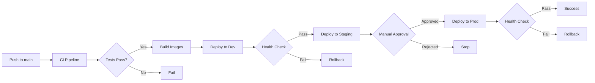

# Deployment Models and Configuration

**Version:** 1.0  
**Last Updated:** 2025-01-20  
**Target Audience:** DevOps Engineers, System Administrators, Developers

## Table of Contents

- [Overview](#overview)
- [Local Development Deployment](#local-development-deployment)
- [Azure Cloud Deployment](#azure-cloud-deployment)
- [CI/CD Pipeline](#cicd-pipeline)
- [Environment Configuration](#environment-configuration)
- [Migration Strategy](#migration-strategy)
- [Monitoring and Observability](#monitoring-and-observability)
- [Disaster Recovery](#disaster-recovery)
- [Troubleshooting](#troubleshooting)

---

## Overview

EduMind.AI supports three primary deployment models, each optimized for different stages of development and scale:

| Deployment Model | Purpose | Technology | Cost | Complexity |
|------------------|---------|------------|------|------------|
| **Local Development** | Developer workstation | .NET Aspire + Docker | Free | Low |
| **Azure Container Apps** | Production (small-medium scale) | Azure PaaS | $575-$4,400/month | Medium |
| **Azure Kubernetes Service** | Production (large scale) | Kubernetes | $10,000+/month | High |

**Recommended Path:**

1. **Start**: Local development with .NET Aspire
2. **Production (< 10K users)**: Azure Container Apps
3. **Scale (10K+ users)**: Migrate to AKS if needed

---

## Local Development Deployment

### Prerequisites

**Required Software:**

- ✅ .NET 9.0 SDK (version 9.0.306 or later)
- ✅ Docker Desktop (for containers)
- ✅ Visual Studio Code or Visual Studio 2022 (17.12+)
- ✅ Azure CLI (optional, for cloud deployments)
- ✅ Git (for source control)

**System Requirements:**

- **CPU**: 4+ cores (8+ recommended)
- **Memory**: 8 GB minimum (16 GB recommended)
- **Disk**: 20 GB free space
- **OS**: Windows 10/11, macOS, or Linux

### .NET Aspire Orchestration

#### What is .NET Aspire?

.NET Aspire is a cloud-native application stack for building distributed applications. It provides:

- **Service Orchestration**: Run multiple services with one command
- **Service Discovery**: Automatic connection string management
- **Observability**: Built-in telemetry, tracing, and logging
- **Developer Dashboard**: Unified view of all services at `https://localhost:15888`

#### Architecture

```
EduMind.AppHost (Orchestrator)
├── PostgreSQL Container (Database)
├── Redis Container (Cache)
├── OLLAMA Container (LLM, optional)
├── AcademicAssessment.Web (REST API)
├── AcademicAssessment.Dashboard (Admin Blazor)
└── AcademicAssessment.StudentApp (Student Blazor)
```

#### Setup Instructions

**1. Clone Repository:**

```bash
git clone https://github.com/johnazariah/edumind-ai.git
cd edumind-ai
```

**2. Install .NET 9 SDK:**

```bash
# Check current version
dotnet --version

# If not 9.0.x, download from:
# https://dotnet.microsoft.com/download/dotnet/9.0
```

**3. Start Docker Desktop:**

```bash
# Ensure Docker is running
docker --version

# Docker Desktop must be running for containers
```

**4. Run Aspire AppHost:**

```bash
# Start all services with Aspire
dotnet run --project src/EduMind.AppHost

# Output:
# Building...
# info: Aspire.Hosting.DistributedApplication[0]
#       Aspire version: 9.5.1+a6e341edbcf6d1cd578f5c8e6e2097befefe4a76
# info: Aspire.Hosting.DistributedApplication[0]
#       Distributed application starting.
# info: Aspire.Hosting.DistributedApplication[0]
#       Application host directory is: /workspaces/edumind-ai/src/EduMind.AppHost
# info: Aspire.Hosting.DistributedApplication[0]
#       Now listening on: https://localhost:15888
# info: Aspire.Hosting.DistributedApplication[0]
#       Aspire Dashboard URL: https://localhost:15888
```

**5. Access Aspire Dashboard:**

- Open browser: `https://localhost:15888`
- View all services, logs, traces, and metrics in one place

**6. Access Applications:**

- **Web API**: `http://localhost:5103`
- **Student App**: `http://localhost:5000`
- **Dashboard**: `http://localhost:5200`
- **Health Check**: `http://localhost:5103/health`

#### Service Configuration

**AppHost/Program.cs:**

```csharp
var builder = DistributedApplication.CreateBuilder(args);

// Infrastructure
var postgres = builder.AddPostgres("postgres")
    .WithImage("postgres", "16")
    .WithEnvironment("POSTGRES_DB", "edumind_dev")
    .WithPgAdmin()  // Optional: PgAdmin UI at http://localhost:5050
    .AddDatabase("edumind");

var redis = builder.AddRedis("cache")
    .WithImage("redis", "7")
    .WithRedisCommander();  // Optional: Redis UI at http://localhost:8081

// OLLAMA (optional for LLM features)
var ollama = builder.AddContainer("ollama", "ollama/ollama")
    .WithBindMount("./ollama-data", "/root/.ollama")
    .WithHttpEndpoint(port: 11434, targetPort: 11434, name: "ollama");

// Applications
var api = builder.AddProject<Projects.AcademicAssessment_Web>("api")
    .WithReference(postgres)
    .WithReference(redis)
    .WithReference(ollama)
    .WithHttpEndpoint(port: 5103);

var dashboard = builder.AddProject<Projects.AcademicAssessment_Dashboard>("dashboard")
    .WithReference(api)
    .WithHttpEndpoint(port: 5200);

var studentApp = builder.AddProject<Projects.AcademicAssessment_StudentApp>("student-app")
    .WithReference(api)
    .WithHttpEndpoint(port: 5000);

builder.Build().Run();
```

#### Automatic Configuration

**Connection Strings (Automatically Injected):**

```json
{
  "ConnectionStrings": {
    "edumind": "Host=localhost;Port=5432;Database=edumind_dev;Username=postgres;Password=***",
    "cache": "localhost:6379"
  },
  "OLLAMA__Endpoint": "http://localhost:11434"
}
```

**No manual configuration needed!** Aspire injects these via environment variables.

#### Development Workflow

**Daily Development:**

```bash
# Start everything
dotnet run --project src/EduMind.AppHost

# Make code changes (hot reload enabled)
# Test in browser
# Check logs in Aspire Dashboard
# Stop with Ctrl+C
```

**Database Migrations:**

```bash
# Create migration
dotnet ef migrations add MigrationName \
  --project src/AcademicAssessment.Infrastructure \
  --startup-project src/EduMind.AppHost

# Apply migration
dotnet ef database update \
  --project src/AcademicAssessment.Infrastructure \
  --startup-project src/EduMind.AppHost
```

**Run Tests:**

```bash
# Unit tests
dotnet test tests/AcademicAssessment.Tests.Unit

# Integration tests (starts TestContainers automatically)
dotnet test tests/AcademicAssessment.Tests.Integration
```

---

## Azure Cloud Deployment

### Architecture Overview

**Production Architecture (Azure Container Apps):**

```
Azure Front Door (Global Load Balancer)
    │
    ├─ Public Endpoint → Student App (Container App)
    │       │
    │       └─ Calls → Web API (Container App)
    │                    │
    │                    ├─ PostgreSQL (Azure Database)
    │                    ├─ Redis (Azure Cache)
    │                    └─ OLLAMA (Container App)
    │
    └─ Private Endpoint → Dashboard (Container App)
                              │
                              └─ Calls → Web API

All services:
    ├─ Application Insights (Monitoring)
    ├─ Azure Monitor (Logs & Metrics)
    ├─ Key Vault (Secrets)
    └─ Virtual Network (Security)
```

### Deployment Options

#### Option 1: Azure Developer CLI (azd) - Recommended

**Automated deployment with Azure Developer CLI:**

```bash
# 1. Install azd
curl -fsSL https://aka.ms/install-azd.sh | bash

# 2. Login to Azure
azd auth login

# 3. Initialize project
azd init

# 4. Provision infrastructure and deploy
azd up

# Follow prompts:
# - Environment name: edumind-dev
# - Azure subscription: Select from list
# - Azure location: eastus

# Output:
# - Resource group created: rg-edumind-dev
# - Container Apps environment created
# - PostgreSQL Flexible Server created
# - Redis Cache created
# - All apps deployed and running

# 5. View deployment
azd show

# 6. Open in browser
azd browse
```

**What `azd up` creates:**

- **Resource Group**: `rg-edumind-{env}`
- **Container Apps Environment**: `cae-edumind-{env}`
- **Container Apps**:
  - `ca-api-{env}` (Web API)
  - `ca-dashboard-{env}` (Admin Dashboard)
  - `ca-student-{env}` (Student App)
  - `ca-ollama-{env}` (LLM Service)
- **PostgreSQL Flexible Server**: `psql-edumind-{env}`
- **Redis Cache**: `redis-edumind-{env}`
- **Application Insights**: `appi-edumind-{env}`
- **Log Analytics Workspace**: `log-edumind-{env}`
- **Key Vault**: `kv-edumind-{env}`

#### Option 2: Manual Bicep Deployment

**For advanced scenarios or custom configurations:**

```bash
# 1. Review Bicep templates
cat infra/main.bicep
cat infra/resources.bicep

# 2. Create parameters file
cat > infra/main.parameters.json <<EOF
{
  "$schema": "https://schema.management.azure.com/schemas/2019-04-01/deploymentParameters.json#",
  "contentVersion": "1.0.0.0",
  "parameters": {
    "environmentName": { "value": "dev" },
    "location": { "value": "eastus" },
    "principalId": { "value": "YOUR_AZURE_AD_OBJECT_ID" }
  }
}
EOF

# 3. Deploy infrastructure
az deployment sub create \
  --location eastus \
  --template-file infra/main.bicep \
  --parameters @infra/main.parameters.json

# 4. Build container images
az acr build \
  --registry edumindacr \
  --image api:latest \
  --file src/AcademicAssessment.Web/Dockerfile \
  .

# 5. Deploy to Container Apps
az containerapp update \
  --name ca-api-dev \
  --resource-group rg-edumind-dev \
  --image edumindacr.azurecr.io/api:latest
```

### Environment Configuration

#### Development Environment

**Purpose**: Testing new features, integration with Azure services

**Configuration:**

- **Auto-scaling**: 1-3 replicas
- **Database**: Basic tier (2 vCores, 8 GB RAM)
- **Redis**: Basic tier (1 GB)
- **Cost**: ~$575/month
- **Data**: Test data only, deleted regularly
- **Authentication**: Azure AD B2C (test tenant)

#### Staging Environment

**Purpose**: Pre-production validation, UAT

**Configuration:**

- **Auto-scaling**: 1-5 replicas
- **Database**: General Purpose (4 vCores, 16 GB RAM)
- **Redis**: Standard tier (2.5 GB)
- **Cost**: ~$1,200/month
- **Data**: Production-like data (anonymized)
- **Authentication**: Azure AD B2C (production tenant)

#### Production Environment

**Purpose**: Live system for end users

**Configuration:**

- **Auto-scaling**: 2-20 replicas
- **Database**: General Purpose (8 vCores, 32 GB RAM, geo-redundant)
- **Redis**: Premium tier (26 GB, clustering enabled)
- **Cost**: ~$4,400/month
- **Data**: Production data (encrypted at rest)
- **Authentication**: Azure AD B2C (production tenant)
- **Monitoring**: 24/7 alerts, on-call rotation
- **Backups**: Daily automated, 35-day retention

### Scaling Configuration

**Auto-Scaling Rules (Container Apps):**

```yaml
# api/containerapp.yaml
scale:
  minReplicas: 2  # Always running for high availability
  maxReplicas: 20
  rules:
    # Scale based on HTTP requests
    - name: http-scaling-rule
      http:
        metadata:
          concurrentRequests: "100"  # 100 requests per replica
    
    # Scale based on CPU utilization
    - name: cpu-scaling-rule
      custom:
        type: cpu
        metadata:
          type: Utilization
          value: "70"  # Scale at 70% CPU
    
    # Scale based on Redis queue depth (for background jobs)
    - name: queue-scaling-rule
      custom:
        type: azure-queue
        metadata:
          queueName: grading-jobs
          queueLength: "5"  # Scale if > 5 jobs per replica
```

**Database Scaling:**

```bash
# Scale up database (more vCores)
az postgres flexible-server update \
  --resource-group rg-edumind-prod \
  --name psql-edumind-prod \
  --sku-name Standard_D8s_v3  # 8 vCores, 32 GB RAM

# Scale storage
az postgres flexible-server update \
  --resource-group rg-edumind-prod \
  --name psql-edumind-prod \
  --storage-size 512  # 512 GB
```

**Redis Scaling:**

```bash
# Scale up Redis (more memory)
az redis update \
  --resource-group rg-edumind-prod \
  --name redis-edumind-prod \
  --sku Premium \
  --vm-size P3  # 26 GB memory
```

---

## CI/CD Pipeline

### GitHub Actions Workflows

**Workflow Files:**

- `.github/workflows/ci.yml` - Main CI pipeline
- `.github/workflows/deploy-azure-azd.yml` - Azure deployment
- `.github/workflows/_reusable-dotnet-build.yml` - Reusable build
- `.github/workflows/_reusable-integration-tests.yml` - Reusable tests
- `.github/workflows/_reusable-code-quality.yml` - Code analysis
- `.github/workflows/_reusable-security-scan.yml` - Security scanning

### CI Pipeline

**Trigger:** Push to `main` or pull request

**Steps:**

1. **Checkout Code**: Clone repository
2. **Setup .NET**: Install .NET 9 SDK
3. **Restore Dependencies**: `dotnet restore`
4. **Build Solution**: `dotnet build --no-restore`
5. **Run Unit Tests**: `dotnet test tests/AcademicAssessment.Tests.Unit`
6. **Run Integration Tests**: `dotnet test tests/AcademicAssessment.Tests.Integration`
7. **Code Coverage**: Generate coverage report (Coverlet)
8. **Code Quality**: Run analyzers (Roslyn, SonarQube)
9. **Security Scan**: Check dependencies for vulnerabilities
10. **Build Container Images**: Docker build (if on `main`)

**Example Workflow:**

```yaml
name: CI

on:
  push:
    branches: [main]
  pull_request:
    branches: [main]

jobs:
  build:
    uses: ./.github/workflows/_reusable-dotnet-build.yml
    with:
      dotnet-version: '9.0.x'
  
  test:
    needs: build
    uses: ./.github/workflows/_reusable-integration-tests.yml
  
  quality:
    needs: build
    uses: ./.github/workflows/_reusable-code-quality.yml
  
  security:
    needs: build
    uses: ./.github/workflows/_reusable-security-scan.yml
```

### CD Pipeline

**Trigger:** Push to `main` (after CI passes)

**Deployment Flow:**



**Deployment Steps:**

```yaml
name: Deploy to Azure

on:
  workflow_run:
    workflows: [CI]
    types: [completed]
    branches: [main]

jobs:
  deploy-dev:
    if: ${{ github.event.workflow_run.conclusion == 'success' }}
    runs-on: ubuntu-latest
    steps:
      - uses: actions/checkout@v4
      
      - name: Azure Login
        uses: azure/login@v2
        with:
          creds: ${{ secrets.AZURE_CREDENTIALS }}
      
      - name: Deploy to Dev
        run: |
          azd deploy --environment dev --no-prompt
      
      - name: Health Check
        run: |
          curl --fail https://api-dev.edumind.ai/health || exit 1
  
  deploy-staging:
    needs: deploy-dev
    runs-on: ubuntu-latest
    steps:
      - uses: actions/checkout@v4
      - name: Deploy to Staging
        run: azd deploy --environment staging --no-prompt
  
  deploy-production:
    needs: deploy-staging
    environment: production  # Requires manual approval in GitHub
    runs-on: ubuntu-latest
    steps:
      - uses: actions/checkout@v4
      - name: Deploy to Production
        run: azd deploy --environment prod --no-prompt
```

### Rollback Strategy

**Automatic Rollback:**

- Health check fails after deployment → automatic rollback to previous version
- Error rate > 5% for 5 minutes → automatic rollback

**Manual Rollback:**

```bash
# List revisions
az containerapp revision list \
  --name ca-api-prod \
  --resource-group rg-edumind-prod

# Activate previous revision
az containerapp revision activate \
  --revision ca-api-prod--rev123 \
  --resource-group rg-edumind-prod

# Deactivate current revision
az containerapp revision deactivate \
  --revision ca-api-prod--rev124 \
  --resource-group rg-edumind-prod
```

---

## Environment Configuration

### Configuration Management

**Configuration Sources (Priority Order):**

1. **Environment Variables** (highest priority - Azure App Settings)
2. **Azure Key Vault** (secrets)
3. **appsettings.{Environment}.json**
4. **appsettings.json** (lowest priority - defaults)

### Required Configuration

#### Database Connection

**Development (Aspire):**

```json
{
  "ConnectionStrings": {
    "edumind": "Host=localhost;Port=5432;Database=edumind_dev;Username=postgres;Password=postgres"
  }
}
```

**Production (Azure):**

```bash
# Stored in Key Vault
az keyvault secret set \
  --vault-name kv-edumind-prod \
  --name ConnectionStrings--edumind \
  --value "Host=psql-edumind-prod.postgres.database.azure.com;Port=5432;Database=edumind;Username=edumind_admin;Password=***;SslMode=Require"
```

#### Redis Cache

**Development:**

```json
{
  "ConnectionStrings": {
    "cache": "localhost:6379"
  }
}
```

**Production:**

```bash
# Stored in Key Vault
az keyvault secret set \
  --vault-name kv-edumind-prod \
  --name ConnectionStrings--cache \
  --value "redis-edumind-prod.redis.cache.windows.net:6380,password=***,ssl=True,abortConnect=False"
```

#### Authentication (Azure AD B2C)

```json
{
  "AzureAdB2C": {
    "Instance": "https://edumindai.b2clogin.com",
    "Domain": "edumindai.onmicrosoft.com",
    "TenantId": "***",
    "ClientId": "***",
    "ClientSecret": "***",  // Stored in Key Vault
    "SignUpSignInPolicyId": "B2C_1_signin_signup",
    "ResetPasswordPolicyId": "B2C_1_password_reset",
    "EditProfilePolicyId": "B2C_1_edit_profile"
  }
}
```

#### OLLAMA / LLM Configuration

```json
{
  "LLM": {
    "Provider": "OLLAMA",  // or "AzureOpenAI" or "Stub"
    "OLLAMA": {
      "Endpoint": "http://localhost:11434",
      "Model": "llama3.2:3b",
      "Timeout": 60
    },
    "AzureOpenAI": {
      "Endpoint": "https://edumind-openai.openai.azure.com/",
      "ApiKey": "***",  // Stored in Key Vault
      "DeploymentName": "gpt-4o",
      "MaxTokens": 2000
    }
  }
}
```

#### Observability

```json
{
  "ApplicationInsights": {
    "ConnectionString": "InstrumentationKey=***;IngestionEndpoint=https://eastus-8.in.applicationinsights.azure.com/"
  },
  "Logging": {
    "LogLevel": {
      "Default": "Information",
      "Microsoft.AspNetCore": "Warning",
      "Microsoft.EntityFrameworkCore": "Warning"
    }
  }
}
```

### Feature Flags

**Enable/Disable Features Per Environment:**

```json
{
  "FeatureFlags": {
    "AdaptiveAssessments": true,
    "LLMGrading": true,
    "CodingQuestions": false,  // Not ready yet
    "PeerComparison": true,
    "MultiAgentOrchestration": true,
    "SignalRRealTime": true
  }
}
```

---

## Migration Strategy

### Phase 1: Aspire Migration (✅ Complete)

**Status:** Complete (October 16, 2025)

**Accomplishments:**

- ✅ Upgraded to .NET 9.0 SDK (9.0.306)
- ✅ Upgraded to Aspire 9.5.1
- ✅ Created `EduMind.AppHost` orchestrator
- ✅ Created `EduMind.ServiceDefaults` shared configuration
- ✅ Integrated OpenTelemetry (automatic tracing, metrics, logging)
- ✅ Service discovery working (automatic connection strings)
- ✅ Developer dashboard at `https://localhost:15888`
- ✅ All services running together with `dotnet run --project src/EduMind.AppHost`

**Benefits Achieved:**

- **Development Speed**: 50% faster onboarding (no manual Docker setup)
- **Observability**: Built-in tracing and metrics (no manual OpenTelemetry config)
- **Reliability**: Automatic health checks and service discovery

### Phase 2: Azure Deployment (🎯 In Progress)

**Goal:** Deploy to Azure Container Apps using `azd`

**Steps:**

1. ✅ Create Bicep templates (`infra/main.bicep`, `infra/resources.bicep`)
2. ⏳ Configure Azure credentials in GitHub Secrets
3. ⏳ Deploy to dev environment with `azd up`
4. ⏳ Validate health checks and monitoring
5. ⏳ Deploy to staging environment
6. ⏳ Deploy to production environment (manual approval)

**Timeline:** 2-3 weeks

### Phase 3: Production Hardening (⏳ Planned)

**Goals:**

- Implement blue-green deployments
- Set up geo-redundancy (multi-region)
- Configure advanced monitoring and alerting
- Implement chaos engineering tests
- Optimize for cost (reserved instances, spot instances)

**Timeline:** 1-2 months

### Phase 4: Scale to AKS (⏳ Future)

**Trigger:** When Container Apps limitations reached:

- Monthly cost > $10,000
- Need > 50,000 concurrent users
- Need advanced Kubernetes features (service mesh, canary deployments)

**Timeline:** 3-6 months after trigger

---

## Monitoring and Observability

### Application Insights

**Automatic Telemetry:**

- HTTP requests (duration, status codes, dependencies)
- Exceptions (stack traces, frequency)
- Custom events (user actions, business metrics)
- Dependencies (database calls, Redis operations, LLM calls)
- Performance counters (CPU, memory, connections)

**Custom Metrics:**

```csharp
_telemetryClient.TrackMetric("AssessmentCompleted", 1, new Dictionary<string, string> {
    { "Subject", "Mathematics" },
    { "GradeLevel", "10" },
    { "Duration", "38m" }
});
```

### OpenTelemetry Tracing

**Distributed Tracing:**

- Trace requests across all services
- Identify slow operations (database queries, LLM calls)
- Correlate logs and metrics using trace IDs

**Example Trace:**

```
Trace ID: 4bf92f3577b34da6a3ce929d0e0e4736
├─ Span: POST /api/v1/assessments/123/submit (380ms)
│  ├─ Span: ValidateSubmission (50ms)
│  ├─ Span: SaveResponsesToDatabase (200ms) ⚠️ SLOW
│  │  ├─ Query: INSERT assessment_responses (180ms)
│  │  └─ Query: UPDATE assessment_session (20ms)
│  ├─ Span: CalculateScore (100ms)
│  └─ Span: SendNotification (30ms)
```

### Dashboards

**Aspire Dashboard (Development):**

- URL: `https://localhost:15888`
- All services, logs, traces, metrics in one place

**Azure Monitor Dashboards (Production):**

- System health overview
- API performance trends
- Error rate and top errors
- User activity metrics
- Resource utilization (CPU, memory, connections)

### Alerting

**Alert Rules:**

- **High Error Rate**: > 1% for 5 minutes → PagerDuty
- **High Latency**: P95 > 2s for 5 minutes → Email
- **Database Slow Queries**: P95 > 1s for 5 minutes → Email
- **Low Cache Hit Rate**: < 60% for 10 minutes → Slack
- **High CPU**: > 80% for 10 minutes → Email
- **Service Down**: Health check fails → PagerDuty

---

## Disaster Recovery

### Backup Strategy

**Database Backups:**

- **Automated**: Daily full backup + continuous transaction log backups
- **Retention**: 7 days (dev), 14 days (staging), 35 days (production)
- **Geo-Redundancy**: Enabled for production (replicate to secondary region)
- **Manual Backups**: Before major migrations or schema changes

**Restore Procedures:**

```bash
# Point-in-time restore
az postgres flexible-server restore \
  --resource-group rg-edumind-prod \
  --name psql-edumind-prod-restored \
  --source-server psql-edumind-prod \
  --restore-time "2025-01-20T14:30:00Z"
```

### High Availability

**Multi-Replica Deployment:**

- Minimum 2 replicas per service (production)
- Automatic failover if replica fails
- Load balancing across replicas

**Database High Availability:**

- Azure Database for PostgreSQL: 99.99% SLA
- Automatic failover to standby replica
- Zone-redundant configuration (production)

**Redis High Availability:**

- Azure Cache for Redis Premium: 99.99% SLA
- Clustering enabled (multiple shards)
- Geo-replication for disaster recovery

### Regional Failover

**Multi-Region Architecture (Enterprise):**

```
Primary Region (East US)
├── Container Apps
├── PostgreSQL (primary)
└── Redis (primary)

Secondary Region (West US)
├── Container Apps (standby)
├── PostgreSQL (read replica)
└── Redis (geo-replicated)

Azure Front Door
├── Routes traffic to healthy region
└── Automatic failover
```

**Failover Process:**

1. **Automatic**: Azure Front Door detects region failure
2. **Route Traffic**: Redirect users to secondary region
3. **Promote Replica**: Promote read replica to primary
4. **Notify Team**: Alert on-call engineer
5. **Investigate**: Root cause analysis
6. **Restore**: Bring primary region back online
7. **Failback**: Route traffic back to primary

---

## Troubleshooting

### Common Issues

#### Issue: Application not starting in Aspire

**Symptoms:**

- `dotnet run --project src/EduMind.AppHost` fails
- "Unable to resolve service" errors

**Solutions:**

1. Check Docker is running: `docker ps`
2. Check port conflicts: `lsof -i :5103` (kill conflicting process)
3. Clean solution: `dotnet clean && dotnet build`
4. Delete Aspire cache: `rm -rf ~/.aspire/`

#### Issue: Database connection failures

**Symptoms:**

- "Npgsql.NpgsqlException: Connection refused" errors
- API returns 500 errors

**Solutions:**

1. Check PostgreSQL container running: `docker ps | grep postgres`
2. Verify connection string in Aspire Dashboard
3. Test connection: `psql -h localhost -p 5432 -U postgres -d edumind_dev`
4. Check firewall rules (Azure): Allow your IP address

#### Issue: Redis cache not working

**Symptoms:**

- High cache miss rate
- "StackExchange.Redis.RedisConnectionException" errors

**Solutions:**

1. Check Redis container running: `docker ps | grep redis`
2. Test connection: `redis-cli -h localhost -p 6379 ping` (should return "PONG")
3. Check memory limits: `redis-cli INFO memory`
4. Restart Redis: `docker restart <redis-container-id>`

#### Issue: Slow LLM evaluations

**Symptoms:**

- Essay grading takes > 60 seconds
- Timeout errors

**Solutions:**

1. Use StubLLMService for development: Set `"LLM:Provider": "Stub"`
2. Add GPU to OLLAMA container (Docker Desktop settings)
3. Migrate to Azure OpenAI GPT-4o (< 2s per evaluation)
4. Implement caching for common evaluations

#### Issue: Azure deployment fails

**Symptoms:**

- `azd up` fails with provisioning errors

**Solutions:**

1. Check Azure credentials: `az account show`
2. Verify subscription permissions: Need Contributor role
3. Check service quotas: Container Apps, PostgreSQL cores
4. Review deployment logs: `azd show` → View logs in Azure Portal
5. Manual cleanup: Delete resource group and retry

---

## Related Documentation

- **System Architecture**: `.github/specification/02-system-architecture.md`
- **Performance**: `.github/specification/12-performance.md`
- **Observability**: `.github/specification/08-observability.md`
- **Security**: `.github/specification/07-security-privacy.md`
- **Azure Deployment Strategy**: `docs/deployment/AZURE_DEPLOYMENT_STRATEGY.md`
- **Aspire Analysis**: `docs/deployment/ASPIRE_ANALYSIS.md`
- **Aspire Migration Log**: `docs/deployment/ASPIRE_MIGRATION_LOG.md`

---

**Document Status:** Complete  
**Last Updated:** 2025-01-20  
**Version:** 1.0  
**Contributors:** GitHub Copilot
