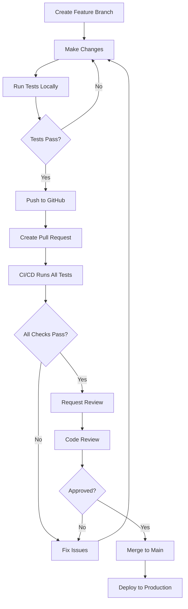

# Branch Protection and PR Integration Tests

**Created:** October 15, 2025  
**Status:** Active  
**Version:** 1.0

## Overview

This document describes the branch protection rules and PR workflow that ensures integration tests **must pass** before code can be merged to main.

## Branch Protection Rules

### GitHub Branch Protection Settings

To enforce integration tests on PRs, configure the following rules in GitHub:

**Repository Settings → Branches → Branch protection rules → Add rule**

#### For `main` branch:

```yaml
Branch name pattern: main

Settings:
  ✅ Require a pull request before merging
    ✅ Require approvals: 1
    ✅ Dismiss stale pull request approvals when new commits are pushed
    ✅ Require review from Code Owners (optional)
  
  ✅ Require status checks to pass before merging
    ✅ Require branches to be up to date before merging
    
    Required status checks (select these):
      ✅ build-and-test (CI)
      ✅ code-quality (CI)
      ✅ build-matrix (ubuntu-latest) (CI)
      ✅ build-matrix (windows-latest) (CI)
      ✅ build-matrix (macos-latest) (CI)
  
  ✅ Require conversation resolution before merging
  ✅ Require signed commits (optional, recommended)
  ✅ Require linear history (optional, recommended)
  
  ✅ Do not allow bypassing the above settings
  ✅ Restrict who can push to matching branches
    - Only allow: Repository administrators, Maintainers
  
  ⚠️ Allow force pushes: DISABLED
  ⚠️ Allow deletions: DISABLED
```

#### For `develop` branch (if using):

Same settings as main, but can optionally:
- Reduce required approvals to 0 for faster iteration
- Allow force pushes for rebasing (use with caution)

### Applying Branch Protection

#### Via GitHub UI:
1. Go to repository → Settings → Branches
2. Click "Add branch protection rule"
3. Enter branch name pattern: `main`
4. Check all boxes as listed above
5. Click "Create" or "Save changes"

#### Via GitHub CLI:
```bash
gh api repos/johnazariah/edumind-ai/branches/main/protection \
  --method PUT \
  --field required_status_checks='{"strict":true,"contexts":["build-and-test","code-quality","build-matrix (ubuntu-latest)","build-matrix (windows-latest)","build-matrix (macos-latest)"]}' \
  --field enforce_admins=true \
  --field required_pull_request_reviews='{"required_approving_review_count":1,"dismiss_stale_reviews":true}' \
  --field restrictions=null
```

#### Via Terraform (Infrastructure as Code):
```hcl
resource "github_branch_protection" "main" {
  repository_id = "edumind-ai"
  pattern       = "main"

  required_status_checks {
    strict   = true
    contexts = [
      "build-and-test",
      "code-quality",
      "build-matrix (ubuntu-latest)",
      "build-matrix (windows-latest)",
      "build-matrix (macos-latest)"
    ]
  }

  required_pull_request_reviews {
    required_approving_review_count = 1
    dismiss_stale_reviews          = true
  }

  enforce_admins = true

  require_conversation_resolution = true
  require_signed_commits         = true
  require_linear_history         = true
}
```

## PR Workflow

### Developer Workflow



### Step-by-Step PR Process

1. **Create Feature Branch**
   ```bash
   git checkout -b feature/my-new-feature
   ```

2. **Make Changes and Run Tests Locally**
   ```bash
   # Run unit tests (fast)
   dotnet test tests/AcademicAssessment.Tests.Unit
   
   # Run integration tests (requires Docker)
   docker-compose -f docker-compose.test.yml up -d
   dotnet test tests/AcademicAssessment.Tests.Integration
   docker-compose -f docker-compose.test.yml down -v
   ```

3. **Commit and Push**
   ```bash
   git add .
   git commit -m "feat: add new feature"
   git push origin feature/my-new-feature
   ```

4. **Create Pull Request**
   - Go to GitHub → Pull requests → New pull request
   - Select base: `main`, compare: `feature/my-new-feature`
   - Fill in PR template with description of changes
   - Click "Create pull request"

5. **CI/CD Runs Automatically**
   - Unit tests (~30 seconds)
   - Performance tests (~1-2 minutes)
   - Integration tests (~3-5 minutes)
   - Code quality checks (~1 minute)
   - Matrix builds across OS (~5 minutes)
   - **Total: ~8-10 minutes**

6. **Address Any Failures**
   - Check the "Checks" tab in PR
   - Click on failed job to see logs
   - Fix issues and push new commits
   - CI/CD runs again automatically

7. **Request Code Review**
   - Once all checks pass (green checkmarks)
   - Click "Reviewers" → Select reviewer(s)
   - Address review comments if any

8. **Merge to Main**
   - Once approved and all checks pass
   - Click "Merge pull request"
   - Select merge strategy:
     - **"Squash and merge"** (recommended for clean history)
     - "Create a merge commit" (preserves all commits)
     - "Rebase and merge" (linear history)

### What Gets Tested on PRs

| Test Category | Runs On | Duration | Can Block Merge? |
|--------------|---------|----------|------------------|
| Unit Tests | Every PR | ~30s | ✅ Yes |
| Performance Tests | Every PR | ~1-2min | ✅ Yes |
| **Integration Tests** | **Every PR** | **~3-5min** | **✅ Yes** |
| Code Quality | Every PR | ~1min | ✅ Yes |
| Matrix Builds | Every PR | ~5min | ✅ Yes |
| OLLAMA Tests | Manual/Nightly | ~10-20min | ❌ No (informational) |

### PR Template

Create `.github/PULL_REQUEST_TEMPLATE.md`:

```markdown
## Description
<!-- Describe what this PR does -->

## Type of Change
- [ ] Bug fix (non-breaking change which fixes an issue)
- [ ] New feature (non-breaking change which adds functionality)
- [ ] Breaking change (fix or feature that would cause existing functionality to not work as expected)
- [ ] Documentation update

## Testing Done
- [ ] Unit tests added/updated
- [ ] Integration tests added/updated
- [ ] Manual testing performed
- [ ] All tests pass locally

## Checklist
- [ ] Code follows project style guidelines
- [ ] Self-review completed
- [ ] Comments added for complex logic
- [ ] Documentation updated (if needed)
- [ ] No new warnings generated
- [ ] Integration tests pass
- [ ] Ready for review

## Related Issues
Closes #(issue number)

## Screenshots (if applicable)
```

## Integration Test Strategy

### Why Run Integration Tests on Every PR?

✅ **Catches issues early** - Before code reaches main  
✅ **Prevents broken main branch** - Main stays deployable  
✅ **Faster feedback** - Developers know immediately if integration breaks  
✅ **Reduces debugging time** - Issues are isolated to specific PRs  
✅ **Builds confidence** - Reviewers know tests passed  

### Performance Considerations

**Before optimization:**
- Integration tests: ~10-15 minutes
- Total CI/CD time: ~20 minutes per PR

**After optimization (current):**
- Integration tests: ~3-5 minutes
- Total CI/CD time: ~8-10 minutes per PR

**Optimizations applied:**
1. Use `docker-compose.test.yml` with tmpfs for faster I/O
2. Disable PostgreSQL fsync and synchronous_commit (safe for tests)
3. Use Redis without persistence
4. Run services in parallel with health checks
5. Use StubLLMService instead of OLLAMA (20-60s → <1ms per evaluation)

### Cost Analysis

**GitHub Actions minutes:**
- Free tier: 2,000 minutes/month
- Pro tier: 3,000 minutes/month
- Team tier: 10,000 minutes/month

**Current usage:**
- ~10 minutes per PR
- Estimate: 20 PRs/month = 200 minutes
- **Well within free tier**

If usage grows:
- Can limit integration tests to specific file paths
- Can use self-hosted runners (free)
- Can use Azure Container Instances for runners

## Azure Container Registry Setup

### Why Use ACR for Test Containers?

❌ **Not recommended for our use case**

**Reasons:**
1. **Standard images work well** - postgres:16-alpine and redis:7-alpine are fast enough
2. **No custom builds needed** - We configure via docker-compose, not custom Dockerfiles
3. **Added complexity** - ACR requires authentication, pushing images, version management
4. **Minimal speed gain** - Pulling from Docker Hub is ~10-30 seconds (acceptable)
5. **Cost** - ACR Basic tier is $5/month, not worth it for test images

### When Would ACR Make Sense?

✅ **Use ACR if:**
- Running 50+ PRs per day (Docker Hub rate limits)
- Building custom test images with pre-seeded data
- Need guaranteed availability (Docker Hub outages affect CI)
- Already using Azure for production
- Have complex multi-stage builds

### ACR Setup (If Needed)

If you decide to use ACR:

```bash
# 1. Create Azure Container Registry
az acr create \
  --resource-group edumind-rg \
  --name edumindacr \
  --sku Basic

# 2. Login to ACR
az acr login --name edumindacr

# 3. Build and push test images
docker build -f deployment/docker/Dockerfile.test-postgres -t edumindacr.azurecr.io/test-postgres:latest .
docker push edumindacr.azurecr.io/test-postgres:latest

docker build -f deployment/docker/Dockerfile.test-redis -t edumindacr.azurecr.io/test-redis:latest .
docker push edumindacr.azurecr.io/test-redis:latest

# 4. Create service principal for GitHub Actions
az ad sp create-for-rbac \
  --name "edumind-github-actions" \
  --role "AcrPull" \
  --scopes /subscriptions/{subscription-id}/resourceGroups/edumind-rg/providers/Microsoft.ContainerRegistry/registries/edumindacr \
  --sdk-auth

# 5. Add credentials to GitHub Secrets
# Settings → Secrets → Actions → New repository secret
# - AZURE_CREDENTIALS (from step 4 output)
# - ACR_LOGIN_SERVER (edumindacr.azurecr.io)
# - ACR_USERNAME (from step 4 output)
# - ACR_PASSWORD (from step 4 output)

# 6. Update docker-compose.test.yml
# services:
#   postgres-test:
#     image: edumindacr.azurecr.io/test-postgres:latest
#   redis-test:
#     image: edumindacr.azurecr.io/test-redis:latest

# 7. Add ACR login to CI/CD workflow
# - name: Login to ACR
#   uses: docker/login-action@v3
#   with:
#     registry: ${{ secrets.ACR_LOGIN_SERVER }}
#     username: ${{ secrets.ACR_USERNAME }}
#     password: ${{ secrets.ACR_PASSWORD }}
```

### Current Recommendation

**Stick with standard Docker Hub images** for now:
- postgres:16-alpine
- redis:7-alpine

**Monitor:**
- Docker Hub rate limits (100 pulls per 6 hours for anonymous users)
- CI/CD run times
- Number of PRs per day

**Switch to ACR if:**
- Hit Docker Hub rate limits
- CI/CD times exceed 15 minutes
- Processing 50+ PRs per day

## Troubleshooting

### PR blocked by failing tests

**Check:**
1. Go to PR → "Checks" tab
2. Click on failed job
3. Expand failed step to see error message

**Common fixes:**
- **Unit test failure:** Fix the code or test
- **Integration test failure:** Check database migrations, service configuration
- **Code quality failure:** Run `dotnet format` locally
- **Matrix build failure:** OS-specific issue, check file paths

### Integration tests timeout

**Possible causes:**
- Services not starting (check health checks)
- Database migration failing
- Network issues in GitHub Actions

**Fix:**
```yaml
# Add longer timeout in .github/workflows/ci.yml
timeout-minutes: 15  # Default is 360 minutes, reduce to 15
```

### "Cannot connect to database"

**Check:**
1. Services started correctly
2. Health checks passing
3. Connection string correct (edumind_test user/database)

### PR cannot be merged despite passing tests

**Check:**
1. Branch protection rules configured correctly
2. Required status checks match job names exactly
3. Branch is up to date with main

## Related Documentation

- [Testing Strategy](TESTING_STRATEGY.md)
- [OLLAMA Integration](OLLAMA_INTEGRATION_COMPLETE.md)
- [CI/CD Workflows](.github/workflows/)
- [Docker Configuration](docker-compose.test.yml)

---

**Last Updated:** October 15, 2025  
**Review Date:** November 15, 2025  
**Maintained By:** Development Team
