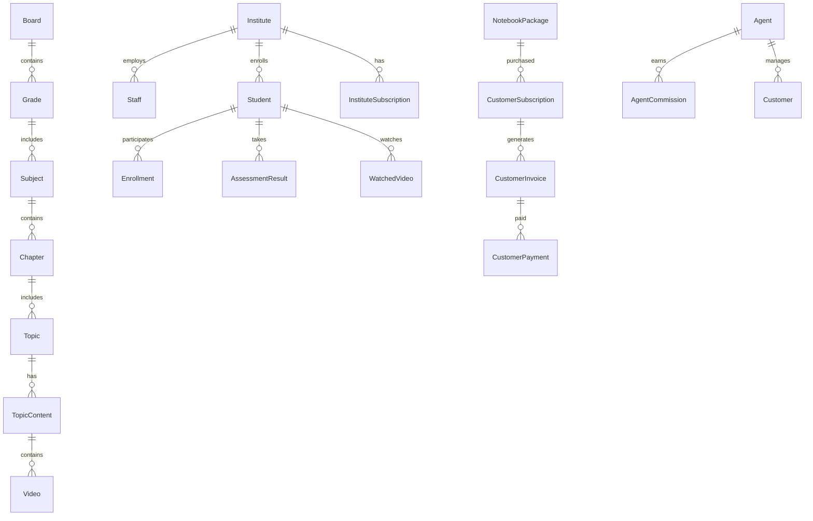

# System Specification - Notebook School Application

**Version:** 1.0  
**Date:** October 16, 2025  
**Platform:** ASP.NET Core 7.0 Web API + Angular 15 SPA  

## Table of Contents

1. [System Overview](#system-overview)
2. [Business Domain](#business-domain)
3. [User Roles & Permissions](#user-roles--permissions)
4. [Core Modules](#core-modules)
5. [API Endpoints](#api-endpoints)
6. [Data Model](#data-model)
7. [External Integrations](#external-integrations)
8. [Business Rules](#business-rules)
9. [UI/UX Features](#uiux-features)
10. [Technical Implementation](#technical-implementation)

## System Overview

### Purpose

Notebook School is a comprehensive educational platform that serves as a Learning Management System (LMS) for educational institutions, individual learners, and agents. The system provides video-based learning, assessments, administrative tools, and AI-powered features.

### Primary Users

- **Students:** Individual learners accessing educational content
- **Teachers/Staff:** Educational content creators and administrators
- **Institute Administrators:** School/institution management
- **Agents:** Sales representatives managing subscriptions and commissions
- **System Administrators:** Platform administrators

### Core Value Proposition

- Video-based learning with Vimeo integration
- AI-powered tutoring and assessment generation
- Multi-tenant institute management
- Subscription-based business model
- Comprehensive reporting and analytics

## Business Domain

### Educational Content Hierarchy

```
Board (Education System)
├── Grade/Class (1-12)
│   ├── Subject (Math, Science, etc.)
│   │   ├── Chapter
│   │   │   ├── Module
│   │   │   │   ├── Topic
│   │   │   │   │   ├── TopicContent
│   │   │   │   │   │   ├── Videos
│   │   │   │   │   │   ├── Documents
│   │   │   │   │   │   └── Assessments
```

### Business Models Supported

1. **B2C Model:** Individual students purchasing packages
2. **B2B Model:** Institutes purchasing bulk subscriptions
3. **Agent Model:** Commission-based sales through agents
4. **Freemium Model:** Sample content with premium subscriptions

## User Roles & Permissions

### Role Hierarchy

```yaml
ADMIN:
  - Full system access
  - User management
  - Content management
  - System configuration

AGENT:
  - Customer management
  - Subscription sales
  - Commission tracking
  - Limited admin access

INSTITUTE_ADMIN:
  - Institute management
  - Staff management
  - Student enrollment
  - Subscription management

STAFF/TEACHER:
  - Content creation
  - Student management
  - Assessment creation
  - Grade management

STUDENT:
  - Content consumption
  - Assessment participation
  - Progress tracking
  - Certificate generation

CUSTOMER:
  - Individual learner
  - Package purchases
  - Content access
  - Progress tracking
```

## Core Modules

### 1. Authentication & Authorization Module

**Purpose:** User management and security

**Features:**

- JWT-based authentication
- Role-based authorization
- Multi-factor authentication support
- Password management
- User device tracking
- Login history

**Key Entities:**

- ApplicationUser (ASP.NET Identity)
- UserRoles, RolePermissions
- LoginRecord
- UserDevice
- Token (JWT refresh tokens)

### 2. Institute Management Module

**Purpose:** Multi-tenant institute administration

**Features:**

- Institute registration and setup
- Academic year management
- Grade and division creation
- Subject assignment
- Staff management
- Student enrollment
- Timetable management
- Holiday calendar
- Event management

**Key Entities:**

- Institute
- InstituteAcademicYear
- InstituteGradeDivision
- InstituteGradeSubject
- InstituteStaffSubjectMap
- InstituteClassTimeTable
- InstituteEvent, InstituteHoliday

### 3. Content Management Module

**Purpose:** Educational content creation and organization

**Features:**

- Hierarchical content structure (Board → Grade → Subject → Chapter → Topic)
- Video content with Vimeo integration
- Document management
- Content versioning
- Bulk content upload
- Content approval workflow

**Key Entities:**

- Board, Grade, Subject
- Chapter, Module, Topic, TopicContent
- Video, VimeoFile
- Document, Folder
- BulkUploadMeta

### 4. Assessment & Examination Module

**Purpose:** Testing and evaluation system

**Features:**

- MCQ assessment creation
- Practice paper generation
- Exam scheduling and management
- Auto-grading system
- Result analysis and reporting
- AI-powered question generation

**Key Entities:**

- AssessmentMCQ, AssessmentMCQQuestion, AssessmentMCQAnswer
- Exam, ExamSubmission, ExamSubmissionDetails
- PracticePaper, PracticePaperQuestion
- AssessmentResult, AssessmentResultDetails

### 5. AI-Powered Learning Module

**Purpose:** AI-enhanced educational features

**Features:**

- AI tutor with ChatGPT integration
- Automated exam generation
- Flash card creation
- Crossword puzzle generation
- Personalized learning recommendations
- Intelligent content tagging

**Key Entities:**

- AIAsk, ChatGPTQuery
- AiTutorExam, AiTutorExamFormat
- AiTutorQuestionPaper
- AiFlashCard
- AiCrossWordPuzzle

### 6. Subscription & Payment Module

**Purpose:** Revenue management and billing

**Features:**

- Package-based subscription model
- Multiple payment gateways (Razorpay, Stripe)
- Invoice generation
- Discount and coupon management
- Subscription renewal
- Payment tracking and reconciliation

**Key Entities:**

- NotebookPackage, NotebookPackagePricing
- CustomerSubscription, CustomerInvoice
- CustomerPayment
- DiscountCupon, DiscountNotebookPriceMap

### 7. Agent & Commission Module

**Purpose:** Sales agent management

**Features:**

- Agent registration and verification
- Commission calculation
- Credit management
- Claims processing
- Performance tracking
- Payout management

**Key Entities:**

- Agent, AgentCommission
- AgentCommissionCredit, AgentCommissionCreditClaim
- UserCredit, UserCreditClaim
- SalesStaffCoupons

### 8. Student Management Module

**Purpose:** Student lifecycle management

**Features:**

- Student registration and enrollment
- Academic progress tracking
- Attendance management
- Fee management
- Guardian/parent portal
- Certificate generation

**Key Entities:**

- Student, StudentRegistration
- StudentGuardian
- InstituteStudentAttendance
- StudentFeeInvoice, StudentFeePayment
- WatchedVideo (progress tracking)

### 9. Communication Module

**Purpose:** Multi-channel communication

**Features:**

- Email notifications (SendGrid)
- SMS notifications (Twilio, TextLocal)
- Push notifications (OneSignal)
- In-app notifications
- Support ticket system
- Marketing messages

**Key Entities:**

- UserNotification
- SupportTicket, SupportTicketDetails
- MarketingMessageBuySubscription

### 10. Reporting & Analytics Module

**Purpose:** Business intelligence and insights

**Features:**

- Student progress reports
- Revenue analytics
- Content usage statistics
- Performance dashboards
- Custom report generation
- Data export capabilities

**Key Entities:**

- ReportHistory
- ContentUsage
- SystemConfiguration

## API Endpoints

### Authentication Endpoints

```
POST /api/connect/login
POST /api/connect/register
POST /api/connect/refresh-token
POST /api/connect/forgot-password
POST /api/connect/reset-password
POST /api/connect/logout
```

### Institute Management

```
GET    /api/institute
POST   /api/institute
PUT    /api/institute/{id}
DELETE /api/institute/{id}
GET    /api/institute/{id}/students
GET    /api/institute/{id}/staff
POST   /api/institute/{id}/enroll-student
```

### Content Management

```
GET    /api/board
GET    /api/grade
GET    /api/subject
GET    /api/chapter
GET    /api/topic
POST   /api/topic/content
GET    /api/video/{id}
POST   /api/document/upload
```

### Assessment System

```
GET    /api/assessmentmcq
POST   /api/assessmentmcq
POST   /api/assessmentmcq/submit
GET    /api/assessmentresult/{id}
POST   /api/exam
GET    /api/exam/{id}/questions
POST   /api/exam/{id}/submit
```

### AI Features

```
POST   /api/aiask
POST   /api/aitutorexam/generate
POST   /api/aiflashcard/create
POST   /api/aicrosswordpuzzle/generate
POST   /api/chatbot/query
```

### Subscription Management

```
GET    /api/notebookpackage
POST   /api/customersubscription
POST   /api/customerpayment/razorpay
POST   /api/customerpayment/stripe
GET    /api/customerinvoice/{id}
```

### User Management

```
GET    /api/student
POST   /api/student
PUT    /api/student/{id}
GET    /api/staff
POST   /api/staff
GET    /api/userroles
POST   /api/userroles/assign
```

## Data Model

### Core Entity Relationships



### Key Database Tables (100+ entities)

- **Identity:** ApplicationUser, ApplicationRole
- **Institute:** Institute, Staff, Student, InstituteSubscription
- **Content:** Board, Grade, Subject, Chapter, Topic, Video, Document
- **Assessment:** AssessmentMCQ, Exam, PracticePaper, AssessmentResult
- **AI Features:** AIAsk, AiTutorExam, AiFlashCard, ChatGPTQuery
- **Commerce:** NotebookPackage, CustomerSubscription, CustomerPayment
- **Agent System:** Agent, AgentCommission, UserCredit
- **Support:** SupportTicket, UserNotification

## External Integrations

### Video Platform

- **Vimeo API:** Video hosting, streaming, thumbnail generation
- **Configuration:** API keys, upload settings, privacy controls

### Payment Gateways

- **Razorpay:** Primary payment processor for Indian market
- **Stripe:** International payment processing
- **PayPal:** Alternative payment method

### Communication Services

- **SendGrid:** Email delivery service
- **Twilio:** SMS and communication APIs
- **TextLocal:** SMS service for Indian market
- **OneSignal:** Push notification service

### AI Services

- **OpenAI/ChatGPT:** AI tutoring and content generation
- **Configuration:** API keys, model settings, rate limits

### Cloud Services

- **Azure Storage:** File and document storage
- **Azure Key Vault:** Security and certificate management
- **Azure Service Bus:** Message queuing and communication

## Business Rules

### Subscription Rules

1. **Package Access:** Users can only access content included in their active subscription
2. **Expiry Handling:** Content access is blocked when subscription expires
3. **Upgrade/Downgrade:** Prorated billing for subscription changes
4. **Trial Periods:** Limited time access to premium features
5. **Geographic Restrictions:** Content availability based on region

### Institute Rules

1. **Multi-tenancy:** Complete data isolation between institutes
2. **Student Limits:** Subscription-based student enrollment limits
3. **Academic Year:** All academic data tied to specific academic years
4. **Staff Permissions:** Role-based access to institute features

### Assessment Rules

1. **Time Limits:** Configurable time limits for exams and assessments
2. **Attempt Limits:** Maximum number of attempts per assessment
3. **Grading:** Automatic grading for MCQ, manual for descriptive
4. **Results:** Immediate results for practice, delayed for exams

### Content Rules

1. **Hierarchy:** Strict content hierarchy enforcement
2. **Prerequisites:** Topic dependencies and learning paths
3. **Progress Tracking:** Video watch time and completion status
4. **Quality Control:** Content approval workflow

### Agent Rules

1. **Commission Calculation:** Percentage-based on subscription value
2. **Credit System:** Credits earned and claimed separately
3. **Verification:** Document verification for agent onboarding
4. **Territory Management:** Geographic or institutional assignments

## UI/UX Features

### Student Portal

- **Dashboard:** Progress overview, recent activity, recommendations
- **Video Player:** Custom video player with progress tracking, speed control
- **Assessment Interface:** MCQ interface, timer, navigation
- **Progress Tracking:** Visual progress indicators, certificates
- **Mobile Responsive:** Optimized for mobile learning

### Institute Admin Portal

- **Institute Dashboard:** Student metrics, revenue, usage analytics
- **Student Management:** Enrollment, attendance, fee management
- **Staff Management:** Role assignment, subject mapping
- **Timetable Management:** Class scheduling, room allocation
- **Reports:** Academic, financial, and operational reports

### Agent Portal

- **Sales Dashboard:** Targets, achievements, commission tracking
- **Customer Management:** Lead tracking, conversion metrics
- **Commission Portal:** Credit balance, claim history
- **Marketing Tools:** Promotional materials, discount codes

### Admin Portal

- **System Dashboard:** Platform-wide metrics and health
- **User Management:** Role assignment, permissions
- **Content Management:** Approval workflows, bulk operations
- **Financial Management:** Revenue tracking, payout processing
- **Support Center:** Ticket management, user assistance

## Technical Implementation

### Backend Architecture

```
Presentation Layer (Controllers)
├── Authentication & Authorization
├── API Versioning & Documentation
├── Request/Response Models
└── Error Handling

Application Layer (BAL - Business Access Layer)
├── Business Logic Services
├── Validation Rules
├── Workflow Orchestration
└── External Service Integration

Data Access Layer (DAL)
├── Repository Pattern Implementation
├── Entity Framework Core
├── Database Abstractions
└── Query Optimization

Infrastructure Layer
├── External Service Clients
├── File Storage (Azure)
├── Caching (Memory/Redis)
└── Logging & Monitoring
```

### Frontend Architecture

```
Angular 15 SPA
├── Feature Modules
│   ├── Student Module
│   ├── Institute Module
│   ├── Agent Module
│   └── Admin Module
├── Shared Components
├── Services (HTTP, State Management)
├── Guards & Interceptors
└── Routing Configuration
```

### Security Implementation

- **Authentication:** JWT Bearer tokens with refresh token mechanism
- **Authorization:** Role-based access control (RBAC)
- **Data Protection:** Azure Key Vault integration
- **CORS:** Configured for cross-origin requests
- **HTTPS:** Enforced SSL/TLS communication

### Performance Features

- **Caching:** Memory caching for frequently accessed data
- **Lazy Loading:** Angular modules loaded on demand
- **CDN:** Static assets served via CDN
- **Database Optimization:** Indexed queries, connection pooling

### Monitoring & Logging

- **Structured Logging:** ILogger with structured data
- **Error Tracking:** Exception logging and monitoring
- **Performance Metrics:** Response time tracking
- **Health Checks:** System health monitoring

## Current System Limitations

### Technical Debt

1. **No Unit Tests:** Critical gap in test coverage
2. **Monolithic Architecture:** Single large application
3. **Performance Issues:** Missing pagination, query optimization
4. **Limited Error Handling:** Basic exception management
5. **Security Gaps:** Missing security headers, limited validation

### Scalability Concerns

1. **Database Design:** Large ApplicationDbContext (100+ DbSets)
2. **Caching Strategy:** Limited caching implementation
3. **Service Architecture:** Tightly coupled services
4. **Load Balancing:** No horizontal scaling strategy

### Business Limitations

1. **Multi-language Support:** Currently English-only
2. **Advanced Analytics:** Limited business intelligence
3. **Mobile App:** No native mobile application
4. **Offline Support:** No offline learning capabilities

## Future Enhancement Opportunities

### Technical Improvements

1. **Microservices Architecture:** Domain-based service decomposition
2. **CQRS Implementation:** Command Query Responsibility Segregation
3. **Event-Driven Architecture:** Domain events and message queues
4. **Advanced Caching:** Multi-level caching with Redis
5. **API Gateway:** Centralized API management

### Business Features

1. **AI Enhancement:** Advanced personalized learning
2. **Social Learning:** Collaboration and discussion features
3. **Advanced Analytics:** Machine learning insights
4. **Mobile Application:** Native iOS/Android apps
5. **Offline Learning:** Download and sync capabilities

This specification provides a comprehensive overview of the current Notebook School application, serving as a foundation for GitHub Copilot to understand the existing functionality and make informed improvements and iterations.
