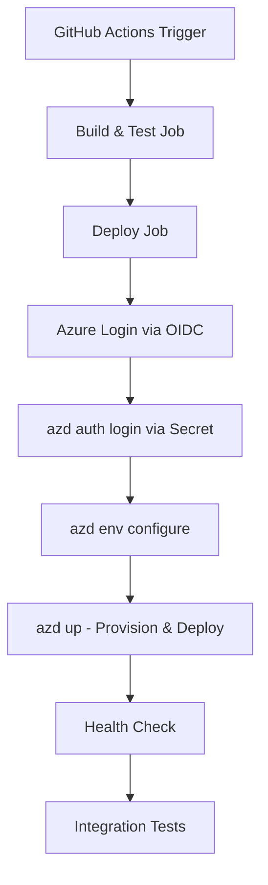

# Azure Deployment Setup - Step by Step

**Date:** October 20, 2025  
**Updated:** Includes fixes and learnings from successful deployment  
**Goal:** Deploy EduMind.AI to Azure using Azure Developer CLI with .NET Aspire

## 🎯 Deployment Strategy

We use **Azure Developer CLI (azd)** for infrastructure-as-code deployment with .NET Aspire, leveraging GitHub Actions for CI/CD and OIDC authentication for secure credential-free deployment.

## 📋 Prerequisites Check

- ✅ Azure CLI installed
- ✅ GitHub CLI installed
- ⏳ Azure subscription (checking...)
- ⏳ GitHub authentication (checking...)

## 🚀 Deployment Steps

### Step 1: Verify Azure Authentication

```bash
az login --use-device-code
az account list --output table
az account set --subscription "YOUR_SUBSCRIPTION_ID"

# Get your subscription ID for later use
SUBSCRIPTION_ID=$(az account show --query id -o tsv)
echo "Subscription ID: $SUBSCRIPTION_ID"
```

### Step 2: Create Azure Service Principal for GitHub Actions

Create an app registration with federated credentials for OIDC authentication:

```bash
# Create the app registration
APP_NAME="edumind-ai-github"
CLIENT_ID=$(az ad app create --display-name "$APP_NAME" --query appId -o tsv)

echo "Client ID: $CLIENT_ID"

# Get tenant ID
TENANT_ID=$(az account show --query tenantId -o tsv)
echo "Tenant ID: $TENANT_ID"

# Assign Contributor role to the service principal
az role assignment create \
  --role "Contributor" \
  --assignee "$CLIENT_ID" \
  --scope "/subscriptions/$SUBSCRIPTION_ID"

# IMPORTANT: Also assign User Access Administrator role
# This allows the service principal to create role assignments for managed identities
# (required by .NET Aspire for Container Registry and Storage access)
az role assignment create \
  --role "User Access Administrator" \
  --assignee "$CLIENT_ID" \
  --scope "/subscriptions/$SUBSCRIPTION_ID"
```

**Key Learning:** .NET Aspire deployments need to create role assignments for managed identities to access Container Registry and Storage. Without User Access Administrator role, deployment will fail with "Authorization failed for template resource" errors.

### Step 3: Configure Federated Identity Credentials for OIDC

**IMPORTANT:** This enables secure, credential-free authentication from GitHub Actions.

```bash
# Create federated credential for dev environment
cat > federated-credential.json << EOF
{
  "name": "github-actions-dev",
  "issuer": "https://token.actions.githubusercontent.com",
  "subject": "repo:YOUR_GITHUB_ORG/edumind-ai:environment:dev",
  "description": "GitHub Actions deployment for dev environment",
  "audiences": ["api://AzureADTokenExchange"]
}
EOF

az ad app federated-credential create \
  --id "$CLIENT_ID" \
  --parameters federated-credential.json
```

**Key Learning:** Federated credentials enable OIDC authentication, which is more secure than client secrets and doesn't require secret rotation.

### Step 4: Create Client Secret for Azure Developer CLI

While GitHub Actions uses OIDC, the Azure Developer CLI (azd) still requires a client secret:

```bash
# Create client secret (valid for 1 year)
CLIENT_SECRET=$(az ad app credential reset --id "$CLIENT_ID" --years 1 --query password -o tsv)

echo "Client Secret: $CLIENT_SECRET"
echo "⚠️  SAVE THIS SECRET - you won't see it again!"
```

### Step 5: Configure GitHub Secrets

Add these secrets to your GitHub repository (Settings → Secrets and variables → Actions):

```bash
# Use GitHub CLI to set secrets
gh secret set AZURE_CLIENT_ID --body "$CLIENT_ID"
gh secret set AZURE_TENANT_ID --body "$TENANT_ID"
gh secret set AZURE_SUBSCRIPTION_ID --body "$SUBSCRIPTION_ID"
gh secret set AZURE_CLIENT_SECRET --body "$CLIENT_SECRET"

# Verify secrets are set
gh secret list
```

**Expected output:**

```text
AZURE_CLIENT_ID
AZURE_CLIENT_SECRET
AZURE_SUBSCRIPTION_ID
AZURE_TENANT_ID
```

### Step 6: Create azure.yaml Configuration

The `azure.yaml` file tells Azure Developer CLI how to deploy your .NET Aspire application:

```yaml
# azure.yaml
name: edumind-ai
metadata:
  template: aspire-starter@0.0.1-beta
services:
  apphost:
    project: ./src/EduMind.AppHost
    language: dotnet
    host: containerapp
```

**Key Learning:** This file is required for `azd` to recognize your project. Without it, you'll get "no project exists" errors.

### Step 7: Install .NET 9.0.100 SDK

Ensure your environment has the correct .NET SDK version:

```bash
# Check current version
dotnet --version

# Install .NET 9.0.100 if needed
curl -sSL https://dot.net/v1/dotnet-install.sh | bash /dev/stdin --version 9.0.100 --install-dir /usr/share/dotnet
```

### Step 8: Trigger GitHub Actions Deployment

```bash
# Trigger the deployment workflow
gh workflow run deploy-azure-azd.yml

# Watch the deployment progress
gh run watch $(gh run list --workflow=deploy-azure-azd.yml --limit 1 --json databaseId --jq '.[0].databaseId')
```

The workflow will:

1. **Build and test** - Run unit tests and generate Aspire manifest
2. **Azure Login** - Authenticate using OIDC (federated credentials)
3. **Deploy** - Use `azd up` to provision and deploy resources
4. **Health check** - Verify the deployment is healthy
5. **Integration tests** - Run integration tests against deployed environment

### Step 9: Verify Deployment

```bash
# Check deployment status in GitHub Actions
gh run list --workflow=deploy-azure-azd.yml --limit 5

# View Azure resources
az resource list --output table

# Get deployed URLs (from GitHub Actions output)
gh run view --log | grep "Deployed to:"
```

## 📊 Expected Resources

| Resource | Type | Purpose |
|----------|------|---------|
| Resource Group | Container | Holds all resources |
| Container Apps Environment | Hosting | Runs microservices |
| Web API | Container App | Main backend |
| Dashboard | Container App | Admin interface |
| Student App | Container App | Student interface |
| PostgreSQL | Database | Data storage |
| Redis | Cache | Session/cache |
| Container Registry | Registry | Docker images |
| App Insights | Monitoring | Telemetry |

## 🔒 Security Setup

### GitHub Secrets Required

| Secret | Purpose | How to Get |
|--------|---------|------------|
| `AZURE_CLIENT_ID` | Service principal app ID | From Step 2 output |
| `AZURE_TENANT_ID` | Azure AD tenant ID | `az account show --query tenantId -o tsv` |
| `AZURE_SUBSCRIPTION_ID` | Target Azure subscription | `az account show --query id -o tsv` |
| `AZURE_CLIENT_SECRET` | Service principal secret | From Step 4 output |

### Authentication Methods

1. **GitHub Actions → Azure:** Uses OIDC (federated credentials) - no secrets needed for auth
2. **Azure Developer CLI:** Uses client secret authentication

**Key Learning:** OIDC is preferred for CI/CD as it's more secure and doesn't require secret management.

## ⏱️ Estimated Time

- Initial setup (Steps 1-6): 15-20 minutes
- First deployment: 15-25 minutes (Azure resource provisioning)
- Subsequent deployments: 5-10 minutes
- Total first-time setup: 30-45 minutes

## 🐛 Common Issues and Solutions

### Issue 1: "Tenant not found" Error

**Symptom:** `AADSTS90002: Tenant '***' not found`

**Cause:** Trailing comma or whitespace in tenant ID

**Solution:** Verify tenant ID has no extra characters:

```bash
# Should be: 16b3c013-d300-468d-ac64-7eda0820b6d3
# NOT: 16b3c013-d300-468d-ac64-7eda0820b6d3,
```

### Issue 2: "No configured federated identity credentials"

**Symptom:** `AADSTS70025: The client has no configured federated identity credentials`

**Cause:** Missing federated credential configuration

**Solution:** Complete Step 3 to add federated credentials

### Issue 3: "No subscriptions found"

**Symptom:** Azure login succeeds but can't find subscriptions

**Cause:** Service principal lacks role assignment

**Solution:** Assign Contributor role (Step 2)

### Issue 4: "no project exists; to create a new project, run `azd init`"

**Symptom:** `azd` commands fail with this error

**Cause:** Missing `azure.yaml` file

**Solution:** Create `azure.yaml` file (Step 6)

### Issue 5: "not logged in, run `azd auth login` to login"

**Symptom:** `azd up` fails with authentication error

**Cause:** `azd` uses different auth from `az` CLI

**Solution:** Workflow now includes `azd auth login` step with client secret

### Issue 6: "Authorization failed for template resource" - Role Assignments

**Symptom:**

```text
### Issue 6: "Authorization failed for template resource" - Role Assignments

**Symptom:**

```text
Authorization failed for template resource 'xxx' of type 'Microsoft.Authorization/roleAssignments'. 
The client does not have permission to perform action 'Microsoft.Authorization/roleAssignments/write'
```

**Cause:** Service principal lacks permission to create role assignments for managed identities

**Solution:** Assign User Access Administrator role (Step 2):

```bash
az role assignment create \
  --role "User Access Administrator" \
  --assignee "$CLIENT_ID" \
  --scope "/subscriptions/$SUBSCRIPTION_ID"
```

**Why This Happens:** .NET Aspire needs to assign roles to managed identities so they can access Container Registry and Storage accounts. This requires the deploying principal to have User Access Administrator permissions.

## 📝 Key Learnings

1. **Federated Credentials vs Secrets:**
   - GitHub Actions uses OIDC/federated credentials (more secure, no rotation needed)
   - Azure Developer CLI still requires client secrets
   - Both can be configured for the same service principal

2. **Two Auth Tools:**
   - `az` (Azure CLI) - authenticated via OIDC in GitHub Actions
   - `azd` (Azure Developer CLI) - requires separate authentication with secrets

3. **azure.yaml is Required:**
   - Must exist in repository root
   - Defines Aspire project structure for azd
   - Points to AppHost project

4. **Role Assignments:**
   - Service principal needs **both** "Contributor" and "User Access Administrator" roles
   - Contributor: Deploy and manage Azure resources
   - User Access Administrator: Create role assignments for managed identities
   - Assignment must be at subscription scope, not resource group
   - **Critical:** Without User Access Administrator, .NET Aspire deployments fail when assigning roles to managed identities

5. **Environment Variables:**
   - `AZURE_ENV_NAME` - deployment environment (dev/staging/prod)
   - `AZURE_LOCATION` - Azure region (eastus, westus2, etc.)
   - `AZURE_SUBSCRIPTION_ID` - target subscription

6. **Managed Identity Role Assignments:**
   - .NET Aspire automatically creates managed identities for Container Apps
   - These identities need access to Container Registry (AcrPull role)
   - These identities need access to Storage (Storage Blob Data Contributor)
   - The deploying service principal must have permission to create these assignments

## 🔄 Workflow Architecture



## 📚 Additional Resources

- [Azure Developer CLI Documentation](https://learn.microsoft.com/azure/developer/azure-developer-cli/)
- [.NET Aspire Deployment](https://learn.microsoft.com/dotnet/aspire/deployment/overview)
- [GitHub OIDC with Azure](https://docs.github.com/actions/deployment/security-hardening-your-deployments/configuring-openid-connect-in-azure)
- [Azure Container Apps](https://learn.microsoft.com/azure/container-apps/)

---

**Status:** ✅ Deployment pipeline configured and tested  
**Last Updated:** October 20, 2025  
**Next:** Monitor deployment in [GitHub Actions](https://github.com/johnazariah/edumind-ai/actions)
