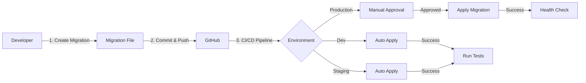

# Azure Deployment Strategy - EduMind.AI

**Status**: 📝 Planning Phase  
**Target Platform**: Azure Container Apps (Primary)  
**Migration Path**: Azure Container Apps → AKS (if scale requires)  
**Date**: October 15, 2025

---

## Executive Summary

This document outlines the deployment strategy for EduMind.AI using **Azure Container Apps** as the primary deployment platform, with a defined migration path to **Azure Kubernetes Service (AKS)** if scale or feature requirements exceed Container Apps capabilities.

### Why Azure Container Apps?

✅ **Serverless container platform** - Pay only for what you use  
✅ **Auto-scaling** - From 0 to N instances automatically  
✅ **Simpler than AKS** - No cluster management overhead  
✅ **Production-ready** - Built-in HTTPS, health probes, secrets  
✅ **Fast deployment** - Minutes vs hours  
✅ **Cost-effective** - Scale to zero during off-hours  
✅ **Microservices-native** - Perfect for our 6+ app architecture

---

## 🏗️ Architecture Overview

### Production Architecture (Azure Container Apps)

```
┌──────────────────────────────────────────────────────────────────┐
│                     Azure Front Door                              │
│  - Global load balancing                                          │
│  - SSL/TLS termination                                            │
│  - WAF (Web Application Firewall)                                 │
│  - DDoS protection                                                │
└────────────────────────┬─────────────────────────────────────────┘
                         │
         ┌───────────────┴───────────────┐
         │                               │
┌────────▼────────────┐     ┌───────────▼──────────────┐
│  Public Endpoint    │     │  Private Endpoint        │
│  (Students/Public)  │     │  (Schools/Internal)      │
└────────┬────────────┘     └───────────┬──────────────┘
         │                               │
┌────────▼───────────────────────────────▼──────────────────────────┐
│            Azure Container Apps Environment                        │
│            (Virtual Network Integrated)                            │
│                                                                    │
│  ┌──────────────────────────────────────────────────────────┐    │
│  │                    API Layer                              │    │
│  │  ┌────────────────────────────────────────────────┐      │    │
│  │  │ AcademicAssessment.Web (Web API)              │      │    │
│  │  │ - REST API endpoints                           │      │    │
│  │  │ - SignalR hubs                                 │      │    │
│  │  │ - Min replicas: 2, Max replicas: 20           │      │    │
│  │  └────────────────────────────────────────────────┘      │    │
│  └──────────────────────────────────────────────────────────┘    │
│                                                                    │
│  ┌──────────────────────────────────────────────────────────┐    │
│  │                 Student Applications                      │    │
│  │  ┌────────────────────────────────────────────────┐      │    │
│  │  │ AcademicAssessment.StudentApp (Blazor)        │      │    │
│  │  │ - B2B (School-based students)                  │      │    │
│  │  │ - B2C (Self-service students)                  │      │    │
│  │  │ - Min replicas: 1, Max replicas: 50           │      │    │
│  │  └────────────────────────────────────────────────┘      │    │
│  └──────────────────────────────────────────────────────────┘    │
│                                                                    │
│  ┌──────────────────────────────────────────────────────────┐    │
│  │              Teacher/Admin Applications                   │    │
│  │  ┌────────────────────────────────────────────────┐      │    │
│  │  │ AcademicAssessment.ClassApp (Teacher)         │      │    │
│  │  │ Min replicas: 1, Max replicas: 10             │      │    │
│  │  └────────────────────────────────────────────────┘      │    │
│  │  ┌────────────────────────────────────────────────┐      │    │
│  │  │ AcademicAssessment.SchoolAdminApp             │      │    │
│  │  │ Min replicas: 0, Max replicas: 5              │      │    │
│  │  └────────────────────────────────────────────────┘      │    │
│  │  ┌────────────────────────────────────────────────┐      │    │
│  │  │ AcademicAssessment.CourseAdminApp             │      │    │
│  │  │ Min replicas: 0, Max replicas: 3              │      │    │
│  │  └────────────────────────────────────────────────┘      │    │
│  │  ┌────────────────────────────────────────────────┐      │    │
│  │  │ AcademicAssessment.BusinessAdminApp           │      │    │
│  │  │ Min replicas: 0, Max replicas: 3              │      │    │
│  │  └────────────────────────────────────────────────┘      │    │
│  │  ┌────────────────────────────────────────────────┐      │    │
│  │  │ AcademicAssessment.SysAdminApp                │      │    │
│  │  │ Min replicas: 0, Max replicas: 2              │      │    │
│  │  └────────────────────────────────────────────────┘      │    │
│  └──────────────────────────────────────────────────────────┘    │
└────────────────────────────────────────────────────────────────────┘
                         │
         ┌───────────────┴───────────────┐
         │                               │
┌────────▼────────────┐     ┌───────────▼──────────────┐
│  Data Services      │     │  External Services       │
│                     │     │                          │
│  PostgreSQL         │     │  Azure AD B2C            │
│  - Per-school DBs   │     │  - Authentication        │
│  - Shared DB (B2C)  │     │                          │
│                     │     │  Azure OpenAI            │
│  Redis Cache        │     │  - LLM Services          │
│  - Sessions         │     │                          │
│  - Distributed Cache│     │  Azure Key Vault         │
│                     │     │  - Secrets Management    │
│  Azure Blob Storage │     │                          │
│  - Assessment files │     │  Application Insights    │
│  - User uploads     │     │  - Monitoring/Telemetry  │
└─────────────────────┘     └──────────────────────────┘
```

---

## 📦 Container Apps Configuration

### 1. Web API Container App

**Purpose**: Primary REST API and SignalR hub

```yaml
Name: edumind-web-api
Container Image: edumindacr.azurecr.io/academic-web:latest
Ingress:
  - External: true
  - Target Port: 8080
  - Transport: HTTP/2 (for gRPC if needed)
Scale:
  - Min Replicas: 2
  - Max Replicas: 20
  - Rules:
    - HTTP: 100 concurrent requests per instance
    - CPU: 70% threshold
Resources:
  - CPU: 1.0 cores
  - Memory: 2.0 Gi
Health Probes:
  - Liveness: /health/live
  - Readiness: /health/ready
  - Startup: /health/ready (30s timeout)
Environment:
  - ASPNETCORE_ENVIRONMENT: Production
  - ConnectionStrings__DefaultConnection: @secret(db-connection)
  - Redis__ConnectionString: @secret(redis-connection)
  - AzureOpenAI__Endpoint: @secret(openai-endpoint)
```

### 2. Student App Container App

**Purpose**: Blazor Server app for students (B2B + B2C)

```yaml
Name: edumind-student-app
Container Image: edumindacr.azurecr.io/academic-student:latest
Ingress:
  - External: true
  - Target Port: 8080
  - Custom Domain: students.edumind.ai
Scale:
  - Min Replicas: 1
  - Max Replicas: 50
  - Rules:
    - HTTP: 50 concurrent requests per instance
    - CPU: 80% threshold
Resources:
  - CPU: 0.5 cores
  - Memory: 1.0 Gi
Health Probes:
  - Liveness: /health
  - Readiness: /health
Dapr: (if using Dapr for pub/sub)
  - Enabled: true
  - App Port: 8080
  - App Protocol: http
```

### 3. Teacher/Admin Apps

**Configuration Template** (similar for all 5 admin apps):

```yaml
Name: edumind-{role}-app  # class, schooladmin, courseadmin, bizadmin, sysadmin
Container Image: edumindacr.azurecr.io/academic-{role}:latest
Ingress:
  - External: true
  - Target Port: 8080
  - Custom Domain: {role}.edumind.ai
Scale:
  - Min Replicas: 0  # Scale to zero for cost savings
  - Max Replicas: 3-10 (based on role)
  - Rules:
    - HTTP: 30 concurrent requests per instance
Resources:
  - CPU: 0.25-0.5 cores
  - Memory: 0.5-1.0 Gi
```

---

## 💾 Data Services

### Azure PostgreSQL Flexible Server

**Why Flexible Server over Containerized PostgreSQL?**

- ✅ **Persistent storage** - Data survives deployments
- ✅ **Automatic backups** - Point-in-time restore (PITR)
- ✅ **High availability** - Zone-redundant deployment
- ✅ **Managed service** - Automatic patching, monitoring
- ✅ **Scaling** - Vertical and horizontal scaling
- ✅ **Security** - Private endpoints, encryption at rest/transit
- ✅ **Compliance** - SOC 2, HIPAA, FedRAMP ready

**Architecture**: Multi-database isolation strategy

```
PostgreSQL Flexible Server (General Purpose, 2 vCores, 8 GB RAM)
│
├── Database: edumind_selfservice          # B2C self-service students
│   └── Schema: Logical tenant isolation
│
├── Database: edumind_school_00001         # B2B School 1
│   └── Schema: Physical isolation
│
├── Database: edumind_school_00002         # B2B School 2
│   └── Schema: Physical isolation
│
└── Database: edumind_school_NNNNN         # B2B School N
    └── Schema: Physical isolation
```

**Environment-Specific Configuration**:

| Environment | SKU | HA | Backup Retention | Geo-Redundant | Cost/Month |
|-------------|-----|----|--------------------|---------------|------------|
| **Dev** | B_Standard_B1ms (1 vCore) | No | 7 days | No | ~$15 |
| **Staging** | GP_Standard_D2ds_v4 (2 vCore) | No | 14 days | No | ~$150 |
| **Production** | GP_Standard_D4ds_v4 (4 vCore) | Zone-Redundant | 35 days | Yes | ~$600 |

**Production Configuration**:

- **Tier**: General Purpose
- **Compute**: 2-4 vCores (auto-scale with Azure Monitor)
- **Storage**: 128 GB (auto-grow enabled)
- **Backup**: 35-day point-in-time restore, geo-redundant
- **High Availability**: Zone-redundant with standby replica
- **Private Endpoint**: VNet integration
- **SSL**: TLS 1.2+ required
- **Connection Pooling**: PgBouncer built-in
- **Version**: PostgreSQL 15

#### Database Migrations

**Migration Workflow**:



**Creating Migrations**:

```bash
# On local development
dotnet ef migrations add MigrationName \
  --project src/AcademicAssessment.Infrastructure \
  --startup-project src/AcademicAssessment.Web \
  --output-dir Data/Migrations

# Review generated migration files
git diff src/AcademicAssessment.Infrastructure/Data/Migrations/

# Commit and push
git add .
git commit -m "feat: Add MigrationName database migration"
git push
```

**Applying Migrations**:

- **Dev/Staging**: Automatic via GitHub Actions
- **Production**: Manual approval required, pre-migration backup created

**Rollback Procedures**:

```bash
# Option 1: Rollback to specific migration
dotnet ef database update PreviousMigrationName \
  --project src/AcademicAssessment.Infrastructure \
  --connection "$PROD_DB_CONNECTION"

# Option 2: Restore from point-in-time backup (see Backup Strategy below)
```

#### Backup and Restore Strategy

**Automated Backups**:

- **Frequency**: Continuous transaction log backups (every 5 minutes)
- **Full Backup**: Daily at 2 AM UTC
- **Retention**: Environment-specific (see table above)
- **Storage**: Geo-redundant in production for disaster recovery

**Point-in-Time Restore (PITR)**:

```bash
# Restore to specific point in time
az postgres flexible-server restore \
  --resource-group rg-prod \
  --name edumind-postgres-prod-pitr \
  --source-server edumind-postgres-prod \
  --restore-time "2025-10-20T14:30:00Z" \
  --location eastus
```

**Manual On-Demand Backup** (before major changes):

```bash
# Trigger backup before migrations
az postgres flexible-server backup create \
  --resource-group rg-prod \
  --name edumind-postgres-prod \
  --backup-name "pre-migration-$(date +%Y%m%d-%H%M)"
```

**Weekly Logical Exports** (disaster recovery):

```bash
# Export to .sql file
pg_dump -h edumind-postgres-prod.postgres.database.azure.com \
  -U edumindadmin \
  -d edumind \
  --format=custom \
  --file="edumind-backup-$(date +%Y%m%d).dump"

# Upload to Azure Blob Storage
az storage blob upload \
  --account-name edumindbackups \
  --container-name database-exports \
  --file "edumind-backup-$(date +%Y%m%d).dump"
```

**Restore from Logical Backup**:

```bash
# Download and restore
az storage blob download \
  --account-name edumindbackups \
  --container-name database-exports \
  --name edumind-backup-20251020.dump \
  --file backup.dump

pg_restore -h edumind-postgres-prod.postgres.database.azure.com \
  -U edumindadmin \
  -d edumind_restored \
  --clean --if-exists \
  backup.dump
```

#### Security and Access Control

**Connection String Management**:

```csharp
// Production: Use Managed Identity with Azure AD authentication
services.AddDbContext<AcademicContext>(options =>
{
    var connectionString = configuration.GetConnectionString("DefaultConnection");
    
    if (environment.IsProduction())
    {
        var credential = new DefaultAzureCredential();
        var token = credential.GetToken(
            new TokenRequestContext(new[] { 
                "https://ossrdbms-aad.database.windows.net/.default" 
            })
        );
        
        options.UseNpgsql(connectionString, npgsqlOptions =>
        {
            npgsqlOptions.ProvidePasswordCallback = () => token.Token;
        });
    }
    else
    {
        options.UseNpgsql(connectionString);
    }
});
```

**Access Control**:

- Admin account stored in Azure Key Vault
- App uses limited-privilege service account
- Read-only replicas for analytics workloads
- Encryption: TLS 1.2+ (transit), Azure-managed keys (at rest)

#### Monitoring and Alerts

**Key Metrics**:

- Connection count (alert at >90% capacity)
- Query duration (p50, p95, p99)
- Storage utilization (alert at 80%)
- Replica lag, deadlocks
- Backup size and duration

**Example Alert**:

```bash
# Storage alert (80% threshold)
az monitor metrics alert create \
  --name postgres-storage-alert \
  --resource-group rg-prod \
  --scopes /subscriptions/.../postgresServers/edumind-postgres-prod \
  --condition "avg storage_percent > 80" \
  --description "PostgreSQL storage usage above 80%"
```

### Azure Redis Cache

**Purpose**: Session state, distributed caching, SignalR backplane

```
Redis Cache: Standard C1 (production) / Basic C0 (dev)
- Memory: 1 GB (Standard C1)
- SSL: Required
- Persistence: RDB snapshots (6 hours)
- Private Endpoint: VNet integration
- Clustering: Premium tier if needed
```

### Azure Blob Storage

**Purpose**: Assessment files, user uploads, static assets

```
Storage Account: edumindstorage
- Performance: Standard (Hot tier for active data)
- Replication: LRS (dev) / ZRS (production)
- Containers:
  - assessments/         # Assessment PDFs, images
  - uploads/             # Student submissions
  - avatars/             # User profile images
  - exports/             # Generated reports
- Access: Private with SAS tokens
- Lifecycle Management: Move to Cool tier after 90 days
```

---

## 🔐 Security Configuration

### Azure AD B2C

**Authentication Provider** for all user types

```
Tenant: edumindai.onmicrosoft.com
User Flows:
  - Sign up and sign in (SUSI)
  - Password reset
  - Profile editing

Identity Providers:
  - Local accounts (email + password)
  - Google
  - Apple ID
  - Microsoft Account

Token Configuration:
  - Access token lifetime: 1 hour
  - Refresh token lifetime: 14 days
  - ID token: Include custom claims (role, schoolId, tenantId)

Custom Policies:
  - COPPA compliance for under-13 users
  - School administrator approval workflow
  - Multi-factor authentication (optional per school)
```

### Azure Key Vault

**Secrets Management**

```
Key Vault: edumind-keyvault-prod
Access Policy:
  - Container Apps Managed Identity: Get, List secrets
  - DevOps Service Principal: All permissions
  
Secrets:
  - db-connection-string
  - redis-connection-string
  - azure-openai-key
  - azure-openai-endpoint
  - jwt-signing-key
  - storage-account-key
  - sendgrid-api-key (email notifications)
  
Rotation:
  - Database passwords: 90 days
  - API keys: Manual rotation
  - Certificates: Auto-renewal (Let's Encrypt via Front Door)
```

### Network Security

```
Virtual Network: edumind-vnet
Subnets:
  - container-apps-subnet: 10.0.1.0/24
  - postgres-subnet: 10.0.2.0/24
  - redis-subnet: 10.0.3.0/24
  
Network Security Groups:
  - Allow HTTPS (443) inbound from Front Door
  - Allow PostgreSQL (5432) from Container Apps only
  - Allow Redis (6379) from Container Apps only
  - Deny all other inbound traffic

Private Endpoints:
  - PostgreSQL: Private endpoint + Private DNS zone
  - Redis: Private endpoint + Private DNS zone
  - Storage: Private endpoint for blob service
  - Key Vault: Private endpoint
```

---

## 📊 Monitoring & Observability

### Application Insights

**Telemetry Collection**

```
Application Insights: edumind-appinsights
Connection Type: OpenTelemetry
Sampling: Adaptive (reduces costs)

Tracked Metrics:
  - Request duration and count
  - Failed requests and exceptions
  - Dependency calls (DB, Redis, OpenAI)
  - Custom metrics (student assessments, analytics queries)
  
Alerts:
  - API response time > 2 seconds (5 min window)
  - Error rate > 5% (10 min window)
  - Database connection failures
  - Container restart events
  
Dashboards:
  - Student activity (concurrent users, assessments taken)
  - API performance (P50, P95, P99 latency)
  - Database performance (query duration, connection pool)
  - Cost tracking (Container Apps consumption)
```

### Azure Monitor

**Infrastructure Monitoring**

```
Log Analytics Workspace: edumind-logs
Data Sources:
  - Container Apps logs (stdout/stderr)
  - PostgreSQL logs (slow queries, connections)
  - Redis cache metrics
  - Front Door access logs
  
Queries:
  - Failed authentication attempts
  - Slow database queries (> 1 second)
  - Container scale events
  - High memory usage (> 80%)
  
Retention: 90 days (production), 30 days (dev)
```

---

## 💰 Cost Estimation

### Development Environment

| Service | Configuration | Monthly Cost |
|---------|--------------|--------------|
| Container Apps Environment | Consumption plan | $0 (free tier) |
| Web API Container App | Min: 1, Avg: 2 instances | $50 |
| Student App Container App | Min: 1, Avg: 2 instances | $50 |
| Admin Apps (5x) | Min: 0, Scale to zero | $10-20 |
| PostgreSQL Flexible (Burstable) | B1ms (1 vCore, 2GB) | $25 |
| Redis Cache | Basic C0 (250 MB) | $15 |
| Storage Account | 10 GB | $2 |
| Application Insights | 5 GB data | $12 |
| **Total Development** | | **~$164-174/month** |

### Production Environment (Small Scale)

**Assumptions**: 500 concurrent students, 50 teachers, 5 schools

| Service | Configuration | Monthly Cost |
|---------|--------------|--------------|
| Container Apps Environment | Consumption plan | Included |
| Web API | Min: 2, Max: 10, Avg: 4 | $120 |
| Student App | Min: 1, Max: 20, Avg: 8 | $240 |
| Teacher App | Min: 1, Max: 5, Avg: 2 | $60 |
| Admin Apps (4x) | Scale to zero, Avg: 1 | $30 |
| PostgreSQL Flexible | General Purpose (2 vCore) | $140 |
| Redis Cache | Standard C1 (1 GB) | $75 |
| Storage Account | 100 GB | $20 |
| Front Door | Standard tier | $35 + $0.01/GB |
| Application Insights | 25 GB data/month | $58 |
| Azure AD B2C | 50k MAU (free tier) | $0 |
| Key Vault | Operations | $5 |
| Bandwidth | 500 GB egress | $40 |
| **Total Small Scale** | | **~$823/month** |

### Production Environment (Medium Scale)

**Assumptions**: 5,000 concurrent students, 500 teachers, 50 schools

| Service | Configuration | Monthly Cost |
|---------|--------------|--------------|
| Container Apps | Higher avg instances | $800 |
| PostgreSQL | General Purpose (4 vCore) | $280 |
| Redis Cache | Standard C2 (2.5 GB) | $150 |
| Storage Account | 1 TB | $200 |
| Front Door | Premium tier + WAF | $350 |
| Application Insights | 100 GB data/month | $230 |
| Azure AD B2C | 100k MAU | $130 |
| Bandwidth | 2 TB egress | $160 |
| **Total Medium Scale** | | **~$2,300/month** |

### Production Environment (Large Scale)

**Assumptions**: 50,000 concurrent students, 5,000 teachers, 500 schools  
**Note**: At this scale, migration to AKS is recommended

| Service | Configuration | Monthly Cost |
|---------|--------------|--------------|
| Container Apps (at limits) | Max recommended scale | $5,000 |
| PostgreSQL | Premium tier cluster | $1,500 |
| Redis Cache | Premium P1 (6 GB cluster) | $670 |
| Storage Account | 10 TB | $2,000 |
| Front Door | Premium + WAF + DDoS | $1,000 |
| Application Insights | 500 GB data/month | $1,150 |
| Azure AD B2C | 500k MAU | $650 |
| Bandwidth | 10 TB egress | $800 |
| **Total Large Scale** | | **~$12,770/month** |

**⚠️ MIGRATION THRESHOLD**: When monthly costs exceed $10,000 or scale requirements hit Container Apps limits, evaluate migration to AKS.

---

## 🔄 Migration Path: Container Apps → AKS

### When to Migrate to AKS

Migrate when you experience:

1. **Scale Limitations**
   - ✅ Need > 50 replicas per container app
   - ✅ Need > 300 total replicas across environment
   - ✅ Need advanced scheduling (node affinity, taints, tolerations)

2. **Advanced Networking Requirements**
   - ✅ Service mesh (Istio, Linkerd)
   - ✅ Advanced ingress controllers (NGINX with custom modules)
   - ✅ Complex network policies

3. **Custom Kubernetes Features**
   - ✅ StatefulSets for stateful workloads
   - ✅ DaemonSets for node-level services
   - ✅ Custom Resource Definitions (CRDs)
   - ✅ Kubernetes Operators

4. **Cost Optimization**
   - ✅ Monthly costs > $10,000
   - ✅ Need spot instances for batch workloads
   - ✅ Reserved capacity pricing

5. **Compliance Requirements**
   - ✅ Need dedicated nodes for data isolation
   - ✅ Specific audit requirements beyond Container Apps

### Migration Strategy (Zero Downtime)

```
Phase 1: Preparation (1 week)
├── Create AKS cluster in parallel
├── Set up monitoring and logging
├── Create Kubernetes manifests from Container Apps config
└── Test in staging AKS environment

Phase 2: Dual-Run (2 weeks)
├── Deploy to both Container Apps + AKS
├── Route 10% traffic to AKS (canary)
├── Increase to 50% traffic
└── Monitor metrics and compare

Phase 3: Migration (1 week)
├── Route 100% traffic to AKS
├── Keep Container Apps running (rollback safety)
├── Validate all functionality
└── Monitor for 1 week

Phase 4: Cleanup (1 week)
├── Decommission Container Apps
├── Update DNS to AKS only
├── Archive Container Apps configuration
└── Update documentation
```

### AKS Architecture (Post-Migration)

```
AKS Cluster: edumind-aks-prod
Node Pools:
  - system: 3 nodes (Standard_D4s_v3) - System workloads
  - api: 2-10 nodes (Standard_D4s_v3) - Web API, autoscale
  - apps: 2-20 nodes (Standard_D2s_v3) - Blazor apps, autoscale
  - admin: 1-3 nodes (Standard_B2s) - Admin apps, scale to zero
  
Ingress: NGINX Ingress Controller
Service Mesh: Linkerd (optional)
GitOps: Flux CD for deployments
Monitoring: Prometheus + Grafana + Application Insights
Secrets: External Secrets Operator → Azure Key Vault
```

### Migration Cost Comparison

| Aspect | Container Apps | AKS |
|--------|----------------|-----|
| **Small Scale** | $800/month | $1,200/month |
| **Medium Scale** | $2,300/month | $3,000/month |
| **Large Scale** | $12,000/month (at limits) | $8,000/month (optimized) |
| **Management Overhead** | Low (serverless) | Medium (cluster ops) |
| **Setup Time** | 1 day | 1 week |
| **Expertise Required** | Basic containers | Kubernetes expert |

**Break-even point**: AKS becomes more cost-effective around 25,000+ concurrent users.

---

## 🚀 Deployment Pipeline

### CI/CD with GitHub Actions

**Workflow**: Build → Test → Package → Deploy

```yaml
# .github/workflows/deploy-production.yml

name: Deploy to Production

on:
  push:
    branches: [main]
  workflow_dispatch:

jobs:
  build-and-test:
    runs-on: ubuntu-latest
    steps:
      - uses: actions/checkout@v4
      - uses: actions/setup-dotnet@v4
        with:
          dotnet-version: '8.0.x'
      - run: dotnet restore
      - run: dotnet build --configuration Release
      - run: dotnet test --no-build --configuration Release

  build-containers:
    needs: build-and-test
    runs-on: ubuntu-latest
    strategy:
      matrix:
        project:
          - Web
          - StudentApp
          - ClassApp
          - SchoolAdminApp
          - CourseAdminApp
          - BusinessAdminApp
          - SysAdminApp
    steps:
      - uses: actions/checkout@v4
      - name: Login to ACR
        uses: azure/docker-login@v1
        with:
          login-server: edumindacr.azurecr.io
          username: ${{ secrets.ACR_USERNAME }}
          password: ${{ secrets.ACR_PASSWORD }}
      
      - name: Build and push
        run: |
          docker build -t edumindacr.azurecr.io/academic-${{ matrix.project }}:${{ github.sha }} \
            -t edumindacr.azurecr.io/academic-${{ matrix.project }}:latest \
            -f src/AcademicAssessment.${{ matrix.project }}/Dockerfile .
          docker push edumindacr.azurecr.io/academic-${{ matrix.project }}:${{ github.sha }}
          docker push edumindacr.azurecr.io/academic-${{ matrix.project }}:latest

  deploy-to-production:
    needs: build-containers
    runs-on: ubuntu-latest
    environment: production
    steps:
      - uses: azure/login@v1
        with:
          creds: ${{ secrets.AZURE_CREDENTIALS }}
      
      - name: Deploy Web API
        uses: azure/container-apps-deploy-action@v1
        with:
          containerAppName: edumind-web-api
          resourceGroup: edumind-prod-rg
          imageToDeploy: edumindacr.azurecr.io/academic-web:${{ github.sha }}
      
      - name: Deploy Student App
        uses: azure/container-apps-deploy-action@v1
        with:
          containerAppName: edumind-student-app
          resourceGroup: edumind-prod-rg
          imageToDeploy: edumindacr.azurecr.io/academic-studentapp:${{ github.sha }}
      
      # Repeat for all other apps...
```

### Environments

```
Development: Container Apps (single instance)
- Auto-deploy on push to 'develop' branch
- Uses dev databases and services
- No custom domains

Staging: Container Apps (production-like)
- Manual approval for deployment
- Uses staging databases (copy of production schema)
- Custom domain: staging.edumind.ai
- Same scale configuration as production

Production: Container Apps (full scale)
- Manual approval required
- Blue/green deployment strategy
- Custom domains: app.edumind.ai, students.edumind.ai, etc.
- Full monitoring and alerting
```

---

## 📋 Implementation Checklist

### Phase 1: Infrastructure Setup (Week 1)

- [ ] Create Azure resource groups
  - [ ] edumind-prod-rg (production resources)
  - [ ] edumind-dev-rg (development resources)
  - [ ] edumind-shared-rg (shared services like ACR, Key Vault)

- [ ] Set up Azure Container Registry
  - [ ] Create ACR: edumindacr.azurecr.io
  - [ ] Enable geo-replication (production)
  - [ ] Configure retention policies

- [ ] Create Container Apps Environment
  - [ ] Development environment
  - [ ] Production environment
  - [ ] Configure VNet integration
  - [ ] Set up Dapr (if using)

- [ ] Provision Data Services
  - [ ] PostgreSQL Flexible Server (dev + prod)
  - [ ] Redis Cache (dev + prod)
  - [ ] Storage Account
  - [ ] Create initial databases

- [ ] Configure Security
  - [ ] Azure AD B2C tenant
  - [ ] Key Vault (dev + prod)
  - [ ] Managed identities for Container Apps
  - [ ] Network Security Groups

### Phase 2: Containerization (Week 2)

- [ ] Create Dockerfiles
  - [ ] AcademicAssessment.Web/Dockerfile
  - [ ] AcademicAssessment.StudentApp/Dockerfile
  - [ ] AcademicAssessment.ClassApp/Dockerfile
  - [ ] Admin apps Dockerfiles (4x)

- [ ] Optimize Docker images
  - [ ] Multi-stage builds
  - [ ] Minimal base images (Alpine or distroless)
  - [ ] Layer caching optimization

- [ ] Test containers locally
  - [ ] Docker Compose for local development
  - [ ] Validate health endpoints
  - [ ] Test inter-service communication

### Phase 3: Deployment Configuration (Week 2-3)

- [ ] Create Bicep/ARM templates
  - [ ] Container Apps definitions
  - [ ] Scaling rules
  - [ ] Environment variables
  - [ ] Secrets configuration

- [ ] Configure GitHub Actions
  - [ ] Build and test workflow
  - [ ] Container build and push
  - [ ] Deployment workflows (dev, staging, prod)
  - [ ] Secrets management

- [ ] Set up monitoring
  - [ ] Application Insights instrumentation
  - [ ] Log Analytics queries
  - [ ] Alerting rules
  - [ ] Dashboards

### Phase 4: Testing & Validation (Week 3-4)

- [ ] Deploy to development environment
  - [ ] Smoke tests
  - [ ] Integration tests
  - [ ] Performance baseline

- [ ] Deploy to staging environment
  - [ ] Full regression testing
  - [ ] Load testing (JMeter/k6)
  - [ ] Security scanning
  - [ ] Disaster recovery testing

- [ ] Production deployment
  - [ ] Blue/green deployment
  - [ ] Gradual traffic shift
  - [ ] Monitor for 24 hours
  - [ ] Rollback plan validated

### Phase 5: Operations (Ongoing)

- [ ] Documentation
  - [ ] Deployment runbook
  - [ ] Troubleshooting guide
  - [ ] Scaling guidelines
  - [ ] Cost optimization recommendations

- [ ] Monitoring & Maintenance
  - [ ] Weekly cost reviews
  - [ ] Monthly performance reviews
  - [ ] Quarterly capacity planning
  - [ ] Security patching schedule

---

## 📚 Additional Resources

### Azure Documentation

- [Container Apps Overview](https://learn.microsoft.com/azure/container-apps/overview)
- [Container Apps Scaling](https://learn.microsoft.com/azure/container-apps/scale-app)
- [Container Apps Networking](https://learn.microsoft.com/azure/container-apps/networking)
- [Migrate to AKS](https://learn.microsoft.com/azure/aks/tutorial-kubernetes-prepare-app)

### Infrastructure as Code

- [Bicep Templates](https://learn.microsoft.com/azure/azure-resource-manager/bicep/overview)
- [Terraform for Azure](https://registry.terraform.io/providers/hashicorp/azurerm/latest/docs)

### Cost Management

- [Azure Pricing Calculator](https://azure.microsoft.com/pricing/calculator/)
- [Azure Cost Management](https://learn.microsoft.com/azure/cost-management-billing/)
- [Container Apps Pricing](https://azure.microsoft.com/pricing/details/container-apps/)

---

## 🎯 Success Criteria

### Technical Metrics

- ✅ API response time < 500ms (P95)
- ✅ Container startup time < 30 seconds
- ✅ Auto-scale response < 60 seconds
- ✅ Zero-downtime deployments
- ✅ 99.9% uptime SLA

### Business Metrics

- ✅ Support 10,000 concurrent students
- ✅ < $3,000/month operating costs (medium scale)
- ✅ Deploy new features in < 1 hour
- ✅ Scale from 0 to 1,000 students in < 5 minutes

### Migration Criteria (to AKS)

- ⚠️ Monthly costs > $10,000
- ⚠️ Need > 50,000 concurrent users
- ⚠️ Require advanced Kubernetes features
- ⚠️ Need service mesh capabilities

---

**Next Steps**: See [TASK_JOURNAL.md](./TASK_JOURNAL.md) for current implementation status and priorities.
